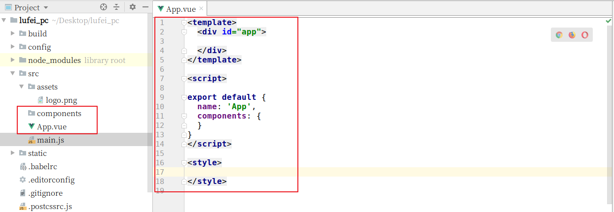
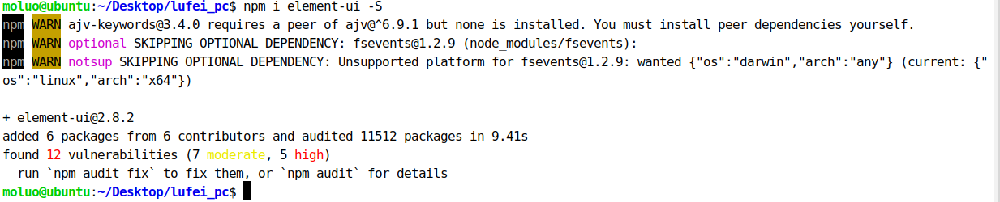

## 4.7 创建数据库

```mysql
create database luffy default charset=utf8mb4;
```


为当前项目创建数据库用户[这个用户只能看到这个数据库]

```mysql
# create user 用户账号 identified by '登录密码';
# grant all privileges on luffy.* to '用户账号'@'%';
# flush privileges;

create user luffy_user identified by 'luffy';
grant all privileges on luffy.* to 'luffy_user'@'%';
flush privileges;
```


## 4.8 配置数据库连接

打开settings/dev.py文件，并配置

```python
DATABASES = {
    "default": {
        "ENGINE": "django.db.backends.mysql",
        "NAME": "luffy",
        "HOST": "127.0.0.1",
        "PORT": 3306,
        "USER": "luffy_user",
        "PASSWORD": "luffy",
    }
}
```


在项目主模块的 `__init__.py`中导入pymysql

```python
import pymysql

pymysql.install_as_MySQLdb()
```


#### 调整错误

数据库版本检测导致的错误


数据库的版本检测代码注释掉。


第二个错误也是因为数据库版本的默认编码导致，query返回的内容格式使用有误。

新增一行代码，把query查询结果转换格式为 bytes类型


# 5. 搭建前端项目

## 5.1 创建项目目录

```bash
cd 项目目录
vue init webpack lufei_pc
```

例如，我要把项目保存在~/Desktop桌面目录下，可以如下操作：

```bash
cd ~/Desktop
vue init webpack lufei_pc
```

根据需要在生成项目时，我们选择对应的选项, 效果：


根据上面的提示，我们已经把vue项目构建好了，运行测试服务器。dev即config目录下的dev.env.js


打开项目已经，在pycharm的终端下运行vue项目，查看效果。

```bash
npm run dev
#或点击左上角dev旁的运行按钮
```

接下来，我们根据终端上效果显示的对应地址来访问项目(如果有多个vue项目在运行，8080端口被占据了，服务器会自动改端口，所以根据自己实际在操作中看到的地址来访问。)

访问：http://localost:8080。效果：


我们也可以把我们的前端项目进行git源代码管理


## 5.2 初始化前端项目

清除默认的HelloWorld组件和APP.vue中的默认样式



接下来，我们可以查看效果了，一张白纸~


## 5.3 安装路由vue-router

### 5.3.1 下载路由组件

如果前面选择安装了vue-router, 则直接跳过当前当前步骤，直接进入下一步配置

```bash
npm i vue-router -S
```

执行效果：


### 5.3.2 配置路由

#### 5.3.2.1 初始化路由对象

在src目录下创建router路由目录，在router目录下创建index.js路由文件

index.js路由文件中，编写初始化路由对象的代码 .

注意：自动生成的路由目录为router

```javascript
import Vue from "vue"
import Router from "vue-router"

// 这里导入可以让让用户访问的组件

Vue.use(Router);

export default new Router({
  // 设置路由模式为‘history’，去掉默认的#
  mode: "history",
  routes:[
    // 路由列表

  ]
})

```


#### 5.3.2.2 注册路由信息

打开main.js文件，把router对象注册到vue中.代码：

```javascript
// The Vue build version to load with the `import` command
// (runtime-only or standalone) has been set in webpack.base.conf with an alias.
import Vue from 'vue'
import App from './App'
import router from './router'

Vue.config.productionTip = false

/* eslint-disable no-new */
new Vue({
  el: '#app',
  router,
  components: { App },
  template: '<App/>'
})

```


#### 5.3.2.3 在视图中显示路由对应的内容

在App.vue组件中，添加显示路由对应的内容。


代码：

```vue
<template>
  <div id="app">
    <router-view/>
  </div>
</template>

<script>
export default {
  name: 'App',
  components: {

  }
}
</script>

<style>

</style>

```


#### 5.3.2.4 创建并提供前端首页的组件

routers/index.js

```javascript
import Vue from "vue"
import Router from "vue-router"

// 这里导入可以让让用户访问的组件
// @符号代表src目录
import Home from "@/components/Home"
//import Home from "../components/Home"
Vue.use(Router);

export default new Router({
 // 设置路由模式为‘history’，去掉默认的#
  mode: "history",
  routes:[
   // 路由列表
     {
	   path:"/",
       name:"Home",
       //注意这里是conponent  
       component:Home,
     },
      {
       path:"/home",
       name:"Home",
       component:Home,
     },
   ]
})

```

##### 创建Home组件

components/Home.vue

```vue
<template>
  <div id="home">
    前端首页
  </div>
</template>
<script>
  export default {
      name:"Home",
      data(){
          return {
              
          }
      }
  }
</script>

<style scoped>

</style>

```


## 5.4 前端初始化全局变量和全局方法

在src目录下创建settings.js站点开发配置文件：

```javascript
export default {
  Host:"http://127.0.0.1:8000",
}
```


在main.js中引入

```javascript
// // The Vue build version to load with the `import` command
// // (runtime-only or standalone) has been set in webpack.base.conf with an alias.
import Vue from 'vue'
import App from './App'
import router from './routers/index';

import settings from "./settings"

Vue.config.productionTip = false;
Vue.prototype.$settings = settings;

// /* eslint-disable no-new */
new Vue({
   el: '#app',
   router,
   components: { App },
   template: '<App/>'
});
```


## 5.5  引入ElementUI

```bash
npm i element-ui -S
```

上面的命令等同于 

```bash
npm install element-ui --save
```

执行命令效果：




### 5.5.1 配置ElementUI到项目中

在main.js中导入ElementUI，并调用。

代码：

```javascript
// The Vue build version to load with the `import` command
// (runtime-only or standalone) has been set in webpack.base.conf with an alias.
// import Vue from 'vue'
// import App from './App'
// import router from './routers/index';

// 开发配置文件
// import settings from "./settings"
// Vue.prototype.$settings = settings;

// elementUI 导入
import ElementUI from 'element-ui';
import 'element-ui/lib/theme-chalk/index.css';
// 调用插件
Vue.use(ElementUI);	


// Vue.config.productionTip = false;

/* eslint-disable no-new */
// new Vue({
//   el: '#app',
//   router,
//   components: { App },
//   template: '<App/>'
// });

```

效果：


成功引入了ElementUI以后，接下来我们就可以开始进入前端页面开发，首先是首页。

接下来我们把之前完成的首页，直接拿过来使用[注意除了组件以外,还有静态文件也需要拿过来,包括App.vue里面的公共样式]，并运行项目。


App.vue，全局css初始化代码

```vue
<template>
  <div id="app">
    <router-view/>
  </div>
</template>

<script>
export default {
  name: 'App'
}
</script>

<style>
/* 声明全局样式和项目的初始化样式 */
body,h1,h2,h3,h4,p,table,tr,td,ul,li,a,form,input,select,option,textarea{
  margin:0;
  padding: 0;
  font-size: 15px;
}
a{
  text-decoration: none;
  color: #333;
}
ul,li{
  list-style: none;
}
table{
  border-collapse: collapse; /* 合并边框 */
}

/* 工具的全局样式 */
.full-left{
  float: left!important;
}
.full-right{
  float: right!important;
}

[class*=" el-icon-"], [class^=el-icon-]{
  font-size: 50px;
}
.el-carousel__arrow{
  width: 120px;
  height: 120px;
}
.el-checkbox__input.is-checked .el-checkbox__inner,
.el-checkbox__input.is-indeterminate .el-checkbox__inner{
  background: #ffc210;
  border-color: #ffc210;
  border: none;
}
.el-checkbox__inner:hover{
  border-color: #9b9b9b;
}
.el-checkbox__inner{
  width: 16px;
  height: 16px;
  border: 1px solid #9b9b9b;
  border-radius: 0;
}
.el-checkbox__inner::after{
  height: 9px;
  width: 5px;
}
</style>
```

Home.vue中添加代码：

```vue
<template>
    <div class="home">
      <Header></Header>
      <Banner></Banner>
      <Footer></Footer>
    </div>
</template>

<script>
  import Header from "./common/Header"
  import Banner from "./common/Banner"
  import Footer from "./common/Footer"
  export default {
      name: "Home",
      data(){
        return {}
      },
      methods:{

      },
      components:{
        Header,
        Footer,
        Banner,
      }
  }
</script>

<style scoped>

</style>
```


components/common/Header.vue

```vue
<template>
    <div class="header-box">
      <div class="header">
        <div class="content">
          <div class="logo full-left">
            <router-link to="/"></router-link>
          </div>
          <ul class="nav full-left">
              <li><span>免费课</span></li>
              <li><span>轻课</span></li>
              <li><span>学位课</span></li>
              <li><span>题库</span></li>
              <li><span>老男孩教育</span></li>
          </ul>
          <div class="login-bar full-right">
            <div class="shop-cart full-left">
              
              <span><router-link to="/cart">购物车</router-link></span>
            </div>
            <div class="login-box full-left">
              <span>登录</span>
              &nbsp;|&nbsp;
              <span>注册</span>
            </div>
          </div>
        </div>
      </div>
    </div>
</template>

<script>
    export default {
      name: "Header",
      data(){
        return{
        }
      },
    }
</script>

<style scoped>
.header-box{
  height: 80px;
}
.header{
  width: 100%;
  height: 80px;
  box-shadow: 0 0.5px 0.5px 0 #c9c9c9;
  position: fixed;
  top:0;
  left: 0;
  right:0;
  margin: auto;
  z-index: 99;
  background: #fff;
}
.header .content{
  max-width: 1200px;
  width: 100%;
  margin: 0 auto;
}
.header .content .logo{
  height: 80px;
  line-height: 80px;
  margin-right: 50px;
  cursor: pointer; /* 设置光标的形状为爪子 */
}
.header .content .logo img{
  vertical-align: middle;
}
.header .nav li{
  float: left;
  height: 80px;
  line-height: 80px;
  margin-right: 30px;
  font-size: 16px;
  color: #4a4a4a;
  cursor: pointer;
}
.header .nav li span{
  padding-bottom: 16px;
  padding-left: 5px;
  padding-right: 5px;
}
.header .nav li span a{
  display: inline-block;
}
.header .nav li .this{
  color: #4a4a4a;
  border-bottom: 4px solid #ffc210;
}
.header .nav li:hover span{
  color: #000;
}
.header .login-bar{
  height: 80px;
}
.header .login-bar .shop-cart{
  margin-right: 20px;
  border-radius: 17px;
  background: #f7f7f7;
  cursor: pointer;
  font-size: 14px;
  height: 28px;
  width: 88px;
  margin-top: 30px;
  line-height: 32px;
  text-align: center;
}
.header .login-bar .shop-cart:hover{
  background: #f0f0f0;
}
.header .login-bar .shop-cart img{
  width: 15px;
  margin-right: 4px;
  margin-left: 6px;
}
.header .login-bar .shop-cart span{
  margin-right: 6px;
}
.header .login-bar .login-box{
  margin-top: 33px;
}
.header .login-bar .login-box span{
  color: #4a4a4a;
  cursor: pointer;
}
.header .login-bar .login-box span:hover{
  color: #000000;
}
</style>
```


components/common/Bannner.vue

```vue
<template>
  <el-carousel height="720px" :interval="3000" arrow="always">
    <el-carousel-item>
      
    </el-carousel-item>
    <el-carousel-item>
      
    </el-carousel-item>
    <el-carousel-item>
      
    </el-carousel-item>
  </el-carousel>
</template>

<script>
    export default {
        name: "Banner",
    }
</script>

<style scoped>
  .el-carousel__item h3 {
    color: #475669;
    font-size: 18px;
    opacity: 0.75;
    line-height: 300px;
    margin: 0;
  }

  .el-carousel__item:nth-child(2n) {
    background-color: #99a9bf;
  }

  .el-carousel__item:nth-child(2n+1) {
    background-color: #d3dce6;
  }
</style>


```

components/common/Footer.vue

```vue
<template>
    <div class="footer">
      <ul>
        <li>关于我们</li>
        <li>联系我们</li>
        <li>商务合作</li>
        <li>帮助中心</li>
        <li>意见反馈</li>
        <li>新手指南</li>
      </ul>
      <p>Copyright © luffycity.com版权所有 | 京ICP备17072161号-1</p>
    </div>
</template>

<script>
    export default {
        name: "Footer"
    }
</script>

<style scoped>
.footer {
  width: 100%;
  height: 128px;
  background: #25292e;
  color: #fff;
}
.footer ul{
  margin: 0 auto 16px;
  padding-top: 38px;
  width: 810px;
}
.footer ul li{
  float: left;
  width: 112px;
  margin: 0 10px;
  text-align: center;
  font-size: 14px;
}
.footer ul::after{
  content:"";
  display:block;
  clear:both;
}
.footer p{
  text-align: center;
  font-size: 12px;
}
</style>
```

也可以把App.vue的style标签的css代码放到static外部目录下引用过来

main.js

```javascript
//引入全局重置样式
import "../static/css/reset.css";
```


reset.css

```css
/* 声明全局样式和项目的初始化样式 */
body,h1,h2,h3,h4,p,table,tr,td,ul,li,a,form,input,select,option,textarea{
  margin:0;
  padding: 0;
  font-size: 15px;
}
a{
  text-decoration: none;
  color: #333;
}
ul,li{
  list-style: none;
}
table{
  border-collapse: collapse; /* 合并边框 */
}

/* 工具的全局样式 */
.full-left{
  float: left!important;
}
.full-right{
  float: right!important;
}

[class*=" el-icon-"], [class^=el-icon-]{
  font-size: 50px;
}
.el-carousel__arrow{
  width: 120px;
  height: 120px;
}
.el-checkbox__input.is-checked .el-checkbox__inner,
.el-checkbox__input.is-indeterminate .el-checkbox__inner{
  background: #ffc210;
  border-color: #ffc210;
  border: none;
}
.el-checkbox__inner:hover{
  border-color: #9b9b9b;
}
.el-checkbox__inner{
  width: 16px;
  height: 16px;
  border: 1px solid #9b9b9b;
  border-radius: 0;
}
.el-checkbox__inner::after{
  height: 9px;
  width: 5px;
}
```

最后记得将图片放到static/image目录中


# 6. 跨域CORS

我们现在为前端和后端分别设置两个不同的域名：

| 位置 | 域名               |
| ---- | ------------------ |
| 前端 | `www.luffycity.cn` |
| 后端 | `api.luffycity.cn` |

编辑`/etc/hosts`文件，可以设置本地域名

```bash
sudo vim /etc/hosts
```

在文件中增加两条信息

```shell
127.0.0.1   localhost

127.0.0.1   api.luffycity.cn
127.0.0.1   www.luffycity.cn
```


通过浏览器输入www.luffycity.cn访问前端vue项目，会出现nginx的欢迎页面，主要因为我们当前操作中已经有一个nginx监听了80端口，所以访问www.luffycity.cn网址时，会自动被转发到127.0.0.1本机，因为没有网址默认端口是80端口，所以被nginx进行处理了当前请求，因此我们暂时先把nginx关闭先。

```bash
# 查找nginx的进程
ps -ef|grep nginx
# 关闭进程
sudo kill -9 nginx进程号
```


关闭了nginx以后，访问www.luffycity.cn网址，效果：


上面并不是错误，而是没人监听了这个地址和端口了，解决方法：

暂停运行前端项目，并修改配置文件config/index.js

```javascript
    host: 'www.luffycity.cn', // can be overwritten by process.env.HOST
    port: 8080, // can be overwritten by process.env.PORT, if port is in use, a free one will be determined
    autoOpenBrowser: true,
```

保存修改信息，并重启项目


通过浏览器访问 www.luffycity.cn:8080


通过浏览器访问后端drf项目,会出现以下错误信息


可以通过settings/dev.py的ALLOWED_HOSTS,设置允许访问

```python
# 设置哪些客户端可以通过地址访问到后端
ALLOWED_HOSTS = [
    'api.luffycity.cn',
]
```


让用户访问的时候，使用api.luffycity.cn:8000

```
1. 修改pycharm的manage.py的配置参数
```


运行manage.py，即可在浏览器访问 http://api.luffycity.cn:8000/


现在，前端与后端分处不同的域名，我们需要为后端添加跨域访问的支持

否则前端无法使用axios无法请求后端提供的api数据，我们使用CORS来解决后端对跨域访问的支持。

使用django-cors-headers扩展

```
在 Response(headers={"Access-Control-Allow-Origin":'客户端地址/*'})
```


文档：https://github.com/ottoyiu/django-cors-headers/

安装

```python
pip install django-cors-headers -i https://pypi.douban.com/simple
```

添加应用

```python
INSTALLED_APPS = (
    ...
    'corsheaders',
    ...
)
```

中间件设置【必须写在第一个位置】

```python
MIDDLEWARE = [
    'corsheaders.middleware.CorsMiddleware',
    ...
]
```

添加白名单

```python
# CORS组的配置信息
CORS_ORIGIN_WHITELIST = (
    'http://www.luffycity.cn:8080',
)
CORS_ALLOW_CREDENTIALS = False  # 允许ajax跨域请求时携带cookie
```


完成了上面的步骤，我们就可以通过后端提供数据给前端使用ajax访问了。

前端使用 axios就可以访问到后端提供给的数据接口，但是如果要附带cookie信息，前端还要设置一下。

前端引入axios插件并配置允许axios发送cookie信息[axios本身也不允许ajax发送cookie到后端]

```shell
npm i axios -S
```


在main.js中引用 axios插件

```javascript
import axios from 'axios'; // 从node_modules目录中导入包
// 允许ajax发送请求时附带cookie
axios.defaults.withCredentials = false;

Vue.prototype.$axios = axios; // 把对象挂载vue中
```


