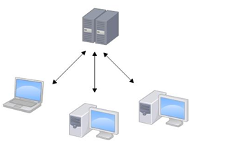
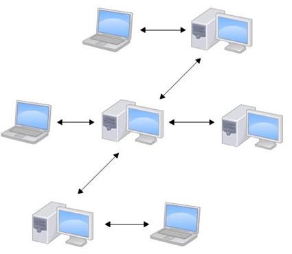
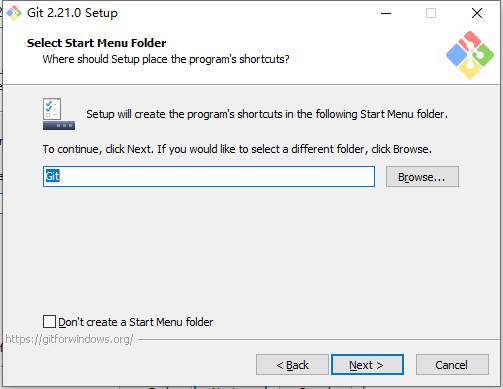
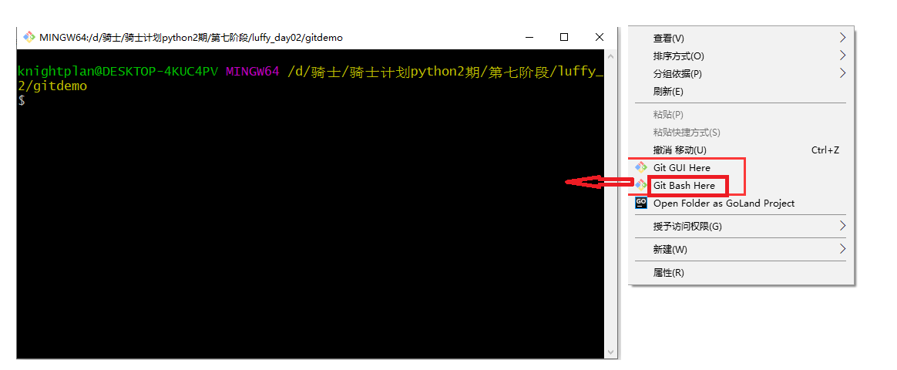
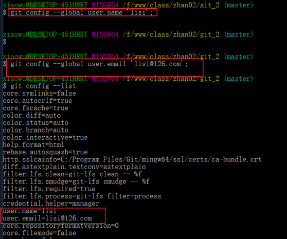
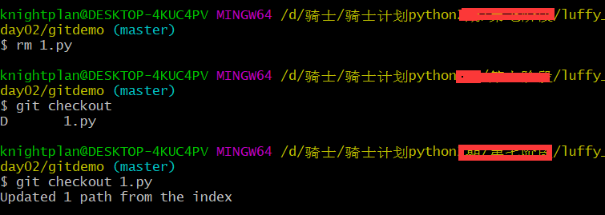
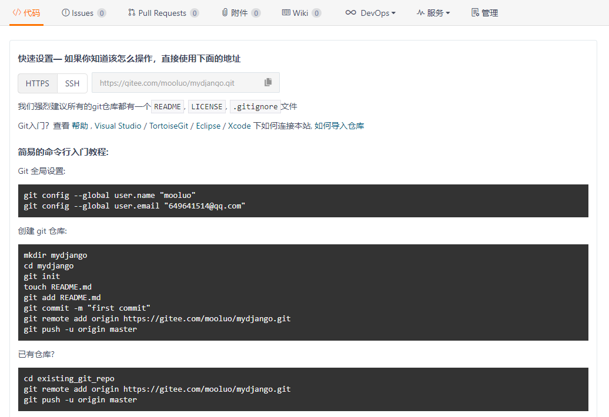
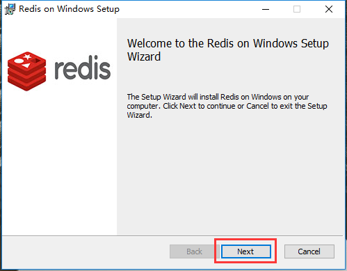
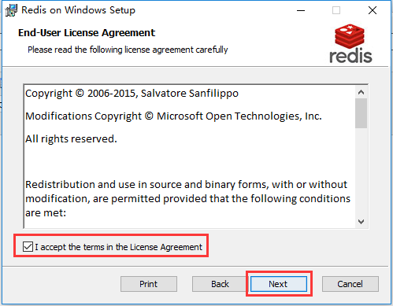
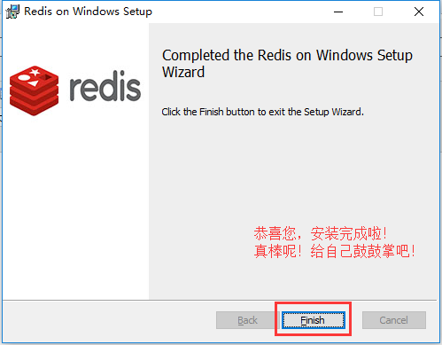

# 如何多人协同开发同一个项目？

使用代码版本控制[version control]软件,

目前市面上比较流行的代码版本控制器有: git,svn,csv


# 1. 使用git管理代码版本

本项目使用git管理项目代码，代码库放在gitee码云平台。（注意，公司中通常放在gitlab私有服务器中）


## 1.1 Git 的诞生

2005 年 4 月3 日，Git 是目前世界上最先进的分布式版本控制系统（没有之一）

作用：源代码管理

**为什么要进行源代码管理?**

- 方便多人协同开发
- 方便版本控制


## 1.2 git与svn区别

SVN 都是集中控制管理的，也就是有一个中央服务器，大家都把代码提交到中央服务器，而
git 是分布式的版本控制工具，也就是说没有中央服务器，每个节点的地位平等。

SVN



Git




## Git的windows下安装

官网地址：

https://git-scm.com/download


下载到本地磁盘


安装


一路【next】就可以了




注意：**openssl  一定选它**

安装完成后，右击菜单栏，有如下菜单，表示安装完成


进入git bash选项



Git工作区、暂存区和版本库


git reset hard

## 1、工作区介绍

就是在你本要电脑磁盘上能看到的目录。

## 2、暂存区介绍

一般存放在【.git】目录下的index文件(.git/index) 中，所以我们把暂存区有时也叫作索引。

## 3、版本库介绍

工作区有一个隐藏目录.git，这个不算工作区，而是Git的版本库。git中的head/master是分支，是版本库。


#### git项目仓库的本地搭建

```
cd进入到自己希望存储代码的目录路径，并创建本地仓库.git
新创建的本地仓库.git是个空仓库

  cd 目录路径
  git init gitdemo  # 如果没有声明目录,则自动把当前目录作为git仓库
```

创建仓库


#### 仓库目录的结构

```bash
branches/   分支管理目录
config      当前项目仓木的配置信息
description 当前项目的描述
HEAD        当前项目仓库的当前版本信息
hooks       当前项目仓库的钩子目录[可以利用这个目录下面的文件实现自己拉去代码到服务器]
info        仓库相关信息
objects     仓库版本信息
refs        引用信息
```


#### 配置用户名和邮箱

```
git config --global user.name 'lisi'
git config --global user.email 'lisi@163.com'
```





#### 查看仓库状态

```
git status

git status –s 简约显示
```

- 红色表示新建文件或者新修改的文件,都在工作区.
- 绿色表示文件在暂存区
- 新建的`login.py`文件在工作区，需要添加到暂存区并提交到仓库区


上图表示： 暂时没有新文件需要提交到暂存区


#### 添加文件到暂存区

```
  # 添加项目中所有文件
  git add .
  或者
  # 添加指定文件
  git add login.py
```

例如： 创建3个文件 ，并查看状态.


#### 提交到版本库

```
 git commit -am "版本描述"
```


#### 手动删除文件

```
手动操作删除 或者 在命令行下 使用 rm 文件名 删除 都是表示在工作区删除.
对于这种删除,如果还原,则可以使用 git checkout 文件名
```



#### 版本删除

```
如果使用 git rm 文件名, 这种操作属于暂存区删除,这种删除无法直接git checkout 文件名 来还原.
如果直接执行git checkout 命令,则报错如下:
```


```
如果要还原在暂存区中删除的文件,必须先执行 git reset head
```


#### 查看历史版本[查看日志]

```
git log   或者   git reflog
 
过滤查看日志
  git log –p 
  退出按【q】键
  ctrl+f向下分页
  ctrl+b 向上分页

显示指定日期之后的日志   git log --after  '2018-11-6'
显示指定日期之前的日志   git log --before '2018-11-6'

指定显示指定开发者的日志  git log --author 'lisi'
```


**回退版本**

- **方案一：**

  - `HEAD`表示当前最新版本

  - `HEAD^`表示当前最新版本的前一个版本

  - `HEAD^^`表示当前最新版本的前两个版本，**以此类推...**

  - `HEAD~1`表示当前最新版本的前一个版本

  - `HEAD~10`表示当前最新版本的前10个版本，**以此类推...**

    ```
    git reset --hard HEAD^
    ```


**方案二：当版本非常多时可选择的方案**

- 通过每个版本的版本号回退到指定版本

  ```
    git reset --hard 版本号
  ```


取消暂存

```
git reset --hard HEAD  # 重置当前版本
git reset <file> ：从暂存区恢复到工作文件
git reset -- ：从暂存区恢复到工作文件
```

恢复误删或误操作的文件状态：

```bash
如果已经提交了版本，那么就直接回滚/重置当前版本就可以了。
如果已经把操作设置到暂存区，则取消暂存
如果没有设置到暂存区，则使用检出操作  git checkout
```


## 查看文件状态

**针对与文件所处的不同分区，文件所处的状态:**

(1)未追踪, 文件第一次出现在工作区, 版本库还没有存储该文件的状态

(2)已追踪, 只要第一次,git add了文件, 文件就是已追踪

(3)未修改, 文件在工作区未被编辑

(4)已修改, 文件在工作区被修改

(5)未暂存, 文件已修改, 但是没有add到暂存区

(6)已暂存, 已经将修改的文件add到暂存区

(7)未提交, 已暂存的文件, 没有commit提交. 处于暂存区

(8)已提交, 提交到版本库的文件修改,只有commit以后才会有仓库的版本号生成


注意：

```
第三方代码库平台: github, gitlab, gitee[码云], codepan
公司一般使用git管理项目,往往会搭建一个gitlab自己内部管理代码,也有公司选择使用码云的企业版仓库来管理

使用git开发项目时，有时候不一定通过https协议提交代码的。也有的公司是通过ssh协议提交,此时需要生成ssh公钥和提交公钥给仓库。[码云这些官网都会有详细的提示说明]

生成SSH公钥【必须安装git bash才可以使用这个命令，而且还要把git bash添加到系统变量里面】
  ssh-keygen -t rsa -C "lisi@163.com"

参考：https://gitee.com/help/articles/4180
```


# 2. 在gitee平台创建工程

1） 创建私有项目库


创建私有空仓库以后的界面:




2）克隆项目到本地

```
git clone http仓库地址
注意，如果当前目录下出现git仓库同名目录时，会克隆失败。
```


3）创建并切换分支到dev

```
# git branch dev      # 创建本地分支dev,dev是自定义
# git checkout dev    # 切换本地分支代码
git checkout -b dev   # 这里是上面两句代码的简写

# git branch -D 分支名  # 删除分支，必须先切换到别的分支下才能删除当前分支
```


git提交

```shell
git add 代码目录
git status
git commit -m '添加项目代码'
```

推送到远端

```shell
git push origin dev:dev
```

如果推送代码,出现以下提示: git pull ....,则表示当前本地的代码和线上的代码版本不同.

```
1. 把线上的代码执行以下命令,拉取到本地,进行同步
git pull

2. 根据提示,移除多余的冲突的文件,也可以删除.
完成这些步骤以后,再次add,commit,push即可.
```


# 3. redis

window系统的redis是微软团队根据官方的linux版本高仿的

官方原版: https://redis.io/

中文官网:http://www.redis.cn

## 3.1 redis下载和安装

下载地址： https://github.com/MicrosoftArchive/redis/releases

 






 



使用以下命令启动redis服务端

```
redis-server C:/tool/redis/redis.windows.conf
```


关闭上面这个cmd窗口就关闭redis服务器服务了。


**redis作为windows服务启动方式**

```
redis-server --service-install redis.windows.conf
```


启动服务：redis-server --service-start
停止服务：redis-server --service-stop


启动内置客户端连接redis服务：


## 3.2 redis的配置

redis 安装成功以后,window下的配置文件保存在软件 安装目录下,如果是mac或者linux,则默认安装/etc/redis/redis.conf

### 3.2.1 redis的核心配置选项

- 绑定ip：如果需要远程访问，可将此⾏注释，或绑定⼀个真实ip

  > bind 127.0.0.1

- 端⼝，默认为6379

  > port 6379

- 是否以守护进程运⾏[这里的配置主要是linux和mac下面需要配置的]

  - 如果以守护进程运⾏，则不会在命令⾏阻塞，类似于服务
  - 如果以⾮守护进程运⾏，则当前终端被阻塞
  - 设置为yes表示守护进程，设置为no表示⾮守护进程
  - 推荐设置为yes

  > daemonize yes

- 数据⽂件

  > dbfilename dump.rdb

- 数据⽂件存储路径

  > dir .

- ⽇志⽂件

  > logfile "C:/tool/redis/redis-server.log"

- 数据库，默认有16个

  > database 16

- 主从复制，类似于双机备份。

  > slaveof


### 3.2.2 Redis的使用

Redis 是一个高性能的key-value数据格式的内存缓存，NoSQL数据库。

NOSQL：not only sql，泛指非关系型数据库。

关系型数据库: (mysql, oracle, sql server, sqlite)

```
1. 数据存放在表中，表之间有关系。
2. 通用的SQL操作语言。
3. 大部分支持事务。
```

非关系型数据库[ redis，hadoop，mangoDB]:

```
1. 没有数据表的概念，不同的nosql数据库存放数据位置不同。
2. nosql数据库没有通用的操作语言。
3. 基本不支持事务。   redis支持简单事务
```

redis：
内存型(数据存放在内存中)的非关系型(nosql)key-value(键值存储)数据库，
支持数据的持久化(注: 数据持久化时将数据存放到文件中，每次启动redis之后会先将文
件中数据加载到内存)，经常用来做缓存(用来缓存一些经常用到的数据，提高读写速度)。

redis是一款基于CS架构的数据库，所以redis有客户端，也有服务端。

其中，客户端可以使用python等编程语言，也可以终端命令行工具


redis客户端连接服务器:

```
redis-cli -h `redis服务器ip` -p `redis服务器port`
```


## 3.3 redis数据类型

```
1. string类型:
	字符串类型是 Redis 中最为基础的数据存储类型，它在 Redis 中是二进制安全的，也就是byte类型
	最大容量是512M。
2. hash类型:
		hash用于存储对象，对象的结构为属性、值，值的类型为string。
		key:{
            域:值[这里的值只能是字符串]，
            域:值，            
            域:值，
            域:值，
            ...
		}
3. list类型:
		列表的元素类型为string。
		key:[ 值1，值2,值3..... ]
4. set类型:
	无序集合，元素为string类型，元素唯一不重复，没有修改操作。
	{值1,值4,值3,值5}
5. zset类型:
	有序集合，元素为string类型，元素唯一不重复，没有修改操作。
```

### 3.4 string

如果设置的键不存在则为添加，如果设置的键已经存在则修改

- 设置键值

  > set key value

- 例1：设置键为`name`值为`xiaoming`的数据

  > set name xiaoming


- 设置键值及过期时间，以秒为单位

  > setex key seconds value

- 例2：设置键为`aa`值为`aa`过期时间为3秒的数据

  > setex name 20 xiaoming


关于设置保存数据的有效期

```
# setex 添加保存数据到redis，同时设置有效期
格式：
	setex key time value
# expire 给已有的数据重新设置有效期
格式：
	expire key time
```


- 设置多个键值

  > mset key1 value1 key2 value2 ...

- 例3：设置键为`a1`值为`python`、键为`a2`值为`java`、键为`a3`值为`c`

  > mset a1 python a2 java a3 c


- 追加值

  > append key value

- 例4：向键为`a1`中追加值`haha`

  > append a1 haha


- 获取：根据键获取值，如果不存在此键则返回`nil`

  > get key

- 例5：获取键`name`的值

  > get name

- 根据多个键获取多个值

  > mget key1 key2 ...

- 例6：获取键`a1、a2、a3`的值

  > mget a1 a2 a3


### 3.5 键操作

- 查找键，参数⽀持正则表达式

  > keys pattern

- 例1：查看所有键

  > keys *

- 例2：查看名称中包含`a`的键

  > keys a*

- 判断键是否存在，如果存在返回`1`，不存在返回`0`

  > exists key1

- 例3：判断键`a1`是否存在

  > exists a1

- 查看键对应的`value`的类型

  > type key

- 例4：查看键`a1`的值类型，为redis⽀持的五种类型中的⼀种

  > type a1

- 删除键及对应的值

  > del key1 key2 ...

- 例5：删除键`a2、a3`

  > del a2 a3

- 查看有效时间，以秒为单位

  > ttl key

- 例7：查看键`bb`的有效时间

  > ttl bb


### 3.6 hash

结构：

```
键key:{
   	域field:值value
}
```


- 设置单个属性

  > hset key field value

- 例1：设置键 `user`的属性`name`为`xiaohong`

  > hset user name xiaohong

- 设置多个属性

  > hmset key field1 value1 field2 value2 ...

- 例2：设置键`u2`的属性`name`为`xiaohong`、属性`age`为`11`

  > hmset u2 name xiaohongage 11

- 获取指定键所有的属性

  > hkeys key

- 例3：获取键u2的所有属性

  > hkeys u2

- 获取⼀个属性的值

  > hget key field

- 例4：获取键`u2`属性`name`的值

  > hget u2 name

- 获取多个属性的值

  > hmget key field1 field2 ...

- 例5：获取键`u2`属性`name`、`age`的值

  > hmget u2 name age


- 获取所有属性的值

  > hvals key

- 例6：获取键`u2`所有属性的值

  > hvals u2

- 删除属性，属性对应的值会被⼀起删除

  > hdel key field1 field2 ...

- 例7：删除键`u2`的属性`age`

  > hdel u2 age

### 3.7 list

列表的元素类型为string

按照插⼊顺序排序

- 在左侧插⼊数据

  > lpush key value1 value2 ...

- 例1：从键为`a1`的列表左侧加⼊数据`a 、 b 、c`

  > lpush a1 a b c

- 在右侧插⼊数据

  > rpush key value1 value2 ...

- 例2：从键为`a1`的列表右侧加⼊数据`0、1`

  > rpush a1 0 1

- 在指定元素的前或后插⼊新元素

  > linsert key before或after 现有元素 新元素

- 例3：在键为`a1`的列表中元素`b`前加⼊`3`

  > linsert a1 before b 3


设置指定索引位置的元素值

- 索引从左侧开始，第⼀个元素为0

- 索引可以是负数，表示尾部开始计数，如`-1`表示最后⼀个元素

  > lset key index value

- 例5：修改键为`a1`的列表中下标为`1`的元素值为`z`

  > lset a 1 z


- 删除指定元素

  - 将列表中前`count`次出现的值为`value`的元素移除
  - count > 0: 从头往尾移除
  - count < 0: 从尾往头移除
  - count = 0: 移除所有

  > lrem key count value

  

- 例6.1：向列表`a2`中加⼊元素`a、b、a、b、a、b`

  > lpush a2 a b a b a b


- 例6.2：从`a2`列表右侧开始删除2个`b`

  > lrem a2 -2 b

- 例6.3：查看列表`a2`的所有元素

  > lrange a2 0 -1


### 3.8 set

- 添加元素

  > sadd key member1 member2 ...

- 例1：向键`a3`的集合中添加元素`zhangsan`、`lisi`、`wangwu`

  > sadd a3 zhangsan sili wangwu


- 返回所有的元素

  > smembers key

- 例2：获取键`a3`的集合中所有元素

  > smembers a3


- 删除指定元素

  > srem key value

- 例3：删除键`a3`的集合中元素`wangwu`

  > srem a3 wangwu


### 3.9 redis的几个站点地址

中文官网： http://www.redis.cn/

英文官网：https://redis.io

参考命令：http://doc.redisfans.com/


##### 针对redis中的内容扩展

flushall 清空数据库中的所有数据

```
针对各种数据类型它们的特性，使用场景如下:
字符串string: 用于保存一些项目中的普通数据，只要键值对的都可以保存，例如，保存 session,定时记录状态
哈希hash：用于保存项目中的一些字典数据，但是不能保存多维的字典，例如，商城的购物车
列表list：用于保存项目中的列表数据，但是也不能保存多维的列表，例如，队列，秒杀，医院的挂号
无序集合set:用于保存项目中的一些不能重复的数据，可以用于过滤，例如，投票海选的时候，过滤候选人
有序集合zset：用于保存项目中一些不能重复，但是需要进行排序的数据，分数排行榜.

```


