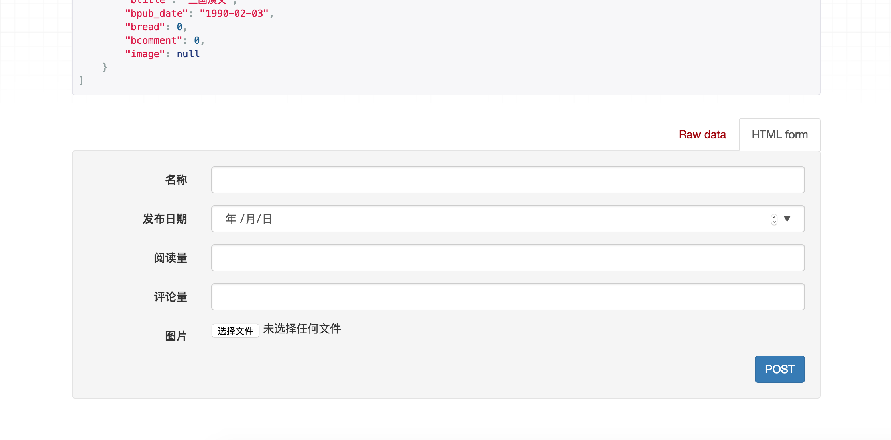

#  Celery

## 简介

Celery是一个功能完备即插即用的异步任务队列系统。它适用于异步处理问题，当发送邮件、或者文件上传, 图像处理等等一些比较耗时的操作，我们可将其异步执行，这样用户不需要等待很久，提高用户体验。

文档：http://docs.jinkan.org/docs/celery/getting-started/index.html

Celery的特点是：

- 简单，易于使用和维护，有丰富的文档。
- 高效，单个celery进程每分钟可以处理数百万个任务。
- 灵活，celery中几乎每个部分都可以自定义扩展。


```python
任务队列是一种跨线程、跨机器工作的一种机制.
任务队列中包含称作任务的工作单元。有专门的工作进程持续不断的监视任务队列，并从中获得新的任务并处理.
celery通过消息进行通信，通常使用一个叫Broker(中间人)来协client(任务的发出者)和worker(任务的处理者). clients发出消息到队列中，broker将队列中的信息派发给worker来处理。
```


**Celery**的架构

Celery的架构由三部分组成，消息队列（message broker），任务执行单元（worker）和任务执行结果存储（task result store）组成。



```python
一个celery系统可以包含很多的worker和broker

Celery本身不提供消息队列功能，但是可以很方便地和第三方提供的消息中间件进行集成，包括RabbitMQ,Redis,MongoDB等
```

## 安装

```python
pip install -U celery -i https://pypi.douban.com/simple
```

也可从官方直接下载安装包:<https://pypi.python.org/pypi/celery/>

```python
tar xvfz celery-0.0.0.tar.gz
cd celery-0.0.0
python setup.py build
python setup.py install
```

## 使用

使用celery第一件要做的最为重要的事情是需要先创建一个Celery实例，我们一般叫做celery应用，或者更简单直接叫做一个app。app应用是我们使用celery所有功能的入口，比如创建任务，管理任务等，在使用celery的时候，app必须能够被其他的模块导入。

一般celery任务目录直接放在项目的根目录下即可，路径:

```python
luffyapi/
├── mycelery/
    ├── config.py     # 配置文件,任务、结果队列的链接地址
    ├── __init__.py   
    ├── main.py       # 主程序，任务队列
    └── sms/          # 一个目录可以放置多个任务,该目录下存放当前任务执行时需要的模块或依赖
        └── tasks.py  # 任务的文件，名称必须是这个！ 任务处理者
```


main.py，代码：

```python
# 主程序
from celery import Celery
# 创建celery实例对象
app = Celery("luffy")

# 通过app对象加载配置
app.config_from_object("mycelery.config")

# 自动搜索并加载任务
# 参数必须必须是一个列表，里面的每一个任务都是任务的路径名称
# app.autodiscover_tasks(["任务1","任务2"])
app.autodiscover_tasks(["mycelery.sms","mycelery.cache"])

# 启动Celery的命令
# 强烈建议切换目录到项目的根目录下启动celery!!
# celery -A mycelerymain worker --loglevel=info
```

配置文件config.py，代码：

```python
# 任务队列的链接地址
broker_url = 'redis://127.0.0.1:6379/15'
# 结果队列的链接地址
result_backend = 'redis://127.0.0.1:6379/14'
```


创建一个任务文件sms/tasks.py，并创建任务，代码:

```python
# celery的任务必须写在tasks.py的文件中，别的文件名称不识别!!!
from mycelery.main import app

@app.task  # name表示设置任务的名称，如果不填写，则默认使用函数名作为任务名
def send_sms():
    print("发送短信!!!")

@app.task  # name表示设置任务的名称，如果不填写，则默认使用函数名作为任务名
def send_sms2():
    print("发送短信任务2!!!")
```


接下来，我们运行celery，效果如下：


发送邮件测试 mail/tasks.py

```python
from mycelery.main import app

@app.task(name="send_mail") #给任务命个名便于查找,否则自动查找的会加上从项目根目录开始的路径名
def send_mail(email):
    import time
    time.sleep(10)
    print("发送邮件,收件人为:%s" % email)
```


user/views.py

```python
from mycelery.mail.tasks import send_mail
send_mail.delay(email="871297690@qq.com")
```


```shell
#启动celery
(luffy) moluo@dingpc:~/Desktop/luffy/luffyapi$ celery -A mycelery.main worker --loglevel=info
```


命令端结果


redis数据库结果


其他参考文档：

http://docs.celeryproject.org/en/latest/getting-started/introduction.html

https://github.com/celery/celery/tree/master/examples/django/

https://www.jianshu.com/p/1840035cb510

https://flower.readthedocs.io/en/latest/screenshots.html


接下来，我们需要把celery和django组合起来一起使用。

### 把django和celery进行组合

在main.py主程序中对django的配置文件进行加载

```python
# 主程序
import os
from celery import Celery
# 创建celery实例对象
app = Celery("luffy")

# 把celery和django进行组合，识别和加载django的配置文件
import os
os.environ.setdefault('DJANGO_SETTINGS_MODULE', 'luffyapi.settings.dev')
import django
django.setup()

# 通过app对象加载配置
app.config_from_object("mycelery.config")

# 加载任务
# 参数必须必须是一个列表，里面的每一个任务都是任务的路径名称
# app.autodiscover_tasks(["任务1","任务2"])
app.autodiscover_tasks(["mycelery.sms","mycelery.mail"])

# 启动Celery的命令
# 切换目录到mycelery根目录下启动
# celery -A mycelery.main worker --loglevel=info
```

在需要使用django配置的任务中，直接加载配置，所以我们把注册的短信发送功能，整合成一个任务函数，代码：

```python
from mycelery.main import app
from luffyapi.libs.yuntongxun.sms import CCP
from luffyapi.settings import constants
import logging

log = logging.getLogger("django")

@app.task(name="send_sms")
def send_sms(mobile, sms_code):
    """发送短信"""
    ccp = CCP()
    ret = ccp.send_template_sms(mobile, [sms_code, constants.SMS_EXPIRE_TIME//60], constants.SMS_TEMPLATE_ID)
    if not ret:
        log.error("用户注册短信发送失败！手机号：%s" % mobile)
```


在这个任务中，我们需要加载短信发送的sdk和相关的配置常量，所以我们可以直接把django中的短信发送模块和相关的常量配置文件直接剪切到当前sms任务目录中

```python
mycelery/
├── config.py
├── __init__.py
├── main.py
└── sms/
    ├── __init__.py
    ├── tasks.py

```

再次启动项目即可。


最终在django里面，我们调用Celery来异步执行任务。需要完成2个步骤：

```python
# 1. 声明一个和celery一模一样的任务函数，但是我们可以导包来解决
from mycelery.sms.tasks import send_sms

# 2. 调用任务函数，发布任务
send_sms.delay(mobile,sms_code)
# send_sms.delay() 如果调用的任务函数没有参数，则不需要填写任何内容
```
