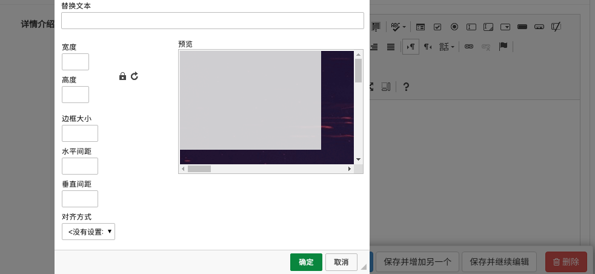

# 课程详情页

## CKEditor富文本编辑器

富文本即具备丰富样式格式的文本。在运营后台，运营人员需要录入课程的相关描述，可以是包含了HTML语法格式的字符串。为了快速简单的让用户能够在页面中编辑带html格式的文本，我们引入富文本编辑器。

富文本编辑器：ueditor、ckeditor、kindeditor

### 1. 安装

```shell
pip install django-ckeditor
```

### 2. 添加应用

在settings/dev.py，找到配置项INSTALLED_APPS中添加

```python
INSTALLED_APPS = [
    ...
    'ckeditor',  # 富文本编辑器
    'ckeditor_uploader',  # 富文本编辑器上传图片模块
    ...
]
```

### 3. 添加CKEditor设置

django-ckeditor文档 https://github.com/django-ckeditor/django-ckeditor

在settings/dev.py中添加

```python
# 富文本编辑器ckeditor配置
# 可自定义需要的工具栏，文档见github的django-ckeditor
CKEDITOR_CONFIGS = {
    'default': {
        # 'toolbar': 'full',  #工具条功能
        # 'toolbar': 'Basic', #只有三个工具条
        'toolbar': 'Custom',  #自定义工具条
        'toolbar_Custom': [
            ['Bold', 'Italic', 'Underline', 'Image'],
            ['NumberedList', 'BulletedList', '-', 'Outdent', 'Indent', '-', 'JustifyLeft', 'JustifyCenter',
             'JustifyRight', 'JustifyBlock'],
            ['Link', 'Unlink'],
            ['RemoveFormat', 'Source']
        ],
        'height': 300,      # 编辑器高度
        # 'width': 300,     # 编辑器宽
    },
}
CKEDITOR_UPLOAD_PATH = ''  # 上传图片保存路径，留空则调用django的文件上传功能
```

### 4. 添加ckeditor路由

在总路由中添加

```python
path(r'^ckeditor/', include('ckeditor_uploader.urls')),
```

### 5. 为模型类添加字段

ckeditor提供了两种类型的Django模型类字段

- `ckeditor.fields.RichTextField` 不支持上传文件的富文本字段
- `ckeditor_uploader.fields.RichTextUploadingField` 支持上传文件的富文本字段\

修改course/models.py里面的字段信息,记得要重新数据迁移

```python
from ckeditor_uploader.fields import RichTextUploadingField
class Course(models.Model):
    """
    专题课程
    """
	...
    
    brief = RichTextUploadingField(max_length=2048, verbose_name="课程概述", null=True, blank=True) #注意前面没有models
    
```

效果：




## 课程详情页显示

详情页components/Detail.vue组件代码：

```vue
<template>
    <div class="detail">
      <Header/>
      <div class="main">
        <div class="course-info">
          <div class="wrap-left">

          </div>
          <div class="wrap-right">
            <h3 class="course-name">Linux系统基础5周入门精讲</h3>
            <p class="data">23475人在学&nbsp;&nbsp;&nbsp;&nbsp;课程总时长：148课时/180小时&nbsp;&nbsp;&nbsp;&nbsp;难度：初级</p>
            <div class="sale-time">
              <p class="sale-type">限时免费</p>
              <p class="expire">距离结束：仅剩 01天 04小时 33分 <span class="second">08</span> 秒</p>
            </div>
            <p class="course-price">
              <span>活动价</span>
              <span class="discount">¥0.00</span>
              <span class="original">¥29.00</span>
            </p>
            <div class="buy">
              <div class="buy-btn">
                <button class="buy-now">立即购买</button>
                <button class="free">免费试学</button>
              </div>
              <div class="add-cart">加入购物车</div>
            </div>
          </div>
        </div>
        <div class="course-tab">
          <ul class="tab-list">
            <li :class="tabIndex==1?'active':''" @click="tabIndex=1">详情介绍</li>
            <li :class="tabIndex==2?'active':''" @click="tabIndex=2">课程章节 <span :class="tabIndex!=2?'free':''">(试学)</span></li>
            <li :class="tabIndex==3?'active':''" @click="tabIndex=3">用户评论 (42)</li>
            <li :class="tabIndex==4?'active':''" @click="tabIndex=4">常见问题</li>
          </ul>
        </div>
        <div class="course-content">
          <div class="course-tab-list">
            <div class="tab-item" v-if="tabIndex==1">
              <p></p>
              <p></p>
              <p></p>
            </div>
            <div class="tab-item" v-if="tabIndex==2">
              <div class="tab-item-title">
                <p class="chapter">课程章节</p>
                <p class="chapter-length">共11章 147个课时</p>
              </div>
              <div class="chapter-item">
                <p class="chapter-title">第1章·Linux硬件基础</p>
                <ul class="lesson-list">
                  <li class="lesson-item">
                    <p class="name"><span class="index">1-1</span> 课程介绍-学习流程<span class="free">免费</span></p>
                    <p class="time">07:30 </p>
                    <button class="try">立即试学</button>
                  </li>
                  <li class="lesson-item">
                    <p class="name"><span class="index">1-2</span> 服务器硬件-详解<span class="free">免费</span></p>
                    <p class="time">07:30 </p>
                    <button class="try">立即试学</button>
                  </li>
                </ul>
              </div>
              <div class="chapter-item">
                <p class="chapter-title">第2章·Linux发展过程</p>
                <ul class="lesson-list">
                  <li class="lesson-item">
                    <p class="name"><span class="index">2-1</span> 操作系统组成-Linux发展过程</p>
                    <p class="time">07:30 </p>
                    <button class="try">立即购买</button>
                  </li>
                  <li class="lesson-item">
                    <p class="name"><span class="index">2-2</span> 自由软件-GNU-GPL核心讲解</p>
                    <p class="time">07:30 </p>
                    <button class="try">立即购买</button>
                  </li>
                </ul>
              </div>
            </div>
            <div class="tab-item" v-if="tabIndex==3">
              用户评论
            </div>
            <div class="tab-item" v-if="tabIndex==4">
              常见问题
            </div>
          </div>
          <div class="course-side">
             <div class="teacher-info">
               <h4 class="side-title"><span>授课老师</span></h4>
               <div class="teacher-content">
                 <div class="cont1">
                   
                   <div class="name">
                     <p class="teacher-name">李泳谊</p>
                     <p class="teacher-title">老男孩LInux学科带头人</p>
                   </div>
                 </div>
                 <p class="narrative" >Linux运维技术专家，老男孩Linux金牌讲师，讲课风趣幽默、深入浅出、声音洪亮到爆炸</p>
               </div>
             </div>
          </div>
        </div>
      </div>
      <Footer/>
    </div>
</template>

<script>
import Header from "./common/Header"
import Footer from "./common/Footer"

export default {
    name: "Detail",
    data(){
      return {
        course_id: 0,
        tabIndex:2, // 当前选项卡显示的下标
      }
    },
    created(){
      // 课程ID
      this.get_course_id();
    },
    methods: {
      get_course_id(){
          let course_id = this.$route.params.id;
          if(course_id > 0){
              this.course_id = parseInt( course_id );
          }else{
              let self = this;
              this.$alert("对不起，访问页面参数有误！","错误",{
                  callback(){
                    self.$router.go(-1);
                  }
              });
              return false;
          }
          return course_id;
      },
    },
    components:{
      Header,
      Footer,
    }
}
</script>

<style scoped>
.main{
  background: #fff;
  padding-top: 30px;
}
.course-info{
  width: 1200px;
  margin: 0 auto;
  overflow: hidden;
}
.wrap-left{
  float: left;
  width: 690px;
  height: 388px;
  background-color: #000;
}
.wrap-right{
  float: left;
  position: relative;
  height: 388px;
}
.course-name{
  font-size: 20px;
  color: #333;
  padding: 10px 23px;
  letter-spacing: .45px;
}
.data{
  padding-left: 23px;
  padding-right: 23px;
  padding-bottom: 16px;
  font-size: 14px;
  color: #9b9b9b;
}
.sale-time{
  width: 464px;
  background: #fa6240;
  font-size: 14px;
  color: #4a4a4a;
  padding: 10px 23px;
  overflow: hidden;
}
.sale-type {
  font-size: 16px;
  color: #fff;
  letter-spacing: .36px;
  float: left;
}
.sale-time .expire{
  font-size: 14px;
  color: #fff;
  float: right;
}
.sale-time .expire .second{
  width: 24px;
  display: inline-block;
  background: #fafafa;
  color: #5e5e5e;
  padding: 6px 0;
  text-align: center;
}
.course-price{
  background: #fff;
  font-size: 14px;
  color: #4a4a4a;
  padding: 5px 23px;
}
.discount{
  font-size: 26px;
  color: #fa6240;
  margin-left: 10px;
  display: inline-block;
  margin-bottom: -5px;
}
.original{
  font-size: 14px;
  color: #9b9b9b;
  margin-left: 10px;
  text-decoration: line-through;
}
.buy{
  width: 464px;
  padding: 0px 23px;
  position: absolute;
  left: 0;
  bottom: 20px;
  overflow: hidden;
}
.buy .buy-btn{
  float: left;
}
.buy .buy-now{
  width: 125px;
  height: 40px;
  border: 0;
  background: #ffc210;
  border-radius: 4px;
  color: #fff;
  cursor: pointer;
  margin-right: 15px;
  outline: none;
}
.buy .free{
  width: 125px;
  height: 40px;
  border-radius: 4px;
  cursor: pointer;
  margin-right: 15px;
  background: #fff;
  color: #ffc210;
  border: 1px solid #ffc210;
}
.add-cart{
  float: right;
  font-size: 14px;
  color: #ffc210;
  text-align: center;
  cursor: pointer;
  margin-top: 10px;
}
.add-cart img{
  width: 20px;
  height: 18px;
  margin-right: 7px;
  vertical-align: middle;
}

.course-tab{
    width: 100%;
    background: #fff;
    margin-bottom: 30px;
    box-shadow: 0 2px 4px 0 #f0f0f0;

}
.course-tab .tab-list{
    width: 1200px;
    margin: auto;
    color: #4a4a4a;
    overflow: hidden;
}
.tab-list li{
    float: left;
    margin-right: 15px;
    padding: 26px 20px 16px;
    font-size: 17px;
    cursor: pointer;
}
.tab-list .active{
    color: #ffc210;
    border-bottom: 2px solid #ffc210;
}
.tab-list .free{
    color: #fb7c55;
}
.course-content{
    width: 1200px;
    margin: 0 auto;
    background: #FAFAFA;
    overflow: hidden;
    padding-bottom: 40px;
}
.course-tab-list{
    width: 880px;
    height: auto;
    padding: 20px;
    background: #fff;
    float: left;
    box-sizing: border-box;
    overflow: hidden;
    position: relative;
    box-shadow: 0 2px 4px 0 #f0f0f0;
}
.tab-item{
    width: 880px;
    background: #fff;
    padding-bottom: 20px;
    box-shadow: 0 2px 4px 0 #f0f0f0;
}
.tab-item-title{
    justify-content: space-between;
    padding: 25px 20px 11px;
    border-radius: 4px;
    margin-bottom: 20px;
    border-bottom: 1px solid #333;
    border-bottom-color: rgba(51,51,51,.05);
    overflow: hidden;
}
.chapter{
    font-size: 17px;
    color: #4a4a4a;
    float: left;
}
.chapter-length{
    float: right;
    font-size: 14px;
    color: #9b9b9b;
    letter-spacing: .19px;
}
.chapter-title{
    font-size: 16px;
    color: #4a4a4a;
    letter-spacing: .26px;
    padding: 12px;
    background: #eee;
    border-radius: 2px;
    display: -ms-flexbox;
    display: flex;
    -ms-flex-align: center;
    align-items: center;
}
.chapter-title img{
    width: 18px;
    height: 18px;
    margin-right: 7px;
    vertical-align: middle;
}
.lesson-list{
    padding:0 20px;
}
.lesson-list .lesson-item{
    padding: 15px 20px 15px 36px;
    cursor: pointer;
    justify-content: space-between;
    position: relative;
    overflow: hidden;
}
.lesson-item .name{
    font-size: 14px;
    color: #666;
    float: left;
}
.lesson-item .index{
    margin-right: 5px;
}
.lesson-item .free{
    font-size: 12px;
    color: #fff;
    letter-spacing: .19px;
    background: #ffc210;
    border-radius: 100px;
    padding: 1px 9px;
    margin-left: 10px;
}
.lesson-item .time{
    font-size: 14px;
    color: #666;
    letter-spacing: .23px;
    opacity: 1;
    transition: all .15s ease-in-out;
    float: right;
}
.lesson-item .time img{
    width: 18px;
    height: 18px;
    margin-left: 15px;
    vertical-align: text-bottom;
}
.lesson-item .try{
    width: 86px;
    height: 28px;
    background: #ffc210;
    border-radius: 4px;
    font-size: 14px;
    color: #fff;
    position: absolute;
    right: 20px;
    top: 10px;
    opacity: 0;
    transition: all .2s ease-in-out;
    cursor: pointer;
    outline: none;
    border: none;
}
.lesson-item:hover{
    background: #fcf7ef;
    box-shadow: 0 0 0 0 #f3f3f3;
}
.lesson-item:hover .name{
    color: #333;
}
.lesson-item:hover .try{
    opacity: 1;
}

.course-side{
    width: 300px;
    height: auto;
    margin-left: 20px;
    float: right;
}
.teacher-info{
    background: #fff;
    margin-bottom: 20px;
    box-shadow: 0 2px 4px 0 #f0f0f0;
}
.side-title{
    font-weight: normal;
    font-size: 17px;
    color: #4a4a4a;
    padding: 18px 14px;
    border-bottom: 1px solid #333;
    border-bottom-color: rgba(51,51,51,.05);
}
.side-title span{
    display: inline-block;
    border-left: 2px solid #ffc210;
    padding-left: 12px;
}

.teacher-content{
    padding: 30px 20px;
    box-sizing: border-box;
}

.teacher-content .cont1{
    margin-bottom: 12px;
    overflow: hidden;
}

.teacher-content .cont1 img{
    width: 54px;
    height: 54px;
    margin-right: 12px;
    float: left;
}
.teacher-content .cont1 .name{
    float: right;
}
.teacher-content .cont1 .teacher-name{
    width: 188px;
    font-size: 16px;
    color: #4a4a4a;
    padding-bottom: 4px;
}
.teacher-content .cont1 .teacher-title{
    width: 188px;
    font-size: 13px;
    color: #9b9b9b;
    white-space: nowrap;
}
.teacher-content .narrative{
    font-size: 14px;
    color: #666;
    line-height: 24px;
}
</style>

```


路由显示，代码：

```python
import Vue from 'vue'
import Router from 'vue-router'

Vue.use(Router)
// @ 表示src目录
import Home from "@/components/Home"
import Login from "@/components/Login"
import Register from "@/components/Register"
import Course from "@/components/Course"
import Detail from "@/components/Detail"
export default new Router({
  mode:"history",
  routes: [
    // ....，
    {
      path: '/course/:id',
      name: 'Detail',
      component: Detail,
    },
  ]
})

```

课程列表的组件中， 打通点击前往详情页的链接地址：

```python
<h3><router-link :to="'/course/'+course.id">{{course.name}}</router-link> <span>{{course.students}}人已加入学习</span></h3>
```

#### 

### 后端提供课程详情页数据接口

模型中针对 难度登记返回文本内容而不是等级数值

模型代码：

```python

class Course(BaseModel):
    """
    专题课程
    """
		# ....
    
    level_choices = (
        (0, '初级'),
        (1, '中级'),
        (2, '高级'),
    )
    
    # 省略。。。
    
    @property
    def level_text(self):
        return self.level_choices[self.level][1]
```


序列化器代码:

```python
# 把原来的讲师序列化器增加几个字段
class CourseTeacherModelSerializer(serializers.ModelSerializer):
    class Meta:
        model = Teacher
        fields = ["name","title","signature","image","brief"]

class CourseModelSerializer(serializers.ModelSerializer):
    """课程列表的模型序列化器"""
    teacher = CourseTeacherModelSerializer()
    class Meta:
        model = Course
        fields = ["id","name","course_img","students","lessons","pub_lessons","price","teacher","lesson_list"]

class CourseRetrieveModelSerializer(serializers.ModelSerializer):
    """课程详情页的序列化器"""
    teacher = CourseTeacherModelSerializer()
    class Meta:
        model = Course
        fields = ["id","name","course_img","students","lessons","pub_lessons","price","teacher","level_text","brief","attachment_path"]

```


视图代码:

```python
"""
/course/(?P<pk>\d+)/
"""
from rest_framework.generics import RetrieveAPIView
from .serializers import CourseRetrieveModelSerializer
class CourseRetrieveAPIView(RetrieveAPIView):
    queryset = Course.objects.filter(is_show=True, is_deleted=False)
    serializer_class = CourseRetrieveModelSerializer
```


路由代码:

```python
    re_path("(?P<pk>\d+)/", views.CourseRetrieveAPIView.as_view()),
```


### 前端请求api接口并显示数据

```vue
<template>
    <div class="detail">
      <Header/>
      <div class="main">
        <div class="course-info">
          <div class="wrap-left">

          </div>
          <div class="wrap-right">
            <h3 class="course-name">{{course.name}}</h3>
            <p class="data">{{course.students}}人在学&nbsp;&nbsp;&nbsp;&nbsp;课程总时长：{{course.lessons}}课时/{{course.lessons==course.pub_lessons?'更新完成':`已更新${course.pub_lessons}课时`}}&nbsp;&nbsp;&nbsp;&nbsp;难度：{{course.level_text}}</p>
            <div class="sale-time">
              <p class="sale-type">限时免费</p>
              <p class="expire">距离结束：仅剩 01天 04小时 33分 <span class="second">08</span> 秒</p>
            </div>
            <p class="course-price">
              <span>活动价</span>
              <span class="discount">¥0.00</span>
              <span class="original">¥{{course.price}}</span>
            </p>
            <div class="buy">
              <div class="buy-btn">
                <button class="buy-now">立即购买</button>
                <button class="free">免费试学</button>
              </div>
              <div class="add-cart">加入购物车</div>
            </div>
          </div>
        </div>
        <div class="course-tab">
          <ul class="tab-list">
            <li :class="tabIndex==1?'active':''" @click="tabIndex=1">详情介绍</li>
            <li :class="tabIndex==2?'active':''" @click="tabIndex=2">课程章节 <span :class="tabIndex!=2?'free':''">(试学)</span></li>
            <li :class="tabIndex==3?'active':''" @click="tabIndex=3">用户评论 (42)</li>
            <li :class="tabIndex==4?'active':''" @click="tabIndex=4">常见问题</li>
          </ul>
        </div>
        <div class="course-content">
          <div class="course-tab-list">
            <div v-html="pad_image_url(course.brief)" class="tab-item" v-if="tabIndex==1">

            </div>
            <div class="tab-item" v-if="tabIndex==2">
              <div class="tab-item-title">
                <p class="chapter">课程章节</p>
                <p class="chapter-length">共11章 147个课时</p>
              </div>
              <div class="chapter-item">
                <p class="chapter-title">第1章·Linux硬件基础</p>
                <ul class="lesson-list">
                  <li class="lesson-item">
                    <p class="name"><span class="index">1-1</span> 课程介绍-学习流程<span class="free">免费</span></p>
                    <p class="time">07:30 </p>
                    <button class="try">立即试学</button>
                  </li>
                  <li class="lesson-item">
                    <p class="name"><span class="index">1-2</span> 服务器硬件-详解<span class="free">免费</span></p>
                    <p class="time">07:30 </p>
                    <button class="try">立即试学</button>
                  </li>
                </ul>
              </div>
              <div class="chapter-item">
                <p class="chapter-title">第2章·Linux发展过程</p>
                <ul class="lesson-list">
                  <li class="lesson-item">
                    <p class="name"><span class="index">2-1</span> 操作系统组成-Linux发展过程</p>
                    <p class="time">07:30 </p>
                    <button class="try">立即购买</button>
                  </li>
                  <li class="lesson-item">
                    <p class="name"><span class="index">2-2</span> 自由软件-GNU-GPL核心讲解</p>
                    <p class="time">07:30 </p>
                    <button class="try">立即购买</button>
                  </li>
                </ul>
              </div>
            </div>
            <div class="tab-item" v-if="tabIndex==3">
              用户评论
            </div>
            <div class="tab-item" v-if="tabIndex==4">
              常见问题
            </div>
          </div>
          <div class="course-side">
             <div class="teacher-info">
               <h4 class="side-title"><span>授课老师</span></h4>
               <div class="teacher-content">
                 <div class="cont1">
                   
                   <div class="name">
                     <p class="teacher-name">李泳谊</p>
                     <p class="teacher-title">老男孩LInux学科带头人</p>
                   </div>
                 </div>
                 <p class="narrative" >Linux运维技术专家，老男孩Linux金牌讲师，讲课风趣幽默、深入浅出、声音洪亮到爆炸</p>
               </div>
             </div>
          </div>
        </div>
      </div>
      <Footer/>
    </div>
</template>

<script>
import Header from "./common/Header"
import Footer from "./common/Footer"

export default {
    name: "Detail",
    data(){
      return {
        course_id: 0,
        course: {},
        tabIndex:2, // 当前选项卡显示的下标
      }
    },
    created(){
      // 课程ID
      this.get_course_id();
      this.get_course();
    },
    methods: {
      get_course_id(){
          // 获取课程id
          this.course_id = this.$route.params.id; // 获取路由参数，参数名称是在index.js路由文件中已经指定名称的
          // alert(this.course_id);
          // let num = this.$route.query.num; // 获取地址栏上问号后面的查询字符串 例如 /course/11?num=100
          // alert(num)
          if(this.course_id<1){
              let self = this;
              this.$alert('对不起，非法参数！不可以访问当前页面！',`路飞学城`,{
                  callback(){
                      self.$router.go(-1);
                  }
              });
              return;
          }
      },
      get_course(){
          // 获取课程详细信息
          this.$axios.get(`${this.$settings.Host}/course/${this.course_id}/`).then(response=>{
              this.course = response.data;
          }).catch(error=>{
              this.$alert('对不起，获取课程信息失败，请联系客服工作人员！',`路飞学城`,{
                  callback(){
                      self.$router.go(-1);
                  }
              });
          });
      },
      pad_image_url(data){ //解决图片不显示问题，使用js替换或vue代理
          while(data.search(`"/media`) !== -1){	//search找不到时返回-1
              data = data.replace(`"/media`,`"${this.$settings.Host}/media`);
          }
          return data;
      }
    },
    components:{
      Header,
      Footer,
    }
}
</script>

<style scoped>
.main{
  background: #fff;
  padding-top: 30px;
}
.course-info{
  width: 1200px;
  margin: 0 auto;
  overflow: hidden;
}
.wrap-left{
  float: left;
  width: 690px;
  height: 388px;
  background-color: #000;
}
.wrap-right{
  float: left;
  position: relative;
  height: 388px;
}
.course-name{
  font-size: 20px;
  color: #333;
  padding: 10px 23px;
  letter-spacing: .45px;
}
.data{
  padding-left: 23px;
  padding-right: 23px;
  padding-bottom: 16px;
  font-size: 14px;
  color: #9b9b9b;
}
.sale-time{
  width: 464px;
  background: #fa6240;
  font-size: 14px;
  color: #4a4a4a;
  padding: 10px 23px;
  overflow: hidden;
}
.sale-type {
  font-size: 16px;
  color: #fff;
  letter-spacing: .36px;
  float: left;
}
.sale-time .expire{
  font-size: 14px;
  color: #fff;
  float: right;
}
.sale-time .expire .second{
  width: 24px;
  display: inline-block;
  background: #fafafa;
  color: #5e5e5e;
  padding: 6px 0;
  text-align: center;
}
.course-price{
  background: #fff;
  font-size: 14px;
  color: #4a4a4a;
  padding: 5px 23px;
}
.discount{
  font-size: 26px;
  color: #fa6240;
  margin-left: 10px;
  display: inline-block;
  margin-bottom: -5px;
}
.original{
  font-size: 14px;
  color: #9b9b9b;
  margin-left: 10px;
  text-decoration: line-through;
}
.buy{
  width: 464px;
  padding: 0px 23px;
  position: absolute;
  left: 0;
  bottom: 20px;
  overflow: hidden;
}
.buy .buy-btn{
  float: left;
}
.buy .buy-now{
  width: 125px;
  height: 40px;
  border: 0;
  background: #ffc210;
  border-radius: 4px;
  color: #fff;
  cursor: pointer;
  margin-right: 15px;
  outline: none;
}
.buy .free{
  width: 125px;
  height: 40px;
  border-radius: 4px;
  cursor: pointer;
  margin-right: 15px;
  background: #fff;
  color: #ffc210;
  border: 1px solid #ffc210;
}
.add-cart{
  float: right;
  font-size: 14px;
  color: #ffc210;
  text-align: center;
  cursor: pointer;
  margin-top: 10px;
}
.add-cart img{
  width: 20px;
  height: 18px;
  margin-right: 7px;
  vertical-align: middle;
}

.course-tab{
    width: 100%;
    background: #fff;
    margin-bottom: 30px;
    box-shadow: 0 2px 4px 0 #f0f0f0;

}
.course-tab .tab-list{
    width: 1200px;
    margin: auto;
    color: #4a4a4a;
    overflow: hidden;
}
.tab-list li{
    float: left;
    margin-right: 15px;
    padding: 26px 20px 16px;
    font-size: 17px;
    cursor: pointer;
}
.tab-list .active{
    color: #ffc210;
    border-bottom: 2px solid #ffc210;
}
.tab-list .free{
    color: #fb7c55;
}
.course-content{
    width: 1200px;
    margin: 0 auto;
    background: #FAFAFA;
    overflow: hidden;
    padding-bottom: 40px;
}
.course-tab-list{
    width: 880px;
    height: auto;
    padding: 20px;
    background: #fff;
    float: left;
    box-sizing: border-box;
    overflow: hidden;
    position: relative;
    box-shadow: 0 2px 4px 0 #f0f0f0;
}
.tab-item{
    width: 880px;
    background: #fff;
    padding-bottom: 20px;
    box-shadow: 0 2px 4px 0 #f0f0f0;
}
.tab-item-title{
    justify-content: space-between;
    padding: 25px 20px 11px;
    border-radius: 4px;
    margin-bottom: 20px;
    border-bottom: 1px solid #333;
    border-bottom-color: rgba(51,51,51,.05);
    overflow: hidden;
}
.chapter{
    font-size: 17px;
    color: #4a4a4a;
    float: left;
}
.chapter-length{
    float: right;
    font-size: 14px;
    color: #9b9b9b;
    letter-spacing: .19px;
}
.chapter-title{
    font-size: 16px;
    color: #4a4a4a;
    letter-spacing: .26px;
    padding: 12px;
    background: #eee;
    border-radius: 2px;
    display: -ms-flexbox;
    display: flex;
    -ms-flex-align: center;
    align-items: center;
}
.chapter-title img{
    width: 18px;
    height: 18px;
    margin-right: 7px;
    vertical-align: middle;
}
.lesson-list{
    padding:0 20px;
}
.lesson-list .lesson-item{
    padding: 15px 20px 15px 36px;
    cursor: pointer;
    justify-content: space-between;
    position: relative;
    overflow: hidden;
}
.lesson-item .name{
    font-size: 14px;
    color: #666;
    float: left;
}
.lesson-item .index{
    margin-right: 5px;
}
.lesson-item .free{
    font-size: 12px;
    color: #fff;
    letter-spacing: .19px;
    background: #ffc210;
    border-radius: 100px;
    padding: 1px 9px;
    margin-left: 10px;
}
.lesson-item .time{
    font-size: 14px;
    color: #666;
    letter-spacing: .23px;
    opacity: 1;
    transition: all .15s ease-in-out;
    float: right;
}
.lesson-item .time img{
    width: 18px;
    height: 18px;
    margin-left: 15px;
    vertical-align: text-bottom;
}
.lesson-item .try{
    width: 86px;
    height: 28px;
    background: #ffc210;
    border-radius: 4px;
    font-size: 14px;
    color: #fff;
    position: absolute;
    right: 20px;
    top: 10px;
    opacity: 0;
    transition: all .2s ease-in-out;
    cursor: pointer;
    outline: none;
    border: none;
}
.lesson-item:hover{
    background: #fcf7ef;
    box-shadow: 0 0 0 0 #f3f3f3;
}
.lesson-item:hover .name{
    color: #333;
}
.lesson-item:hover .try{
    opacity: 1;
}

.course-side{
    width: 300px;
    height: auto;
    margin-left: 20px;
    float: right;
}
.teacher-info{
    background: #fff;
    margin-bottom: 20px;
    box-shadow: 0 2px 4px 0 #f0f0f0;
}
.side-title{
    font-weight: normal;
    font-size: 17px;
    color: #4a4a4a;
    padding: 18px 14px;
    border-bottom: 1px solid #333;
    border-bottom-color: rgba(51,51,51,.05);
}
.side-title span{
    display: inline-block;
    border-left: 2px solid #ffc210;
    padding-left: 12px;
}

.teacher-content{
    padding: 30px 20px;
    box-sizing: border-box;
}

.teacher-content .cont1{
    margin-bottom: 12px;
    overflow: hidden;
}

.teacher-content .cont1 img{
    width: 54px;
    height: 54px;
    margin-right: 12px;
    float: left;
}
.teacher-content .cont1 .name{
    float: right;
}
.teacher-content .cont1 .teacher-name{
    width: 188px;
    font-size: 16px;
    color: #4a4a4a;
    padding-bottom: 4px;
}
.teacher-content .cont1 .teacher-title{
    width: 188px;
    font-size: 13px;
    color: #9b9b9b;
    white-space: nowrap;
}
.teacher-content .narrative{
    font-size: 14px;
    color: #666;
    line-height: 24px;
}
</style>
```


样式重置下图片的宽度，最大宽度不能超过父元素的宽度，static/css/reset.css，代码：

```css
img{
  max-width: 100%;
}
```


因为接下来的组件中使用了vue-video视频播放组件，所以我们需要先预安装。

在lufei_pc目录下安装依赖

```bash
npm install vue-video-player --save
```

在main.js中注册加载组件

```java
require('video.js/dist/video-js.css');
require('vue-video-player/src/custom-theme.css');
import VideoPlayer from 'vue-video-player'
Vue.use(VideoPlayer);
```


Detail.vue组件中内置vue-video播放器，代码：

分四个步骤：

1. 通过import 导入videoPlayer组件

   ```JS
   import {videoPlayer} from 'vue-video-player';
   ```

2. 在vue组件中的component，注册播放器组件

   ```JS
       components:{
         Header,
         Footer,
         videoPlayer,
       }
   ```

3. 在html中调用videoPlayer组件标签

   ```html
               <videoPlayer
                  class="video-player vjs-custom-skin"
                  ref="videoPlayer"
                  :playsinline="true"
                  :options="playerOptions"
                  @play="onPlayerPlay($event)"
                  @pause="onPlayerPause($event)">
               </videoPlayer>
   ```

   

4. 在data中配置播放器的相关参数

   ```JS
   data(){
       return{
   		playerOptions: {
             playbackRates: [0.7, 1.0, 1.5, 2.0], // 播放速度
             autoplay: false, //如果true,则自动播放
             muted: false, // 默认情况下将会消除任何音频。
             loop: false, // 循环播放
             preload: 'auto',     // 建议浏览器在<video>加载元素后是否应该开始下载视频数据。auto浏览器选择最佳行为,立即开始加载视频（如果浏览器支持）
             language: 'zh-CN',
             aspectRatio: '16:9', // 将播放器置于流畅模式，并在计算播放器的动态大小时使用该值。值应该代表一个比例 - 用冒号分隔的两个数字（例如"16:9"或"4:3"）
             fluid: true, // 当true时，Video.js player将拥有流体大小。换句话说，它将按比例缩放以适应其容器。
             sources: [{ // 播放资源和资源格式
               type: "video/mp4",
               src: "http://img.ksbbs.com/asset/Mon_1703/05cacb4e02f9d9e.mp4", //你的视频地址（必填）
             }],
             poster: "../static/image/course-cover.jpeg", //视频封面图
             width: document.documentElement.clientWidth, // 默认视频全屏时的最大宽度
             notSupportedMessage: '此视频暂无法播放，请稍后再试', //允许覆盖Video.js无法播放媒体源时显示的默认信息。
           }           
       }
    
   }
             
   methods:{
         onPlayerPlay(){
             // 播放器准备播放
             this.$alert("准备开始播放视频");
         },
         onPlayerPause(){
             // 播放器按了暂停
             this.$alert("点击了暂停按钮");
         }    
   }          
   ```

   components/Detail.vue

```vue
<template>
    <div class="detail">
      <Header/>
      <div class="main">
        <div class="course-info">
          <div class="wrap-left">
            <videoPlayer
               class="video-player vjs-custom-skin"
               ref="videoPlayer"
               :playsinline="true"
               :options="playerOptions"
               @play="onPlayerPlay($event)"
               @pause="onPlayerPause($event)">
            </videoPlayer>
          </div>
          <div class="wrap-right">
            <h3 class="course-name">{{course.name}}</h3>
            <p class="data">{{course.students}}人在学&nbsp;&nbsp;&nbsp;&nbsp;课程总时长：{{course.lessons}}课时/{{course.lessons==course.pub_lessons?'更新完成':`已更新${course.pub_lessons}课时`}}&nbsp;&nbsp;&nbsp;&nbsp;难度：{{course.level_text}}</p>
            <div class="sale-time">
              <p class="sale-type">限时免费</p>
              <p class="expire">距离结束：仅剩 01天 04小时 33分 <span class="second">08</span> 秒</p>
            </div>
            <p class="course-price">
              <span>活动价</span>
              <span class="discount">¥0.00</span>
              <span class="original">¥{{course.price}}</span>
            </p>
            <div class="buy">
              <div class="buy-btn">
                <button class="buy-now">立即购买</button>
                <button class="free">免费试学</button>
              </div>
              <div class="add-cart">加入购物车</div>
            </div>
          </div>
        </div>
        <div class="course-tab">
          <ul class="tab-list">
            <li :class="tabIndex==1?'active':''" @click="tabIndex=1">详情介绍</li>
            <li :class="tabIndex==2?'active':''" @click="tabIndex=2">课程章节 <span :class="tabIndex!=2?'free':''">(试学)</span></li>
            <li :class="tabIndex==3?'active':''" @click="tabIndex=3">用户评论 (42)</li>
            <li :class="tabIndex==4?'active':''" @click="tabIndex=4">常见问题</li>
          </ul>
        </div>
        <div class="course-content">
          <div class="course-tab-list">
            <div v-html="pad_image_url(course.brief)" class="tab-item" v-if="tabIndex==1">

            </div>
            <div class="tab-item" v-if="tabIndex==2">
              <div class="tab-item-title">
                <p class="chapter">课程章节</p>
                <p class="chapter-length">共11章 147个课时</p>
              </div>
              <div class="chapter-item">
                <p class="chapter-title">第1章·Linux硬件基础</p>
                <ul class="lesson-list">
                  <li class="lesson-item">
                    <p class="name"><span class="index">1-1</span> 课程介绍-学习流程<span class="free">免费</span></p>
                    <p class="time">07:30 </p>
                    <button class="try">立即试学</button>
                  </li>
                  <li class="lesson-item">
                    <p class="name"><span class="index">1-2</span> 服务器硬件-详解<span class="free">免费</span></p>
                    <p class="time">07:30 </p>
                    <button class="try">立即试学</button>
                  </li>
                </ul>
              </div>
              <div class="chapter-item">
                <p class="chapter-title">第2章·Linux发展过程</p>
                <ul class="lesson-list">
                  <li class="lesson-item">
                    <p class="name"><span class="index">2-1</span> 操作系统组成-Linux发展过程</p>
                    <p class="time">07:30 </p>
                    <button class="try">立即购买</button>
                  </li>
                  <li class="lesson-item">
                    <p class="name"><span class="index">2-2</span> 自由软件-GNU-GPL核心讲解</p>
                    <p class="time">07:30 </p>
                    <button class="try">立即购买</button>
                  </li>
                </ul>
              </div>
            </div>
            <div class="tab-item" v-if="tabIndex==3">
              用户评论
            </div>
            <div class="tab-item" v-if="tabIndex==4">
              常见问题
            </div>
          </div>
          <div class="course-side">
             <div class="teacher-info">
               <h4 class="side-title"><span>授课老师</span></h4>
               <div class="teacher-content">
                 <div class="cont1">
                   
                   <div class="name">
                     <p class="teacher-name">李泳谊</p>
                     <p class="teacher-title">老男孩LInux学科带头人</p>
                   </div>
                 </div>
                 <p class="narrative" >Linux运维技术专家，老男孩Linux金牌讲师，讲课风趣幽默、深入浅出、声音洪亮到爆炸</p>
               </div>
             </div>
          </div>
        </div>
      </div>
      <Footer/>
    </div>
</template>

<script>
import Header from "./common/Header"
import Footer from "./common/Footer"
import {videoPlayer} from 'vue-video-player';

export default {
    name: "Detail",
    data(){
      return {
        course_id: 0,
        course: {},
        tabIndex:2, // 当前选项卡显示的下标
        playerOptions: {
          playbackRates: [0.7, 1.0, 1.5, 2.0], // 播放速度
          autoplay: false, //如果true,则自动播放
          muted: false, // 默认情况下将会消除任何音频。
          loop: false, // 循环播放
          preload: 'auto',     // 建议浏览器在<video>加载元素后是否应该开始下载视频数据。auto浏览器选择最佳行为,立即开始加载视频（如果浏览器支持）
          language: 'zh-CN',
          aspectRatio: '16:9', // 将播放器置于流畅模式，并在计算播放器的动态大小时使用该值。值应该代表一个比例 - 用冒号分隔的两个数字（例如"16:9"或"4:3"）
          fluid: true, // 当true时，Video.js player将拥有流体大小。换句话说，它将按比例缩放以适应其容器。
          sources: [{ // 播放资源和资源格式
            type: "video/mp4",
            src: "http://img.ksbbs.com/asset/Mon_1703/05cacb4e02f9d9e.mp4", //你的视频地址（必填）
          }],
          poster: "../static/image/course-cover.jpeg", //视频封面图
          width: document.documentElement.clientWidth, // 默认视频全屏时的最大宽度
          notSupportedMessage: '此视频暂无法播放，请稍后再试', //允许覆盖Video.js无法播放媒体源时显示的默认信息。
        }
      }
    },
    created(){
      // 课程ID
      this.get_course_id();
      this.get_course();
    },
    methods: {
      get_course_id(){
          // 获取课程id
          this.course_id = this.$route.params.id; // 获取路由参数，参数名称是在index.js理由文件中已经指定名称的
          // alert(this.course_id);
          // let num = this.$route.query.num; // 获取地址栏上问号后面的查询字符串 例如 /course/11?num=100
          // alert(num)
          if(this.course_id<1){
              let self = this;
              this.$alert('对不起，非法参数！不可以访问当前页面！',`路飞学城`,{
                  callback(){
                      self.$router.go(-1);
                  }
              });
              return;
          }
      },
      get_course(){
          // 获取课程详细信息
          this.$axios.get(`${this.$settings.Host}/course/${this.course_id}/`).then(response=>{
              this.course = response.data;
          }).catch(error=>{
              this.$alert('对不起，获取课程信息失败，请联系客服工作人员！',`路飞学城`,{
                  callback(){
                      self.$router.go(-1);
                  }
              });
          });
      },
      pad_image_url(data){
          while(data.search(`"/media`) !== -1){
              data = data.replace(`"/media`,`"${this.$settings.Host}/media`);
          }
          return data;
      },
      onPlayerPlay(){
          // 播放器准备播放
          this.$alert("准备开始播放视频");
      },
      onPlayerPause(){
          // 播放器按了暂停
          this.$alert("点击了暂停按钮");
      }
    },
    components:{
      Header,
      Footer,
      videoPlayer,
    }
}
</script>

<style scoped>
.main{
  background: #fff;
  padding-top: 30px;
}
.course-info{
  width: 1200px;
  margin: 0 auto;
  overflow: hidden;
}
.wrap-left{
  float: left;
  width: 690px;
  height: 388px;
  background-color: #000;
}
.wrap-right{
  float: left;
  position: relative;
  height: 388px;
}
.course-name{
  font-size: 20px;
  color: #333;
  padding: 10px 23px;
  letter-spacing: .45px;
}
.data{
  padding-left: 23px;
  padding-right: 23px;
  padding-bottom: 16px;
  font-size: 14px;
  color: #9b9b9b;
}
.sale-time{
  width: 464px;
  background: #fa6240;
  font-size: 14px;
  color: #4a4a4a;
  padding: 10px 23px;
  overflow: hidden;
}
.sale-type {
  font-size: 16px;
  color: #fff;
  letter-spacing: .36px;
  float: left;
}
.sale-time .expire{
  font-size: 14px;
  color: #fff;
  float: right;
}
.sale-time .expire .second{
  width: 24px;
  display: inline-block;
  background: #fafafa;
  color: #5e5e5e;
  padding: 6px 0;
  text-align: center;
}
.course-price{
  background: #fff;
  font-size: 14px;
  color: #4a4a4a;
  padding: 5px 23px;
}
.discount{
  font-size: 26px;
  color: #fa6240;
  margin-left: 10px;
  display: inline-block;
  margin-bottom: -5px;
}
.original{
  font-size: 14px;
  color: #9b9b9b;
  margin-left: 10px;
  text-decoration: line-through;
}
.buy{
  width: 464px;
  padding: 0px 23px;
  position: absolute;
  left: 0;
  bottom: 20px;
  overflow: hidden;
}
.buy .buy-btn{
  float: left;
}
.buy .buy-now{
  width: 125px;
  height: 40px;
  border: 0;
  background: #ffc210;
  border-radius: 4px;
  color: #fff;
  cursor: pointer;
  margin-right: 15px;
  outline: none;
}
.buy .free{
  width: 125px;
  height: 40px;
  border-radius: 4px;
  cursor: pointer;
  margin-right: 15px;
  background: #fff;
  color: #ffc210;
  border: 1px solid #ffc210;
}
.add-cart{
  float: right;
  font-size: 14px;
  color: #ffc210;
  text-align: center;
  cursor: pointer;
  margin-top: 10px;
}
.add-cart img{
  width: 20px;
  height: 18px;
  margin-right: 7px;
  vertical-align: middle;
}

.course-tab{
    width: 100%;
    background: #fff;
    margin-bottom: 30px;
    box-shadow: 0 2px 4px 0 #f0f0f0;

}
.course-tab .tab-list{
    width: 1200px;
    margin: auto;
    color: #4a4a4a;
    overflow: hidden;
}
.tab-list li{
    float: left;
    margin-right: 15px;
    padding: 26px 20px 16px;
    font-size: 17px;
    cursor: pointer;
}
.tab-list .active{
    color: #ffc210;
    border-bottom: 2px solid #ffc210;
}
.tab-list .free{
    color: #fb7c55;
}
.course-content{
    width: 1200px;
    margin: 0 auto;
    background: #FAFAFA;
    overflow: hidden;
    padding-bottom: 40px;
}
.course-tab-list{
    width: 880px;
    height: auto;
    padding: 20px;
    background: #fff;
    float: left;
    box-sizing: border-box;
    overflow: hidden;
    position: relative;
    box-shadow: 0 2px 4px 0 #f0f0f0;
}
.tab-item{
    width: 880px;
    background: #fff;
    padding-bottom: 20px;
    box-shadow: 0 2px 4px 0 #f0f0f0;
}
.tab-item-title{
    justify-content: space-between;
    padding: 25px 20px 11px;
    border-radius: 4px;
    margin-bottom: 20px;
    border-bottom: 1px solid #333;
    border-bottom-color: rgba(51,51,51,.05);
    overflow: hidden;
}
.chapter{
    font-size: 17px;
    color: #4a4a4a;
    float: left;
}
.chapter-length{
    float: right;
    font-size: 14px;
    color: #9b9b9b;
    letter-spacing: .19px;
}
.chapter-title{
    font-size: 16px;
    color: #4a4a4a;
    letter-spacing: .26px;
    padding: 12px;
    background: #eee;
    border-radius: 2px;
    display: -ms-flexbox;
    display: flex;
    -ms-flex-align: center;
    align-items: center;
}
.chapter-title img{
    width: 18px;
    height: 18px;
    margin-right: 7px;
    vertical-align: middle;
}
.lesson-list{
    padding:0 20px;
}
.lesson-list .lesson-item{
    padding: 15px 20px 15px 36px;
    cursor: pointer;
    justify-content: space-between;
    position: relative;
    overflow: hidden;
}
.lesson-item .name{
    font-size: 14px;
    color: #666;
    float: left;
}
.lesson-item .index{
    margin-right: 5px;
}
.lesson-item .free{
    font-size: 12px;
    color: #fff;
    letter-spacing: .19px;
    background: #ffc210;
    border-radius: 100px;
    padding: 1px 9px;
    margin-left: 10px;
}
.lesson-item .time{
    font-size: 14px;
    color: #666;
    letter-spacing: .23px;
    opacity: 1;
    transition: all .15s ease-in-out;
    float: right;
}
.lesson-item .time img{
    width: 18px;
    height: 18px;
    margin-left: 15px;
    vertical-align: text-bottom;
}
.lesson-item .try{
    width: 86px;
    height: 28px;
    background: #ffc210;
    border-radius: 4px;
    font-size: 14px;
    color: #fff;
    position: absolute;
    right: 20px;
    top: 10px;
    opacity: 0;
    transition: all .2s ease-in-out;
    cursor: pointer;
    outline: none;
    border: none;
}
.lesson-item:hover{
    background: #fcf7ef;
    box-shadow: 0 0 0 0 #f3f3f3;
}
.lesson-item:hover .name{
    color: #333;
}
.lesson-item:hover .try{
    opacity: 1;
}

.course-side{
    width: 300px;
    height: auto;
    margin-left: 20px;
    float: right;
}
.teacher-info{
    background: #fff;
    margin-bottom: 20px;
    box-shadow: 0 2px 4px 0 #f0f0f0;
}
.side-title{
    font-weight: normal;
    font-size: 17px;
    color: #4a4a4a;
    padding: 18px 14px;
    border-bottom: 1px solid #333;
    border-bottom-color: rgba(51,51,51,.05);
}
.side-title span{
    display: inline-block;
    border-left: 2px solid #ffc210;
    padding-left: 12px;
}

.teacher-content{
    padding: 30px 20px;
    box-sizing: border-box;
}

.teacher-content .cont1{
    margin-bottom: 12px;
    overflow: hidden;
}

.teacher-content .cont1 img{
    width: 54px;
    height: 54px;
    margin-right: 12px;
    float: left;
}
.teacher-content .cont1 .name{
    float: right;
}
.teacher-content .cont1 .teacher-name{
    width: 188px;
    font-size: 16px;
    color: #4a4a4a;
    padding-bottom: 4px;
}
.teacher-content .cont1 .teacher-title{
    width: 188px;
    font-size: 13px;
    color: #9b9b9b;
    white-space: nowrap;
}
.teacher-content .narrative{
    font-size: 14px;
    color: #666;
    line-height: 24px;
}
</style>

```

后端增加课程的封面视频字段，并在接口中进行返回。

course/models.py，模型代码：

```python
class Course(BaseModel):
    """
    实战课程
    """
	...省略....
    
    course_video = models.FileField(upload_to="course", max_length=255, verbose_name="封面视频", blank=True, null=True)
```

数据迁移

```python
python manage.py makemigrations
python manage.py migrate
```

修改序列化器字段

```python
class CourseRetrieveModelSerializer(serializers.ModelSerializer):
    """课程详情页的序列化器"""
    teacher = CourseTeacherModelSerializer()
    class Meta:
        model = Course
        fields = ["id","name","course_img","course_video","students","lessons","pub_lessons","price","teacher","level_text","brief","attachment_path"]

```

前端组件中，在获取课程以后的代码中，修改播放器选项中的视频和封面图片，

```js
 this.$axios.get(`${this.$settings.Host}/course/${this.course_id}/`).then(response=>{
              this.course = response.data;
              // 修改vue-video-player的视频和封面图片
              this.playerOptions.poster = response.data.course_img;
              this.playerOptions.sources[0].src = response.data.course_video;
          })
```

Detail.vue，代码：

```vue
<template>
    <div class="detail">
      <Header/>
      <div class="main">
        <div class="course-info">
          <div class="wrap-left">
            <videoPlayer
               class="video-player vjs-custom-skin"
               ref="videoPlayer"
               :playsinline="true"
               :options="playerOptions"
               @play="onPlayerPlay($event)"
               @pause="onPlayerPause($event)">
            </videoPlayer>
          </div>
          <div class="wrap-right">
            <h3 class="course-name">{{course.name}}</h3>
            <p class="data">{{course.students}}人在学&nbsp;&nbsp;&nbsp;&nbsp;课程总时长：{{course.lessons}}课时/{{course.lessons==course.pub_lessons?'更新完成':`已更新${course.pub_lessons}课时`}}&nbsp;&nbsp;&nbsp;&nbsp;难度：{{course.level_text}}</p>
            <div class="sale-time">
              <p class="sale-type">限时免费</p>
              <p class="expire">距离结束：仅剩 01天 04小时 33分 <span class="second">08</span> 秒</p>
            </div>
            <p class="course-price">
              <span>活动价</span>
              <span class="discount">¥0.00</span>
              <span class="original">¥{{course.price}}</span>
            </p>
            <div class="buy">
              <div class="buy-btn">
                <button class="buy-now">立即购买</button>
                <button class="free">免费试学</button>
              </div>
              <div class="add-cart">加入购物车</div>
            </div>
          </div>
        </div>
        <div class="course-tab">
          <ul class="tab-list">
            <li :class="tabIndex==1?'active':''" @click="tabIndex=1">详情介绍</li>
            <li :class="tabIndex==2?'active':''" @click="tabIndex=2">课程章节 <span :class="tabIndex!=2?'free':''">(试学)</span></li>
            <li :class="tabIndex==3?'active':''" @click="tabIndex=3">用户评论 (42)</li>
            <li :class="tabIndex==4?'active':''" @click="tabIndex=4">常见问题</li>
          </ul>
        </div>
        <div class="course-content">
          <div class="course-tab-list">
            <div v-html="pad_image_url(course.brief)" class="tab-item" v-if="tabIndex==1">

            </div>
            <div class="tab-item" v-if="tabIndex==2">
              <div class="tab-item-title">
                <p class="chapter">课程章节</p>
                <p class="chapter-length">共11章 147个课时</p>
              </div>
              <div class="chapter-item">
                <p class="chapter-title">第1章·Linux硬件基础</p>
                <ul class="lesson-list">
                  <li class="lesson-item">
                    <p class="name"><span class="index">1-1</span> 课程介绍-学习流程<span class="free">免费</span></p>
                    <p class="time">07:30 </p>
                    <button class="try">立即试学</button>
                  </li>
                  <li class="lesson-item">
                    <p class="name"><span class="index">1-2</span> 服务器硬件-详解<span class="free">免费</span></p>
                    <p class="time">07:30 </p>
                    <button class="try">立即试学</button>
                  </li>
                </ul>
              </div>
              <div class="chapter-item">
                <p class="chapter-title">第2章·Linux发展过程</p>
                <ul class="lesson-list">
                  <li class="lesson-item">
                    <p class="name"><span class="index">2-1</span> 操作系统组成-Linux发展过程</p>
                    <p class="time">07:30 </p>
                    <button class="try">立即购买</button>
                  </li>
                  <li class="lesson-item">
                    <p class="name"><span class="index">2-2</span> 自由软件-GNU-GPL核心讲解</p>
                    <p class="time">07:30 </p>
                    <button class="try">立即购买</button>
                  </li>
                </ul>
              </div>
            </div>
            <div class="tab-item" v-if="tabIndex==3">
              用户评论
            </div>
            <div class="tab-item" v-if="tabIndex==4">
              常见问题
            </div>
          </div>
          <div class="course-side">
             <div class="teacher-info">
               <h4 class="side-title"><span>授课老师</span></h4>
               <div class="teacher-content">
                 <div class="cont1">
                   
                   <div class="name">
                     <p class="teacher-name">李泳谊</p>
                     <p class="teacher-title">老男孩LInux学科带头人</p>
                   </div>
                 </div>
                 <p class="narrative" >Linux运维技术专家，老男孩Linux金牌讲师，讲课风趣幽默、深入浅出、声音洪亮到爆炸</p>
               </div>
             </div>
          </div>
        </div>
      </div>
      <Footer/>
    </div>
</template>

<script>
import Header from "./common/Header"
import Footer from "./common/Footer"
import {videoPlayer} from 'vue-video-player';

export default {
    name: "Detail",
    data(){
      return {
        course_id: 0,
        course: {},
        tabIndex:2, // 当前选项卡显示的下标
        playerOptions: {
          playbackRates: [0.7, 1.0, 1.5, 2.0], // 播放速度
          autoplay: false, //如果true,则自动播放
          muted: false, // 默认情况下将会消除任何音频。
          loop: false, // 循环播放
          preload: 'auto',     // 建议浏览器在<video>加载元素后是否应该开始下载视频数据。auto浏览器选择最佳行为,立即开始加载视频（如果浏览器支持）
          language: 'zh-CN',
          aspectRatio: '16:9', // 将播放器置于流畅模式，并在计算播放器的动态大小时使用该值。值应该代表一个比例 - 用冒号分隔的两个数字（例如"16:9"或"4:3"）
          fluid: true, // 当true时，Video.js player将拥有流体大小。换句话说，它将按比例缩放以适应其容器。
          sources: [{ // 播放资源和资源格式
            type: "video/mp4",
            src: "http://img.ksbbs.com/asset/Mon_1703/05cacb4e02f9d9e.mp4", //你的视频地址（必填）
          }],
          poster: "../static/image/course-cover.jpeg", //视频封面图
          width: document.documentElement.clientWidth, // 默认视频全屏时的最大宽度
          notSupportedMessage: '此视频暂无法播放，请稍后再试', //允许覆盖Video.js无法播放媒体源时显示的默认信息。
        }
      }
    },
    created(){
      // 课程ID
      this.get_course_id();
      this.get_course();
    },
    methods: {
      get_course_id(){
          // 获取课程id
          this.course_id = this.$route.params.id; // 获取路由参数，参数名称是在index.js理由文件中已经指定名称的
          // alert(this.course_id);
          // let num = this.$route.query.num; // 获取地址栏上问号后面的查询字符串 例如 /course/11?num=100
          // alert(num)
          if(this.course_id<1){
              let self = this;
              this.$alert('对不起，非法参数！不可以访问当前页面！',`路飞学城`,{
                  callback(){
                      self.$router.go(-1);
                  }
              });
              return;
          }
      },
      get_course(){
          // 获取课程详细信息
          this.$axios.get(`${this.$settings.Host}/course/${this.course_id}/`).then(response=>{
              this.course = response.data;
              // 修改vue-video-player的视频和封面图片
              this.playerOptions.poster = response.data.course_img;
              this.playerOptions.sources[0].src = response.data.course_video;
          }).catch(error=>{
              this.$alert('对不起，获取课程信息失败，请联系客服工作人员！',`路飞学城`,{
                  callback(){
                      self.$router.go(-1);
                  }
              });
          });
      },
      pad_image_url(data){
          while(data.search(`"/media`) !== -1){
              data = data.replace(`"/media`,`"${this.$settings.Host}/media`);
          }
          return data;
      },
      onPlayerPlay(){
          // 播放器准备播放
          this.$alert("准备开始播放视频");
      },
      onPlayerPause(){
          // 播放器按了暂停
          this.$alert("点击了暂停按钮");
      }
    },
    components:{
      Header,
      Footer,
      videoPlayer,
    }
}
</script>

<style scoped>
.main{
  background: #fff;
  padding-top: 30px;
}
.course-info{
  width: 1200px;
  margin: 0 auto;
  overflow: hidden;
}
.wrap-left{
  float: left;
  width: 690px;
  height: 388px;
  background-color: #000;
}
.wrap-right{
  float: left;
  position: relative;
  height: 388px;
}
.course-name{
  font-size: 20px;
  color: #333;
  padding: 10px 23px;
  letter-spacing: .45px;
}
.data{
  padding-left: 23px;
  padding-right: 23px;
  padding-bottom: 16px;
  font-size: 14px;
  color: #9b9b9b;
}
.sale-time{
  width: 464px;
  background: #fa6240;
  font-size: 14px;
  color: #4a4a4a;
  padding: 10px 23px;
  overflow: hidden;
}
.sale-type {
  font-size: 16px;
  color: #fff;
  letter-spacing: .36px;
  float: left;
}
.sale-time .expire{
  font-size: 14px;
  color: #fff;
  float: right;
}
.sale-time .expire .second{
  width: 24px;
  display: inline-block;
  background: #fafafa;
  color: #5e5e5e;
  padding: 6px 0;
  text-align: center;
}
.course-price{
  background: #fff;
  font-size: 14px;
  color: #4a4a4a;
  padding: 5px 23px;
}
.discount{
  font-size: 26px;
  color: #fa6240;
  margin-left: 10px;
  display: inline-block;
  margin-bottom: -5px;
}
.original{
  font-size: 14px;
  color: #9b9b9b;
  margin-left: 10px;
  text-decoration: line-through;
}
.buy{
  width: 464px;
  padding: 0px 23px;
  position: absolute;
  left: 0;
  bottom: 20px;
  overflow: hidden;
}
.buy .buy-btn{
  float: left;
}
.buy .buy-now{
  width: 125px;
  height: 40px;
  border: 0;
  background: #ffc210;
  border-radius: 4px;
  color: #fff;
  cursor: pointer;
  margin-right: 15px;
  outline: none;
}
.buy .free{
  width: 125px;
  height: 40px;
  border-radius: 4px;
  cursor: pointer;
  margin-right: 15px;
  background: #fff;
  color: #ffc210;
  border: 1px solid #ffc210;
}
.add-cart{
  float: right;
  font-size: 14px;
  color: #ffc210;
  text-align: center;
  cursor: pointer;
  margin-top: 10px;
}
.add-cart img{
  width: 20px;
  height: 18px;
  margin-right: 7px;
  vertical-align: middle;
}

.course-tab{
    width: 100%;
    background: #fff;
    margin-bottom: 30px;
    box-shadow: 0 2px 4px 0 #f0f0f0;

}
.course-tab .tab-list{
    width: 1200px;
    margin: auto;
    color: #4a4a4a;
    overflow: hidden;
}
.tab-list li{
    float: left;
    margin-right: 15px;
    padding: 26px 20px 16px;
    font-size: 17px;
    cursor: pointer;
}
.tab-list .active{
    color: #ffc210;
    border-bottom: 2px solid #ffc210;
}
.tab-list .free{
    color: #fb7c55;
}
.course-content{
    width: 1200px;
    margin: 0 auto;
    background: #FAFAFA;
    overflow: hidden;
    padding-bottom: 40px;
}
.course-tab-list{
    width: 880px;
    height: auto;
    padding: 20px;
    background: #fff;
    float: left;
    box-sizing: border-box;
    overflow: hidden;
    position: relative;
    box-shadow: 0 2px 4px 0 #f0f0f0;
}
.tab-item{
    width: 880px;
    background: #fff;
    padding-bottom: 20px;
    box-shadow: 0 2px 4px 0 #f0f0f0;
}
.tab-item-title{
    justify-content: space-between;
    padding: 25px 20px 11px;
    border-radius: 4px;
    margin-bottom: 20px;
    border-bottom: 1px solid #333;
    border-bottom-color: rgba(51,51,51,.05);
    overflow: hidden;
}
.chapter{
    font-size: 17px;
    color: #4a4a4a;
    float: left;
}
.chapter-length{
    float: right;
    font-size: 14px;
    color: #9b9b9b;
    letter-spacing: .19px;
}
.chapter-title{
    font-size: 16px;
    color: #4a4a4a;
    letter-spacing: .26px;
    padding: 12px;
    background: #eee;
    border-radius: 2px;
    display: -ms-flexbox;
    display: flex;
    -ms-flex-align: center;
    align-items: center;
}
.chapter-title img{
    width: 18px;
    height: 18px;
    margin-right: 7px;
    vertical-align: middle;
}
.lesson-list{
    padding:0 20px;
}
.lesson-list .lesson-item{
    padding: 15px 20px 15px 36px;
    cursor: pointer;
    justify-content: space-between;
    position: relative;
    overflow: hidden;
}
.lesson-item .name{
    font-size: 14px;
    color: #666;
    float: left;
}
.lesson-item .index{
    margin-right: 5px;
}
.lesson-item .free{
    font-size: 12px;
    color: #fff;
    letter-spacing: .19px;
    background: #ffc210;
    border-radius: 100px;
    padding: 1px 9px;
    margin-left: 10px;
}
.lesson-item .time{
    font-size: 14px;
    color: #666;
    letter-spacing: .23px;
    opacity: 1;
    transition: all .15s ease-in-out;
    float: right;
}
.lesson-item .time img{
    width: 18px;
    height: 18px;
    margin-left: 15px;
    vertical-align: text-bottom;
}
.lesson-item .try{
    width: 86px;
    height: 28px;
    background: #ffc210;
    border-radius: 4px;
    font-size: 14px;
    color: #fff;
    position: absolute;
    right: 20px;
    top: 10px;
    opacity: 0;
    transition: all .2s ease-in-out;
    cursor: pointer;
    outline: none;
    border: none;
}
.lesson-item:hover{
    background: #fcf7ef;
    box-shadow: 0 0 0 0 #f3f3f3;
}
.lesson-item:hover .name{
    color: #333;
}
.lesson-item:hover .try{
    opacity: 1;
}

.course-side{
    width: 300px;
    height: auto;
    margin-left: 20px;
    float: right;
}
.teacher-info{
    background: #fff;
    margin-bottom: 20px;
    box-shadow: 0 2px 4px 0 #f0f0f0;
}
.side-title{
    font-weight: normal;
    font-size: 17px;
    color: #4a4a4a;
    padding: 18px 14px;
    border-bottom: 1px solid #333;
    border-bottom-color: rgba(51,51,51,.05);
}
.side-title span{
    display: inline-block;
    border-left: 2px solid #ffc210;
    padding-left: 12px;
}

.teacher-content{
    padding: 30px 20px;
    box-sizing: border-box;
}

.teacher-content .cont1{
    margin-bottom: 12px;
    overflow: hidden;
}

.teacher-content .cont1 img{
    width: 54px;
    height: 54px;
    margin-right: 12px;
    float: left;
}
.teacher-content .cont1 .name{
    float: right;
}
.teacher-content .cont1 .teacher-name{
    width: 188px;
    font-size: 16px;
    color: #4a4a4a;
    padding-bottom: 4px;
}
.teacher-content .cont1 .teacher-title{
    width: 188px;
    font-size: 13px;
    color: #9b9b9b;
    white-space: nowrap;
}
.teacher-content .narrative{
    font-size: 14px;
    color: #666;
    line-height: 24px;
}
</style>
```


### 后端提供当前课程对应的章节和课时列表信息

courses/serializers.py,序列化器，代码：

```python
from .models import CourseChapter
class CourseChapterModelSerializer(serializers.ModelSerializer):
    class Meta:
        model = CourseChapter
        fields = ["id","name","chapter","summary","lesson_list"]
```

courses/views.py视图，代码：

```python
from rest_framework.generics import RetrieveAPIView
from .serializers import CourseRetrieveModelSerializer
class CourseRetrieveAPIView(RetrieveAPIView):
    queryset = Course.objects.filter(is_show=True, is_deleted=False)
    serializer_class = CourseRetrieveModelSerializer


from rest_framework.generics import ListAPIView
from .models import CourseChapter
from .serializers import CourseChapterModelSerializer
class CourseChapterListAPIView(ListAPIView):
    queryset = CourseChapter.objects.filter(is_show=True, is_deleted=False)
    serializer_class = CourseChapterModelSerializer
    filter_fields = ('course',)
```


courses/urls.py路由，代码：

```python
    re_path("chapter/", views.CourseChapterListAPIView.as_view()),
```


### 前端请求章节信息展示到页面中

```vue
<template>
    <div class="detail">
      <Header/>
      <div class="main">
        <div class="course-info">
          <div class="wrap-left">
            <videoPlayer
               class="video-player vjs-custom-skin"
               ref="videoPlayer"
               :playsinline="true"
               :options="playerOptions"
               @play="onPlayerPlay($event)"
               @pause="onPlayerPause($event)">
            </videoPlayer>
          </div>
          <div class="wrap-right">
            <h3 class="course-name">{{course.name}}</h3>
            <p class="data">{{course.students}}人在学&nbsp;&nbsp;&nbsp;&nbsp;课程总时长：{{course.lessons}}课时/{{course.lessons==course.pub_lessons?'更新完成':`已更新${course.pub_lessons}课时`}}&nbsp;&nbsp;&nbsp;&nbsp;难度：{{course.level_text}}</p>
            <div class="sale-time">
              <p class="sale-type">限时免费</p>
              <p class="expire">距离结束：仅剩 01天 04小时 33分 <span class="second">08</span> 秒</p>
            </div>
            <p class="course-price">
              <span>活动价</span>
              <span class="discount">¥0.00</span>
              <span class="original">¥{{course.price}}</span>
            </p>
            <div class="buy">
              <div class="buy-btn">
                <button class="buy-now">立即购买</button>
                <button class="free">免费试学</button>
              </div>
              <div class="add-cart">加入购物车</div>
            </div>
          </div>
        </div>
        <div class="course-tab">
          <ul class="tab-list">
            <li :class="tabIndex==1?'active':''" @click="tabIndex=1">详情介绍</li>
            <li :class="tabIndex==2?'active':''" @click="tabIndex=2">课程章节 <span :class="tabIndex!=2?'free':''">(试学)</span></li>
            <li :class="tabIndex==3?'active':''" @click="tabIndex=3">用户评论 (42)</li>
            <li :class="tabIndex==4?'active':''" @click="tabIndex=4">常见问题</li>
          </ul>
        </div>
        <div class="course-content">
          <div class="course-tab-list">
            <div v-html="pad_image_url(course.brief)" class="tab-item" v-if="tabIndex==1">

            </div>
            <div class="tab-item" v-if="tabIndex==2">
              <div class="tab-item-title">
                <p class="chapter">课程章节</p>
                <p class="chapter-length">共11章 147个课时</p>
              </div>
              <div class="chapter-item" v-for="chapter in chapter_list">
                <p class="chapter-title">第{{chapter.chapter}}章·{{chapter.name}}</p>
                <ul class="lesson-list">
                  <li class="lesson-item" v-for="lesson in chapter.lesson_list">
                    <p class="name"><span class="index">{{chapter.chapter}}-{{lesson.lesson}}</span> {{lesson.name}}<span class="free" v-if="lesson.free_trail">免费</span></p>
                    <p class="time">{{lesson.duration}} </p>
                    <button class="try" v-if="lesson.free_trail">
                      <router-link v-if="lesson.section_type===0" data="文档" to="/">立即试学</router-link>
                      <router-link v-else-if="lesson.section_type===1" data="练习" to="/">立即试学</router-link>
                      <router-link v-else data="视频" to="/">立即试学</router-link>
                      <router-link to="/">立即试学</router-link>
                    </button>
                    <button class="try" v-else>立即购买</button>
                  </li>

                </ul>
              </div>
            </div>
            <div class="tab-item" v-if="tabIndex==3">
              用户评论
            </div>
            <div class="tab-item" v-if="tabIndex==4">
              常见问题
            </div>
          </div>
          <div class="course-side">
             <div class="teacher-info">
               <h4 class="side-title"><span>授课老师</span></h4>
               <div class="teacher-content">
                 <div class="cont1">
                   
                   <div class="name">
                     <p class="teacher-name">{{course.teacher.name}}</p>
                     <p class="teacher-title">{{course.teacher.signature}} {{course.teacher.title}}</p>
                   </div>
                 </div>
                 <p class="narrative" >{{course.teacher.brief}}</p>
               </div>
             </div>
          </div>
        </div>
      </div>
      <Footer/>
    </div>
</template>

<script>
import Header from "./common/Header"
import Footer from "./common/Footer"
import {videoPlayer} from 'vue-video-player';

export default {
    name: "Detail",
    data(){
      return {
        course_id: 0,     // 当前课程的ID
        course: {
            teacher:{},
        },      // 当前课程的基本信息
        chapter_list:[], // 当前课程的章节列表
        tabIndex:2, // 当前选项卡显示的下标
        playerOptions: {  // vue-video-player的初始化配置参数
          playbackRates: [0.7, 1.0, 1.5, 2.0], // 播放速度
          autoplay: false, //如果true,则自动播放
          muted: false, // 默认情况下将会消除任何音频。
          loop: false, // 循环播放
          preload: 'auto',     // 建议浏览器在<video>加载元素后是否应该开始下载视频数据。auto浏览器选择最佳行为,立即开始加载视频（如果浏览器支持）
          language: 'zh-CN',
          aspectRatio: '16:9', // 将播放器置于流畅模式，并在计算播放器的动态大小时使用该值。值应该代表一个比例 - 用冒号分隔的两个数字（例如"16:9"或"4:3"）
          fluid: true, // 当true时，Video.js player将拥有流体大小。换句话说，它将按比例缩放以适应其容器。
          sources: [{ // 播放资源和资源格式
            type: "video/mp4",
            src: "http://img.ksbbs.com/asset/Mon_1703/05cacb4e02f9d9e.mp4", //你的视频地址（必填）
          }],
          poster: "../static/image/course-cover.jpeg", //视频封面图
          width: document.documentElement.clientWidth, // 默认视频全屏时的最大宽度
          notSupportedMessage: '此视频暂无法播放，请稍后再试', //允许覆盖Video.js无法播放媒体源时显示的默认信息。
        }
      }
    },
    created(){
      // 课程ID
      this.get_course_id();
      this.get_course();
      this.get_chapter();
    },
    methods: {
      get_course_id(){
          // 获取课程id
          this.course_id = this.$route.params.id; // 获取路由参数，参数名称是在index.js理由文件中已经指定名称的
          // alert(this.course_id);
          // let num = this.$route.query.num; // 获取地址栏上问号后面的查询字符串 例如 /course/11?num=100
          // alert(num)
          if(this.course_id<1){
              let self = this;
              this.$alert('对不起，非法参数！不可以访问当前页面！',`路飞学城`,{
                  callback(){
                      self.$router.go(-1);
                  }
              });
              return;
          }
      },
      get_course(){
          // 获取课程详细信息
          this.$axios.get(`${this.$settings.Host}/course/${this.course_id}/`).then(response=>{
              this.course = response.data;
              // 修改vue-video-player的视频和封面图片
              this.playerOptions.poster = response.data.course_img;
              this.playerOptions.sources[0].src = response.data.course_video;
          }).catch(error=>{
              this.$alert('对不起，获取课程信息失败，请联系客服工作人员！',`路飞学城`,{
                  callback(){
                      self.$router.go(-1);
                  }
              });
          });
      },
      get_chapter(){
          // 获取当前课程的章节信息
          this.$axios.get(`${this.$settings.Host}/course/chapter/`,{
              params:{
                  course: this.course_id,
              }
          }).then(response=>{
              this.chapter_list = response.data;
          }).catch(error=>{
              let self = this;
              this.$alert('对不起，无法获取当前课程的章节信息',"路飞学城",{
                  callback(){
                      self.$router.go(-1);
                  }
              })
          })
      },
      pad_image_url(data){
          while(data.search(`"/media`) !== -1){
              data = data.replace(`"/media`,`"${this.$settings.Host}/media`);
          }
          return data;
      },
      onPlayerPlay(){
          // 播放器准备播放
          this.$message("准备开始播放视频");
      },
      onPlayerPause(){
          // 播放器按了暂停
          this.$message("点击了暂停按钮");
      }
    },
    components:{
      Header,
      Footer,
      videoPlayer,
    }
}
</script>

<style scoped>
.main{
  background: #fff;
  padding-top: 30px;
}
.course-info{
  width: 1200px;
  margin: 0 auto;
  overflow: hidden;
}
.wrap-left{
  float: left;
  width: 690px;
  height: 388px;
  background-color: #000;
}
.wrap-right{
  float: left;
  position: relative;
  height: 388px;
}
.course-name{
  font-size: 20px;
  color: #333;
  padding: 10px 23px;
  letter-spacing: .45px;
}
.data{
  padding-left: 23px;
  padding-right: 23px;
  padding-bottom: 16px;
  font-size: 14px;
  color: #9b9b9b;
}
.sale-time{
  width: 464px;
  background: #fa6240;
  font-size: 14px;
  color: #4a4a4a;
  padding: 10px 23px;
  overflow: hidden;
}
.sale-type {
  font-size: 16px;
  color: #fff;
  letter-spacing: .36px;
  float: left;
}
.sale-time .expire{
  font-size: 14px;
  color: #fff;
  float: right;
}
.sale-time .expire .second{
  width: 24px;
  display: inline-block;
  background: #fafafa;
  color: #5e5e5e;
  padding: 6px 0;
  text-align: center;
}
.course-price{
  background: #fff;
  font-size: 14px;
  color: #4a4a4a;
  padding: 5px 23px;
}
.discount{
  font-size: 26px;
  color: #fa6240;
  margin-left: 10px;
  display: inline-block;
  margin-bottom: -5px;
}
.original{
  font-size: 14px;
  color: #9b9b9b;
  margin-left: 10px;
  text-decoration: line-through;
}
.buy{
  width: 464px;
  padding: 0px 23px;
  position: absolute;
  left: 0;
  bottom: 20px;
  overflow: hidden;
}
.buy .buy-btn{
  float: left;
}
.buy .buy-now{
  width: 125px;
  height: 40px;
  border: 0;
  background: #ffc210;
  border-radius: 4px;
  color: #fff;
  cursor: pointer;
  margin-right: 15px;
  outline: none;
}
.buy .free{
  width: 125px;
  height: 40px;
  border-radius: 4px;
  cursor: pointer;
  margin-right: 15px;
  background: #fff;
  color: #ffc210;
  border: 1px solid #ffc210;
}
.add-cart{
  float: right;
  font-size: 14px;
  color: #ffc210;
  text-align: center;
  cursor: pointer;
  margin-top: 10px;
}
.add-cart img{
  width: 20px;
  height: 18px;
  margin-right: 7px;
  vertical-align: middle;
}

.course-tab{
    width: 100%;
    background: #fff;
    margin-bottom: 30px;
    box-shadow: 0 2px 4px 0 #f0f0f0;

}
.course-tab .tab-list{
    width: 1200px;
    margin: auto;
    color: #4a4a4a;
    overflow: hidden;
}
.tab-list li{
    float: left;
    margin-right: 15px;
    padding: 26px 20px 16px;
    font-size: 17px;
    cursor: pointer;
}
.tab-list .active{
    color: #ffc210;
    border-bottom: 2px solid #ffc210;
}
.tab-list .free{
    color: #fb7c55;
}
.course-content{
    width: 1200px;
    margin: 0 auto;
    background: #FAFAFA;
    overflow: hidden;
    padding-bottom: 40px;
}
.course-tab-list{
    width: 880px;
    height: auto;
    padding: 20px;
    background: #fff;
    float: left;
    box-sizing: border-box;
    overflow: hidden;
    position: relative;
    box-shadow: 0 2px 4px 0 #f0f0f0;
}
.tab-item{
    width: 880px;
    background: #fff;
    padding-bottom: 20px;
    box-shadow: 0 2px 4px 0 #f0f0f0;
}
.tab-item-title{
    justify-content: space-between;
    padding: 25px 20px 11px;
    border-radius: 4px;
    margin-bottom: 20px;
    border-bottom: 1px solid #333;
    border-bottom-color: rgba(51,51,51,.05);
    overflow: hidden;
}
.chapter{
    font-size: 17px;
    color: #4a4a4a;
    float: left;
}
.chapter-length{
    float: right;
    font-size: 14px;
    color: #9b9b9b;
    letter-spacing: .19px;
}
.chapter-title{
    font-size: 16px;
    color: #4a4a4a;
    letter-spacing: .26px;
    padding: 12px;
    background: #eee;
    border-radius: 2px;
    display: -ms-flexbox;
    display: flex;
    -ms-flex-align: center;
    align-items: center;
}
.chapter-title img{
    width: 18px;
    height: 18px;
    margin-right: 7px;
    vertical-align: middle;
}
.lesson-list{
    padding:0 20px;
}
.lesson-list .lesson-item{
    padding: 15px 20px 15px 36px;
    cursor: pointer;
    justify-content: space-between;
    position: relative;
    overflow: hidden;
}
.lesson-item .name{
    font-size: 14px;
    color: #666;
    float: left;
}
.lesson-item .index{
    margin-right: 5px;
}
.lesson-item .free{
    font-size: 12px;
    color: #fff;
    letter-spacing: .19px;
    background: #ffc210;
    border-radius: 100px;
    padding: 1px 9px;
    margin-left: 10px;
}
.lesson-item .time{
    font-size: 14px;
    color: #666;
    letter-spacing: .23px;
    opacity: 1;
    transition: all .15s ease-in-out;
    float: right;
}
.lesson-item .time img{
    width: 18px;
    height: 18px;
    margin-left: 15px;
    vertical-align: text-bottom;
}
.lesson-item .try{
    width: 86px;
    height: 28px;
    background: #ffc210;
    border-radius: 4px;
    font-size: 14px;
    color: #fff;
    position: absolute;
    right: 20px;
    top: 10px;
    opacity: 0;
    transition: all .2s ease-in-out;
    cursor: pointer;
    outline: none;
    border: none;
}
.lesson-item:hover{
    background: #fcf7ef;
    box-shadow: 0 0 0 0 #f3f3f3;
}
.lesson-item:hover .name{
    color: #333;
}
.lesson-item:hover .try{
    opacity: 1;
}

.course-side{
    width: 300px;
    height: auto;
    margin-left: 20px;
    float: right;
}
.teacher-info{
    background: #fff;
    margin-bottom: 20px;
    box-shadow: 0 2px 4px 0 #f0f0f0;
}
.side-title{
    font-weight: normal;
    font-size: 17px;
    color: #4a4a4a;
    padding: 18px 14px;
    border-bottom: 1px solid #333;
    border-bottom-color: rgba(51,51,51,.05);
}
.side-title span{
    display: inline-block;
    border-left: 2px solid #ffc210;
    padding-left: 12px;
}

.teacher-content{
    padding: 30px 20px;
    box-sizing: border-box;
}

.teacher-content .cont1{
    margin-bottom: 12px;
    overflow: hidden;
}

.teacher-content .cont1 img{
    width: 54px;
    height: 54px;
    margin-right: 12px;
    float: left;
}
.teacher-content .cont1 .name{
    float: right;
}
.teacher-content .cont1 .teacher-name{
    width: 188px;
    font-size: 16px;
    color: #4a4a4a;
    padding-bottom: 4px;
}
.teacher-content .cont1 .teacher-title{
    width: 188px;
    font-size: 13px;
    color: #9b9b9b;
    white-space: nowrap;
}
.teacher-content .narrative{
    font-size: 14px;
    color: #666;
    line-height: 24px;
}
</style>
```

效果：


