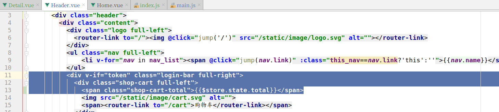

# 购物车实现

### 创建子应用 cart

```
cd luffyapi/apps
python ../../manage.py startapp cart
```


### 注册子应用cart

```python
INSTALLED_APPS = [
    'ckeditor',  # 富文本编辑器
    'ckeditor_uploader',  # 富文本编辑器上传图片模块

    'home',
    'users',
    'courses',
    'cart',
]
```


因为购物车中的商品(课程)信息会经常被用户操作,所以为了减轻mysql服务器的压力,可以选择把购物车信息通过redis来存储.

### 配置信息

```python
# 设置redis缓存
CACHES = {
    # 默认缓存
    ....
    
    "cart":{
        "BACKEND": "django_redis.cache.RedisCache",
        "LOCATION": "redis://127.0.0.1:6379/3",
        "OPTIONS": {
            "CLIENT_CLASS": "django_redis.client.DefaultClient",
        }
    },
}
```


接下来商品信息存储以下内容:

```python
购物车商品信息格式：
    商品数量[因为目前路飞学城的商品是视频，所以没有数量限制，如果以后做到真实商品，则必须有数量]
    
    商品id
    用户id
    课程有效期【一个课程有多个有效期选项，要记录用户勾选哪一个？】
    商品勾选状态【是否要结算，都是单个商品】

五种数据类型
    string字符串
        键:值
    hash哈希字典
        键:{
            域:值,
        }
    list列表
        键:[值1,值2,....]
    set集合
        键:{值1,值2,....}
    zset有序集合
        键:{
            权重值1:值,
            权重值2:值,
        }

经过比较可以发现没有一种数据类型，可以同时存储4个字段数据的，所以我们才有2种数据结构来保存购物车数据
可以发现，上面5种数据类型中，哈希hash可以存储的数据量是最多的。
hash：
    键[用户ID]:{
        域[商品ID]:值[课程有效期],
        域[商品ID]:值[课程有效期],
        域[商品ID]:值[课程有效期],
        域[商品ID]:值[课程有效期],
    }
set:    
    键[用户ID]:{商品ID1,商品ID2....}
```


## 添加课程商品到购物车的API接口实现

cart/views.py视图，代码：

```python
from rest_framework.viewsets import ViewSet
from rest_framework.permissions import IsAuthenticated
from course.models import Course
from rest_framework.response import Response
from rest_framework import status
from django_redis import get_redis_connection
import logging

log = logging.getLogger("django")

class CartAPIView(ViewSet):
    """购物车"""
    permission_classes = [IsAuthenticated]
    def add(self,request):
        """添加商品到购物车中"""
        # 接受客户端提交参数[用户ID，课程ID，勾选状态，有效期选项]
        course_id = request.data.get("course_id")
        user_id = request.user.id
        # 设置默认值
        selected = True
        expire = 0
        # 校验参数
        try:
            course = Course.objects.get(is_show=True, is_deleted=False, id=course_id)
        except Course.DoesNotExist:
            return Response({"message":"参数有误！课程不存在！"}, status=status.HTTP_400_BAD_REQUEST)

        # 获取redis连接对象
        redis_conn = get_redis_connection("cart")
        # 保存数据到redis
        try:
            pipe = redis_conn.pipeline()
            pipe.multi()
            pipe.hset("cart_%s" % user_id, course_id, expire)
            pipe.sadd("selected_%s" % user_id, course_id)
            pipe.execute()

            # 查询购物车中商品总数
            cart_num = redis_conn.hlen("cart_%s" % user_id)

        except:
            log.error("购物车数据存储错误！")
            return Response({"message": "参数有误！购物车添加商品失败！"}, status=status.HTTP_507_INSUFFICIENT_STORAGE)


        # 返回结果[当前购物车中商品总数]
        return Response({"message":"购物车商品添加成功！","length": course_len})
```


## 提供访问路由

总路由,代码：

```python
urlpatterns = [
	...
    path('cart/', include("cart.urls") ),
]
```

子应用路由cart/urls.py,代码:

```python
from django.urls import path,re_path
from . import views
urlpatterns = [
    path(r"", views.CartAPIView.as_view({"post":"add"}) ),
]
```

 为了保证系统的日志记录可以跟进redis部分的，我们还可以在之前自定义异常处理中增加关于 redis的异常捕获

utils/execptions.py，代码：

```python
from rest_framework.views import exception_handler
from django.db import DatabaseError
from rest_framework.response import Response
import logging
logger = logging.getLogger("django")
from rest_framework import status
from redis import RedisError

def custom_exception_handler(exc, context):
    """
    自定义异常处理
    :param exc:  本次请求发生的异常信息
    :param context:  本清请求发送异常的执行上下文[ 本次请求的request对象，异常发送的时间，行号等... ]
    :return:
    """
    response = exception_handler(exc, context)

    if response is None:
        """来到这里只有2种情况：要么程序没出错，要么就是出错了而django或者restframework不识别"""
        view = context["view"]
        if isinstance(exc, DatabaseError) or isinstance(exc, RedisError):
            # 数据库异常
            logger.error('[%s] %s' % (view, exc))
            response = Response({'message': '服务器内部错误，请联系客服工作人员！'}, status=status.HTTP_507_INSUFFICIENT_STORAGE)

    return response
```


## 前端提交课程到后端添加购物车数据

setting.js

```js
export default {
  Host:"http://api.luffycity.cn:8000",
  check_user_login(){
    //检查用户是否登录了
    let token = sessionStorage.user_token || localStorage.user_token;
    return token;
  }
}
```

Detail.vue添加以下代码

```html
<div class="add-cart" @click="add_cart">加入购物车</div>
```

```js
add_cart(){
    let token = this.$settings.check_user_login();
    if(!token){
        // 让用户确认是否要登录
        this.$confirm('您尚未登录,请登录再进行操作, 是否继续?', '路飞学城', {
            confirmButtonText: '登录',
            cancelButtonText: '取消',
            type: 'warning'
        }).then(() => {
            this.$router.push("/user/login");
        }).catch(() => {
            return ;
        });
    }else{
        // 添加课程商品到购物车
        this.$axios.post(`${this.$settings.Host}/cart/`,{
            course_id: this.course_id,
        },{
            headers:{
                Authorization: "jwt "+token,
            }
        }).then(response=>{
            this.$message.success("添加商品到购物车操作成功!");
        }).catch(error=>{
            this.$message.error("添加商品到购物车操作失败!");
        });
    }
}
```


```vue
<template>
    <div class="detail">
      <Header/>
      <div class="main">
        <div class="course-info">
          <div class="wrap-left">
            <videoPlayer
               class="video-player vjs-custom-skin"
               ref="videoPlayer"
               :playsinline="true"
               :options="playerOptions"
               @play="onPlayerPlay($event)"
               @pause="onPlayerPause($event)">
            </videoPlayer>
          </div>
          <div class="wrap-right">
            <h3 class="course-name">{{course.name}}</h3>
            <p class="data">{{course.students}}人在学&nbsp;&nbsp;&nbsp;&nbsp;课程总时长：{{course.lessons}}课时/{{course.lessons==course.pub_lessons?'更新完成':`已更新${course.pub_lessons}课时`}}&nbsp;&nbsp;&nbsp;&nbsp;难度：{{course.level_text}}</p>
            <div class="sale-time">
              <p class="sale-type">限时免费</p>
              <p class="expire">距离结束：仅剩 01天 04小时 33分 <span class="second">08</span> 秒</p>
            </div>
            <p class="course-price">
              <span>活动价</span>
              <span class="discount">¥0.00</span>
              <span class="original">¥{{course.price}}</span>
            </p>
            <div class="buy">
              <div class="buy-btn">
                <button class="buy-now">立即购买</button>
                <button class="free">免费试学</button>
              </div>
              <div class="add-cart" @click="add_cart">加入购物车</div>
            </div>
          </div>
        </div>
        <div class="course-tab">
          <ul class="tab-list">
            <li :class="tabIndex==1?'active':''" @click="tabIndex=1">详情介绍</li>
            <li :class="tabIndex==2?'active':''" @click="tabIndex=2">课程章节 <span :class="tabIndex!=2?'free':''">(试学)</span></li>
            <li :class="tabIndex==3?'active':''" @click="tabIndex=3">用户评论 (42)</li>
            <li :class="tabIndex==4?'active':''" @click="tabIndex=4">常见问题</li>
          </ul>
        </div>
        <div class="course-content">
          <div class="course-tab-list">
            <div v-html="pad_image_url(course.brief)" class="tab-item" v-if="tabIndex==1">

            </div>
            <div class="tab-item" v-if="tabIndex==2">
              <div class="tab-item-title">
                <p class="chapter">课程章节</p>
                <p class="chapter-length">共11章 147个课时</p>
              </div>
              <div class="chapter-item" v-for="chapter in chapter_list">
                <p class="chapter-title">第{{chapter.chapter}}章·{{chapter.name}}</p>
                <ul class="lesson-list">
                  <li class="lesson-item" v-for="lesson in chapter.lesson_list">
                    <p class="name"><span class="index">{{chapter.chapter}}-{{lesson.lesson}}</span> {{lesson.name}}<span class="free" v-if="lesson.free_trail">免费</span></p>
                    <p class="time">{{lesson.duration}} </p>
                    <button class="try" v-if="lesson.free_trail">
                      <router-link v-if="lesson.section_type===0" data="文档" to="/">立即试学</router-link>
                      <router-link v-else-if="lesson.section_type===1" data="练习" to="/">立即试学</router-link>
                      <router-link v-else data="视频" to="/">立即试学</router-link>
                      <router-link to="/">立即试学</router-link>
                    </button>
                    <button class="try" v-else>立即购买</button>
                  </li>

                </ul>
              </div>
            </div>
            <div class="tab-item" v-if="tabIndex==3">
              用户评论
            </div>
            <div class="tab-item" v-if="tabIndex==4">
              常见问题
            </div>
          </div>
          <div class="course-side">
             <div class="teacher-info">
               <h4 class="side-title"><span>授课老师</span></h4>
               <div class="teacher-content">
                 <div class="cont1">
                   
                   <div class="name">
                     <p class="teacher-name">{{course.teacher.name}}</p>
                     <p class="teacher-title">{{course.teacher.signature}} {{course.teacher.title}}</p>
                   </div>
                 </div>
                 <p class="narrative" >{{course.teacher.brief}}</p>
               </div>
             </div>
          </div>
        </div>
      </div>
      <Footer/>
    </div>
</template>

<script>
import Header from "./common/Header"
import Footer from "./common/Footer"
import {videoPlayer} from 'vue-video-player';

export default {
    name: "Detail",
    data(){
      return {
        course_id: 0,     // 当前课程的ID
        course: {         // 当前课程的基本信息
          teacher:{},
        },
        chapter_list:[], // 当前课程的章节列表
        tabIndex:2, // 当前选项卡显示的下标
        playerOptions: {  // vue-video-player的初始化配置参数
          playbackRates: [0.7, 1.0, 1.5, 2.0], // 播放速度
          autoplay: false, //如果true,则自动播放
          muted: false, // 默认情况下将会消除任何音频。
          loop: false, // 循环播放
          preload: 'auto',     // 建议浏览器在<video>加载元素后是否应该开始下载视频数据。auto浏览器选择最佳行为,立即开始加载视频（如果浏览器支持）
          language: 'zh-CN',
          aspectRatio: '16:9', // 将播放器置于流畅模式，并在计算播放器的动态大小时使用该值。值应该代表一个比例 - 用冒号分隔的两个数字（例如"16:9"或"4:3"）
          fluid: true, // 当true时，Video.js player将拥有流体大小。换句话说，它将按比例缩放以适应其容器。
          sources: [{ // 播放资源和资源格式
            type: "video/mp4",
            src: "http://img.ksbbs.com/asset/Mon_1703/05cacb4e02f9d9e.mp4", //你的视频地址（必填）
          }],
          poster: "../static/image/course-cover.jpeg", //视频封面图
          width: document.documentElement.clientWidth, // 默认视频全屏时的最大宽度
          notSupportedMessage: '此视频暂无法播放，请稍后再试', //允许覆盖Video.js无法播放媒体源时显示的默认信息。
        }
      }
    },
    created(){
      // 课程ID
      this.get_course_id();
      this.get_course();
      this.get_chapter();
    },
    methods: {
      get_course_id(){
          // 获取课程id
          this.course_id = this.$route.params.id; // 获取路由参数，参数名称是在index.js理由文件中已经指定名称的
          // alert(this.course_id);
          // let num = this.$route.query.num; // 获取地址栏上问号后面的查询字符串 例如 /course/11?num=100
          // alert(num)
          if(this.course_id<1){
              let self = this;
              this.$alert('对不起，非法参数！不可以访问当前页面！',`路飞学城`,{
                  callback(){
                      self.$router.go(-1);
                  }
              });
              return;
          }
      },
      get_course(){
          // 获取课程详细信息
          this.$axios.get(`${this.$settings.Host}/course/${this.course_id}/`).then(response=>{
              this.course = response.data;
              // 修改vue-video-player的视频和封面图片
              this.playerOptions.poster = response.data.course_img;
              this.playerOptions.sources[0].src = response.data.course_video;
          }).catch(error=>{
              this.$alert('对不起，获取课程信息失败，请联系客服工作人员！',`路飞学城`,{
                  callback(){
                      self.$router.go(-1);
                  }
              });
          });
      },
      get_chapter(){
          // 获取当前课程的章节信息
          this.$axios.get(`${this.$settings.Host}/course/chapter/`,{
              params:{
                  course: this.course_id,
              }
          }).then(response=>{
              this.chapter_list = response.data;
          }).catch(error=>{
              let self = this;
              this.$alert('对不起，无法获取当前课程的章节信息',"路飞学城",{
                  callback(){
                      self.$router.go(-1);
                  }
              })
          })
      },
      pad_image_url(data){
          while(data.search(`"/media`) !== -1){
              data = data.replace(`"/media`,`"${this.$settings.Host}/media`);
          }
          return data;
      },
      onPlayerPlay(){
          // 播放器准备播放
          this.$alert("准备开始播放视频");
      },
      onPlayerPause(){
          // 播放器按了暂停
          this.$alert("点击了暂停按钮");
      },
      add_cart(){
        let token = this.$settings.check_user_login();
        if(!token){
          // 让用户确认是否要登录
          this.$confirm('您尚未登录,请登录再进行操作, 是否继续?', '路飞学城', {
            confirmButtonText: '登录',
            cancelButtonText: '取消',
            type: 'warning'
          }).then(() => {
            this.$router.push("/user/login");
          }).catch(() => {
            return ;
          });
        }else{
          // 添加课程商品到购物车
          this.$axios.post(`${this.$settings.Host}/cart/`,{
            course_id: this.course_id,
          },{
            headers:{
              Authorization: "jwt "+token,
            }
          }).then(response=>{
            this.$message.success("添加商品到购物车操作成功!");
          }).catch(error=>{
            this.$message.error("添加商品到购物车操作失败!");
          });
        }
      }
    },
    components:{
      Header,
      Footer,
      videoPlayer,
    }
}
</script>

<style scoped>
.main{
  background: #fff;
  padding-top: 30px;
}
.course-info{
  width: 1200px;
  margin: 0 auto;
  overflow: hidden;
}
.wrap-left{
  float: left;
  width: 690px;
  height: 388px;
  background-color: #000;
}
.wrap-right{
  float: left;
  position: relative;
  height: 388px;
}
.course-name{
  font-size: 20px;
  color: #333;
  padding: 10px 23px;
  letter-spacing: .45px;
}
.data{
  padding-left: 23px;
  padding-right: 23px;
  padding-bottom: 16px;
  font-size: 14px;
  color: #9b9b9b;
}
.sale-time{
  width: 464px;
  background: #fa6240;
  font-size: 14px;
  color: #4a4a4a;
  padding: 10px 23px;
  overflow: hidden;
}
.sale-type {
  font-size: 16px;
  color: #fff;
  letter-spacing: .36px;
  float: left;
}
.sale-time .expire{
  font-size: 14px;
  color: #fff;
  float: right;
}
.sale-time .expire .second{
  width: 24px;
  display: inline-block;
  background: #fafafa;
  color: #5e5e5e;
  padding: 6px 0;
  text-align: center;
}
.course-price{
  background: #fff;
  font-size: 14px;
  color: #4a4a4a;
  padding: 5px 23px;
}
.discount{
  font-size: 26px;
  color: #fa6240;
  margin-left: 10px;
  display: inline-block;
  margin-bottom: -5px;
}
.original{
  font-size: 14px;
  color: #9b9b9b;
  margin-left: 10px;
  text-decoration: line-through;
}
.buy{
  width: 464px;
  padding: 0px 23px;
  position: absolute;
  left: 0;
  bottom: 20px;
  overflow: hidden;
}
.buy .buy-btn{
  float: left;
}
.buy .buy-now{
  width: 125px;
  height: 40px;
  border: 0;
  background: #ffc210;
  border-radius: 4px;
  color: #fff;
  cursor: pointer;
  margin-right: 15px;
  outline: none;
}
.buy .free{
  width: 125px;
  height: 40px;
  border-radius: 4px;
  cursor: pointer;
  margin-right: 15px;
  background: #fff;
  color: #ffc210;
  border: 1px solid #ffc210;
}
.add-cart{
  float: right;
  font-size: 14px;
  color: #ffc210;
  text-align: center;
  cursor: pointer;
  margin-top: 10px;
}
.add-cart img{
  width: 20px;
  height: 18px;
  margin-right: 7px;
  vertical-align: middle;
}

.course-tab{
    width: 100%;
    background: #fff;
    margin-bottom: 30px;
    box-shadow: 0 2px 4px 0 #f0f0f0;

}
.course-tab .tab-list{
    width: 1200px;
    margin: auto;
    color: #4a4a4a;
    overflow: hidden;
}
.tab-list li{
    float: left;
    margin-right: 15px;
    padding: 26px 20px 16px;
    font-size: 17px;
    cursor: pointer;
}
.tab-list .active{
    color: #ffc210;
    border-bottom: 2px solid #ffc210;
}
.tab-list .free{
    color: #fb7c55;
}
.course-content{
    width: 1200px;
    margin: 0 auto;
    background: #FAFAFA;
    overflow: hidden;
    padding-bottom: 40px;
}
.course-tab-list{
    width: 880px;
    height: auto;
    padding: 20px;
    background: #fff;
    float: left;
    box-sizing: border-box;
    overflow: hidden;
    position: relative;
    box-shadow: 0 2px 4px 0 #f0f0f0;
}
.tab-item{
    width: 880px;
    background: #fff;
    padding-bottom: 20px;
    box-shadow: 0 2px 4px 0 #f0f0f0;
}
.tab-item-title{
    justify-content: space-between;
    padding: 25px 20px 11px;
    border-radius: 4px;
    margin-bottom: 20px;
    border-bottom: 1px solid #333;
    border-bottom-color: rgba(51,51,51,.05);
    overflow: hidden;
}
.chapter{
    font-size: 17px;
    color: #4a4a4a;
    float: left;
}
.chapter-length{
    float: right;
    font-size: 14px;
    color: #9b9b9b;
    letter-spacing: .19px;
}
.chapter-title{
    font-size: 16px;
    color: #4a4a4a;
    letter-spacing: .26px;
    padding: 12px;
    background: #eee;
    border-radius: 2px;
    display: -ms-flexbox;
    display: flex;
    -ms-flex-align: center;
    align-items: center;
}
.chapter-title img{
    width: 18px;
    height: 18px;
    margin-right: 7px;
    vertical-align: middle;
}
.lesson-list{
    padding:0 20px;
}
.lesson-list .lesson-item{
    padding: 15px 20px 15px 36px;
    cursor: pointer;
    justify-content: space-between;
    position: relative;
    overflow: hidden;
}
.lesson-item .name{
    font-size: 14px;
    color: #666;
    float: left;
}
.lesson-item .index{
    margin-right: 5px;
}
.lesson-item .free{
    font-size: 12px;
    color: #fff;
    letter-spacing: .19px;
    background: #ffc210;
    border-radius: 100px;
    padding: 1px 9px;
    margin-left: 10px;
}
.lesson-item .time{
    font-size: 14px;
    color: #666;
    letter-spacing: .23px;
    opacity: 1;
    transition: all .15s ease-in-out;
    float: right;
}
.lesson-item .time img{
    width: 18px;
    height: 18px;
    margin-left: 15px;
    vertical-align: text-bottom;
}
.lesson-item .try{
    width: 86px;
    height: 28px;
    background: #ffc210;
    border-radius: 4px;
    font-size: 14px;
    color: #fff;
    position: absolute;
    right: 20px;
    top: 10px;
    opacity: 0;
    transition: all .2s ease-in-out;
    cursor: pointer;
    outline: none;
    border: none;
}
.lesson-item:hover{
    background: #fcf7ef;
    box-shadow: 0 0 0 0 #f3f3f3;
}
.lesson-item:hover .name{
    color: #333;
}
.lesson-item:hover .try{
    opacity: 1;
}

.course-side{
    width: 300px;
    height: auto;
    margin-left: 20px;
    float: right;
}
.teacher-info{
    background: #fff;
    margin-bottom: 20px;
    box-shadow: 0 2px 4px 0 #f0f0f0;
}
.side-title{
    font-weight: normal;
    font-size: 17px;
    color: #4a4a4a;
    padding: 18px 14px;
    border-bottom: 1px solid #333;
    border-bottom-color: rgba(51,51,51,.05);
}
.side-title span{
    display: inline-block;
    border-left: 2px solid #ffc210;
    padding-left: 12px;
}

.teacher-content{
    padding: 30px 20px;
    box-sizing: border-box;
}

.teacher-content .cont1{
    ma rgin-bottom: 12px;
    overflow: hidden;
}

.teacher-content .cont1 img{
    width: 54px;
    height: 54px;
    margin-right: 12px;
    float: left;
}
.teacher-content .cont1 .name{
    float: right;
}
.teacher-content .cont1 .teacher-name{
    width: 188px;
    font-size: 16px;
    color: #4a4a4a;
    padding-bottom: 4px;
}
.teacher-content .cont1 .teacher-title{
    width: 188px;
    font-size: 13px;
    color: #9b9b9b;
    white-space: nowrap;
}
.teacher-content .narrative{
    font-size: 14px;
    color: #666;
    line-height: 24px;
}
</style>

```

#### 前端展示商品课程的总数

后端返回了当前用户的购物车商品总数,所以我们要把这个值展示到页面头部中.但是这个页面头部,是大部分页面的公共头部,所以我们需要把这个值保存到一个全局访问的地方,让所有的页面加载头部时,都可以共享访问

获取商品总数是在头部组件中使用到，并展示出来，但是我们后面可以在购物车中，或者商品课程的详情页中修改购物车中商品总数，**因为对于一些数据，需要在多个组件中即时共享，这种情况，我们可以使用本地存储来完成，但是也可以通过vuex组件来完成这个功能**。

##### 安装vuex，实现组件数据共享

lufei_pc下安装

```python
npm install -S vuex
```

##### 把vuex注册到vue中

1. 在src目录下创建store目录，并在store目录下创建一个index.js文件，index.js文件代码：

   ```javascript
   import Vue from 'vue'
   
   import Vuex from 'vuex'
   
   Vue.use(Vuex);
   
   export default new Vuex.Store({
     // 数据仓库,类似vue组件里面的data
     state: {
   
     },
     // 数据操作方法,类似vue里面的methods
     mutations: {
   
     }
   });
   
   ```


2. 把上面index.js中创建的store对象注册到main.js的vue中。

```javascript
// The Vue build version to load with the `import` command
// (runtime-only or standalone) has been set in webpack.base.conf with an alias.
import Vue from 'vue'
import axios from 'axios';
import App from './App'
import router from './router'
import settings from "./settings";
Vue.config.productionTip = false;
import store from "./store/index";		//导入store

Vue.prototype.$settings = settings;

// 允许ajax发送请求时附带cookie
axios.defaults.withCredentials = false;
Vue.prototype.$axios = axios;

// ElementUI 导入
import ElementUI from 'element-ui';
import 'element-ui/lib/theme-chalk/index.css';

// 调用插件
Vue.use(ElementUI);

// 引入全局重置样式
import "../static/css/reset.css";

// 导入gt极验
import '../static/js/gt.js'

// vue-video-player播放器组件的注册
require('video.js/dist/video-js.css');
require('vue-video-player/src/custom-theme.css');
import VideoPlayer from 'vue-video-player'
Vue.use(VideoPlayer);

/* eslint-disable no-new */
new Vue({
  el: '#app',
  router,
  store,				//在这里注册store
  components: { App },
  template: '<App/>'
});
```


接下来，我们就可以在组件使用到store中state里面保存的共享数据了.

先到vuex中添加数据，store/inde.js，代码

```javascript
import Vue from "vue"
import Vuex from 'vuex'

Vue.use(Vuex);

export default new Vuex.Store({
  // 数据仓库,类似vue组件里面的data
  state: {

  },
  // 数据操作方法,类似vue里面的methods
  mutations: {

  }
})

```

在Header.vue头部组件中，直接读取store里面的数据

```vue
          <div v-if="token" class="login-bar full-right">
            <div class="shop-cart full-left">
              <span class="shop-cart-total">{{this.$store.state.cart.num}}</span>

// this可以省略不写。
          <div v-if="token" class="login-bar full-right">
            <div class="shop-cart full-left">
              <span class="shop-cart-total">{{$store.state.cart.num}}</span>
```




接下来,我们就可以在用户登录以后,返回user_id,user_token的时候,顺便查询购物车中的商品总数,一并返回. user/utils.py

```python
from django_redis import get_redis_connection

def jwt_response_payload_handler(token, user=None, request=None):
    """
    自定义jwt认证成功返回数据
    :param token 在登录视图里面调用的序列化器生成的jwt token
    :param user  在登录视图里面调用的序列化器获取到的当前用户模型对象
    :param request 本次客户端请求中，客户端的请求对象
    :return 字典，包含了jwt和用户的相关信息
    """

    # 获取用户购物车中的商品数量
    redis_conn = get_redis_connection("cart")
    cart_num = redis_conn.hlen("cart_%s" % user.id)
    return {
        'token': token,
        'id': user.id,
        'username': user.username,
        "cart_num": cart_num,
    }

```

方法一：在客户端中的登录页面中, 把当前新增返回的购物车商品数量保存到vuex里面.（不推荐）

方法二：在store/index.js中新增mutations的方法，代码：

```javascript
import Vue from 'vue'

import Vuex from 'vuex'

Vue.use(Vuex);

export default new Vuex.Store({
  // 数据仓库,类似vue里面的data
  state: {
    // 购物车数据
    cart:{
      num: 0,
    }
  },

  // 数据操作方法,类似vue里面的methods
  mutations: {
     // 修改购物车的商品总数
    update_num(state,data){
      state.cart.num = data;

    }
  }
});

```

在用户登录成功以后,更新num的数值,Login.vue,代码:

```js
// 保存购物车商品数量到Vuex,调用updae_num方法，response.data.cart_num为传进去的参数
this.$store.commit(`update_num`, response.data.cart_num);
```

Login.vue

```vue
<template>
	<div class="login box">
		
		<div class="login">
			<div class="login-title">
				
				<p>帮助有志向的年轻人通过努力学习获得体面的工作和生活!</p>
			</div>
			<div class="login_box">
				<div class="title">
					<span @click="login_type=0">密码登录</span>
					<span @click="login_type=1">短信登录</span>
				</div>
				<div class="inp" v-if="login_type==0">
					<input v-model="username" type="text" placeholder="用户名 / 手机号码" class="user">
					<input v-model="password" type="password" name="" class="pwd" placeholder="密码">
					<div id="geetest1"></div>
					<div class="rember">
						<p>
							<input type="checkbox" class="no" v-model="remember"/>
							<span>记住密码</span>
						</p>
						<p>忘记密码</p>
					</div>
					<button class="login_btn" @click="get_captcha">登录</button>
					<p class="go_login" >没有账号 <router-link to="/user/register">立即注册</router-link></p>
				</div>
				<div class="inp" v-show="login_type==1">
					<input v-model = "username" type="text" placeholder="手机号码" class="user">
					<input v-model = "password"  type="text" class="pwd" placeholder="短信验证码">
          <button id="get_code">获取验证码</button>
					<button class="login_btn">登录</button>
					<p class="go_login" >没有账号 <router-link to="/user/register">立即注册</router-link></p>
				</div>
			</div>
		</div>
	</div>
</template>

<script>
export default {
  name: 'Login',
  data(){
    return {
        login_type: 0,
        username: "",
        password: "",
        remember: false,
    }
  },

  methods:{
    get_captcha(){
        this.$axios.get(`${this.$settings.Host}/user/captcha/`).then(response=>{
            // 使用initGeetest接口
            // 参数1：配置参数
            // 参数2：回调，回调的第一个参数验证码对象，之后可以使用它做appendTo之类的事件
            let data = JSON.parse(response.data);
            initGeetest({
                gt: data.gt,
                challenge: data.challenge,
                product: "popup", // 产品形式，包括：float，embed，popup。注意只对PC版验证码有效
                offline: !data.success // 表示用户后台检测极验服务器是否宕机，一般不需要关注
                // 更多配置参数请参见：http://www.geetest.com/install/sections/idx-client-sdk.html#config
            }, this.handlerPopup);
        }).catch(error=>{
           this.$alert("获取验证码失败！");
        });
    },
    handlerPopup(captchaObj){
        // 成功的回调
        let self = this;
        captchaObj.onSuccess(function () {
            var validate = captchaObj.getValidate();
            self.$axios.post(`${self.$settings.Host}/user/captcha/`,{
                geetest_challenge: validate.geetest_challenge,
                geetest_validate: validate.geetest_validate,
                geetest_seccode: validate.geetest_seccode
            }).then(response=>{
               // 验证码验证通过以后，要调用登录处理
               self.loginHandler();
            }).catch(error=>{
               self.$alert("验证码验证错误！");
            });
        });

        // 将验证码加到id为geetest1的元素里
        document.getElementById("geetest1").innerHTML = "";
        captchaObj.appendTo("#geetest1");

    },
    loginHandler(){
        // 登录处理
        if(this.username.length<1 || this.password.length<1){
            this.$alert('当前账号和密码不能为空！', '路飞学城');
            return;
        }
        this.$axios.post(`${this.$settings.Host}/user/login/`,{
            username: this.username,
            password: this.password,
        }).then(response=>{
            // 登录成功保存jwt
            if(this.remember){
                // 记住密码
                sessionStorage.removeItem("user_token");
                sessionStorage.removeItem("user_id");
                sessionStorage.removeItem("user_name");
                localStorage.user_token = response.data.token;
                localStorage.user_id = response.data.id;
                localStorage.user_name = response.data.username;
            }else{
                // 不记住密码
                localStorage.removeItem("user_token");
                localStorage.removeItem("user_id");
                localStorage.removeItem("user_name");
                sessionStorage.user_token = response.data.token;
                sessionStorage.user_id = response.data.id;
                sessionStorage.user_name = response.data.username;
            }
            // 保存购物车商品数量到Vuex
            this.$store.commit(`update_num`, response.data.cart_num);
            // 保存了token以后，进行页面跳转跳转
            let self = this;
            this.$alert("登录成功！欢迎回来","路飞学城",{
                callback(){
                    // self.$router.push("/"); // 返回首页
                    self.$router.go(-1); // 返回上一页
                }
            })
        }).catch(error=>{
            this.$alert('登录失败！账号或密码错误！', '路飞学城');
        })
    }
  },

};
</script>

<style scoped>
.box{
	width: 100%;
  height: 100%;
	position: relative;
  overflow: hidden;
}
.box img{
	width: 100%;
  min-height: 100%;
}
.box .login {
	position: absolute;
	width: 500px;
	height: 400px;
	left: 0;
  margin: auto;
  right: 0;
  bottom: 0;
  top: -338px;
}
.login .login-title{
     width: 100%;
    text-align: center;
}
.login-title img{
    width: 190px;
    height: auto;
}
.login-title p{
    font-size: 18px;
    color: #fff;
    letter-spacing: .29px;
    padding-top: 10px;
    padding-bottom: 50px;
}
.login_box{
    width: 400px;
    height: auto;
    background: #fff;
    box-shadow: 0 2px 4px 0 rgba(0,0,0,.5);
    border-radius: 4px;
    margin: 0 auto;
    padding-bottom: 40px;
}
.login_box .title{
	font-size: 20px;
	color: #9b9b9b;
	letter-spacing: .32px;
	border-bottom: 1px solid #e6e6e6;
	 display: flex;
    	justify-content: space-around;
    	padding: 50px 60px 0 60px;
    	margin-bottom: 20px;
    	cursor: pointer;
}
.login_box .title span:nth-of-type(1){
	color: #4a4a4a;
    	border-bottom: 2px solid #84cc39;
}

.inp{
	width: 350px;
	margin: 0 auto;
}
.inp input{
    outline: 0;
    width: 100%;
    height: 45px;
    border-radius: 4px;
    border: 1px solid #d9d9d9;
    text-indent: 20px;
    font-size: 14px;
    background: #fff !important;
}
.inp input.user{
    margin-bottom: 16px;
}
.inp .rember{
     display: flex;
    justify-content: space-between;
    align-items: center;
    position: relative;
    margin-top: 10px;
}
.inp .rember p:first-of-type{
    font-size: 12px;
    color: #4a4a4a;
    letter-spacing: .19px;
    margin-left: 22px;
    display: -ms-flexbox;
    display: flex;
    -ms-flex-align: center;
    align-items: center;
    /*position: relative;*/
}
.inp .rember p:nth-of-type(2){
    font-size: 14px;
    color: #9b9b9b;
    letter-spacing: .19px;
    cursor: pointer;
}

.inp .rember input{
    outline: 0;
    width: 30px;
    height: 45px;
    border-radius: 4px;
    border: 1px solid #d9d9d9;
    text-indent: 20px;
    font-size: 14px;
    background: #fff !important;
}

.inp .rember p span{
    display: inline-block;
  font-size: 12px;
  width: 100px;
  /*position: absolute;*/
/*left: 20px;*/

}
#geetest1{
	margin-top: 20px;
}
.login_btn{
     width: 100%;
    height: 45px;
    background: #84cc39;
    border-radius: 5px;
    font-size: 16px;
    color: #fff;
    letter-spacing: .26px;
    margin-top: 30px;
}
.inp .go_login{
    text-align: center;
    font-size: 14px;
    color: #9b9b9b;
    letter-spacing: .26px;
    padding-top: 20px;
}
.inp .go_login span{
    color: #84cc39;
    cursor: pointer;
}
</style>
```


我们还可以在课程详情的组件调用更新num的方法，在成功添加商品到购物车时更新商品总数。

服务端中添加商品到购物车的接口返回结果,增加返回购物车商品总数

```js
return Response({"cart_num":cart_num},status=status.HTTP_201_CREATED)
```

```python
# Create your views here.
from rest_framework.viewsets import ViewSet
from django_redis import get_redis_connection
from rest_framework.response import Response
from rest_framework import status
class CartViewSet(ViewSet):
    def post(self,request):
        """添加商品课程到购物车中"""
        """接收客户端提交的数据"""
        user_id = request.user.id
        course_id=request.data.get("course_id")   #对数据进行验证
        expire_time = 0
        # 打开redis连接
        redis_conn = get_redis_connection("cart")

        # 把图片/文件保存到redis中`
        redis_conn = get_redis_connection("cart")
        pipe = redis_conn.pipeline()
        pipe.multi()
        pipe.hset("cart_%s" % user_id, course_id, expire_time)
        pipe.sadd("selected_%s" % user_id, course_id) # 默认用户添加商品到购物车时就是默认选中
        pipe.execute()
        cart_num = redis_conn.hlen("cart_%s" % user_id)

        # 返回数据给客户端
        return Response({"cart_num":cart_num},status=status.HTTP_201_CREATED)

    def delete(self,request):
        pass

    def update(self,request):
        pass

    def get(self,request):
        pass
```


Detail.vue增加代码:

```js
.then(response=>{
            this.$message.success("添加商品到购物车操作成功!");
            this.$store.commit(`update_num`, response.data.cart_num);
```

```vue
<template>
    <div class="detail">
      <Header/>
      <div class="main">
        <div class="course-info">
          <div class="wrap-left">
            <videoPlayer
               class="video-player vjs-custom-skin"
               ref="videoPlayer"
               :playsinline="true"
               :options="playerOptions"
               @play="onPlayerPlay($event)"
               @pause="onPlayerPause($event)">
            </videoPlayer>
          </div>
          <div class="wrap-right">
            <h3 class="course-name">{{course.name}}</h3>
            <p class="data">{{course.students}}人在学&nbsp;&nbsp;&nbsp;&nbsp;课程总时长：{{course.lessons}}课时/{{course.lessons==course.pub_lessons?'更新完成':`已更新${course.pub_lessons}课时`}}&nbsp;&nbsp;&nbsp;&nbsp;难度：{{course.level_text}}</p>
            <div class="sale-time">
              <p class="sale-type">限时免费</p>
              <p class="expire">距离结束：仅剩 01天 04小时 33分 <span class="second">08</span> 秒</p>
            </div>
            <p class="course-price">
              <span>活动价</span>
              <span class="discount">¥0.00</span>
              <span class="original">¥{{course.price}}</span>
            </p>
            <div class="buy">
              <div class="buy-btn">
                <button class="buy-now">立即购买</button>
                <button class="free">免费试学</button>
              </div>
              <div class="add-cart" @click="add_cart">加入购物车</div>
            </div>
          </div>
        </div>
        <div class="course-tab">
          <ul class="tab-list">
            <li :class="tabIndex==1?'active':''" @click="tabIndex=1">详情介绍</li>
            <li :class="tabIndex==2?'active':''" @click="tabIndex=2">课程章节 <span :class="tabIndex!=2?'free':''">(试学)</span></li>
            <li :class="tabIndex==3?'active':''" @click="tabIndex=3">用户评论 (42)</li>
            <li :class="tabIndex==4?'active':''" @click="tabIndex=4">常见问题</li>
          </ul>
        </div>
        <div class="course-content">
          <div class="course-tab-list">
            <div v-html="pad_image_url(course.brief)" class="tab-item" v-if="tabIndex==1">

            </div>
            <div class="tab-item" v-if="tabIndex==2">
              <div class="tab-item-title">
                <p class="chapter">课程章节</p>
                <p class="chapter-length">共11章 147个课时</p>
              </div>
              <div class="chapter-item" v-for="chapter in chapter_list">
                <p class="chapter-title">第{{chapter.chapter}}章·{{chapter.name}}</p>
                <ul class="lesson-list">
                  <li class="lesson-item" v-for="lesson in chapter.lesson_list">
                    <p class="name"><span class="index">{{chapter.chapter}}-{{lesson.lesson}}</span> {{lesson.name}}<span class="free" v-if="lesson.free_trail">免费</span></p>
                    <p class="time">{{lesson.duration}} </p>
                    <button class="try" v-if="lesson.free_trail">
                      <router-link v-if="lesson.section_type===0" data="文档" to="/">立即试学</router-link>
                      <router-link v-else-if="lesson.section_type===1" data="练习" to="/">立即试学</router-link>
                      <router-link v-else data="视频" to="/">立即试学</router-link>
                      <router-link to="/">立即试学</router-link>
                    </button>
                    <button class="try" v-else>立即购买</button>
                  </li>

                </ul>
              </div>
            </div>
            <div class="tab-item" v-if="tabIndex==3">
              用户评论
            </div>
            <div class="tab-item" v-if="tabIndex==4">
              常见问题
            </div>
          </div>
          <div class="course-side">
             <div class="teacher-info">
               <h4 class="side-title"><span>授课老师</span></h4>
               <div class="teacher-content">
                 <div class="cont1">
                   
                   <div class="name">
                     <p class="teacher-name">{{course.teacher.name}}</p>
                     <p class="teacher-title">{{course.teacher.signature}} {{course.teacher.title}}</p>
                   </div>
                 </div>
                 <p class="narrative" >{{course.teacher.brief}}</p>
               </div>
             </div>
          </div>
        </div>
      </div>
      <Footer/>
    </div>
</template>

<script>
import Header from "./common/Header"
import Footer from "./common/Footer"
import {videoPlayer} from 'vue-video-player';

export default {
    name: "Detail",
    data(){
      return {
        course_id: 0,     // 当前课程的ID
        course: {         // 当前课程的基本信息
          teacher:{},
        },
        chapter_list:[], // 当前课程的章节列表
        tabIndex:2, // 当前选项卡显示的下标
        playerOptions: {  // vue-video-player的初始化配置参数
          playbackRates: [0.7, 1.0, 1.5, 2.0], // 播放速度
          autoplay: false, //如果true,则自动播放
          muted: false, // 默认情况下将会消除任何音频。
          loop: false, // 循环播放
          preload: 'auto',     // 建议浏览器在<video>加载元素后是否应该开始下载视频数据。auto浏览器选择最佳行为,立即开始加载视频（如果浏览器支持）
          language: 'zh-CN',
          aspectRatio: '16:9', // 将播放器置于流畅模式，并在计算播放器的动态大小时使用该值。值应该代表一个比例 - 用冒号分隔的两个数字（例如"16:9"或"4:3"）
          fluid: true, // 当true时，Video.js player将拥有流体大小。换句话说，它将按比例缩放以适应其容器。
          sources: [{ // 播放资源和资源格式
            type: "video/mp4",
            src: "http://img.ksbbs.com/asset/Mon_1703/05cacb4e02f9d9e.mp4", //你的视频地址（必填）
          }],
          poster: "../static/image/course-cover.jpeg", //视频封面图
          width: document.documentElement.clientWidth, // 默认视频全屏时的最大宽度
          notSupportedMessage: '此视频暂无法播放，请稍后再试', //允许覆盖Video.js无法播放媒体源时显示的默认信息。
        }
      }
    },
    created(){
      // 课程ID
      this.get_course_id();
      this.get_course();
      this.get_chapter();
    },
    methods: {
      get_course_id(){
          // 获取课程id
          this.course_id = this.$route.params.id; // 获取路由参数，参数名称是在index.js理由文件中已经指定名称的
          // alert(this.course_id);
          // let num = this.$route.query.num; // 获取地址栏上问号后面的查询字符串 例如 /course/11?num=100
          // alert(num)
          if(this.course_id<1){
              let self = this;
              this.$alert('对不起，非法参数！不可以访问当前页面！',`路飞学城`,{
                  callback(){
                      self.$router.go(-1);
                  }
              });
              return;
          }
      },
      get_course(){
          // 获取课程详细信息
          this.$axios.get(`${this.$settings.Host}/course/${this.course_id}/`).then(response=>{
              this.course = response.data;
              // 修改vue-video-player的视频和封面图片
              this.playerOptions.poster = response.data.course_img;
              this.playerOptions.sources[0].src = response.data.course_video;
          }).catch(error=>{
              this.$alert('对不起，获取课程信息失败，请联系客服工作人员！',`路飞学城`,{
                  callback(){
                      self.$router.go(-1);
                  }
              });
          });
      },
      get_chapter(){
          // 获取当前课程的章节信息
          this.$axios.get(`${this.$settings.Host}/course/chapter/`,{
              params:{
                  course: this.course_id,
              }
          }).then(response=>{
              this.chapter_list = response.data;
          }).catch(error=>{
              let self = this;
              this.$alert('对不起，无法获取当前课程的章节信息',"路飞学城",{
                  callback(){
                      self.$router.go(-1);
                  }
              })
          })
      },
      pad_image_url(data){
          while(data.search(`"/media`) !== -1){
              data = data.replace(`"/media`,`"${this.$settings.Host}/media`);
          }
          return data;
      },
      onPlayerPlay(){
          // 播放器准备播放
          this.$alert("准备开始播放视频");
      },
      onPlayerPause(){
          // 播放器按了暂停
          this.$alert("点击了暂停按钮");
      },
      add_cart(){
        let token = this.$settings.check_user_login();
        if(!token){
          // 让用户确认是否要登录
          this.$confirm('您尚未登录,请登录再进行操作, 是否继续?', '路飞学城', {
            confirmButtonText: '登录',
            cancelButtonText: '取消',
            type: 'warning'
          }).then(() => {
            this.$router.push("/user/login");
          }).catch(() => {
            return ;
          });
        }else{
          // 添加课程商品到购物车
          this.$axios.post(`${this.$settings.Host}/cart/`,{
            course_id: this.course_id,
          },{
            headers:{
              Authorization: "jwt "+token,
            }
          }).then(response=>{
            this.$message.success("添加商品到购物车操作成功!");
            this.$store.commit(`update_num`, response.data.cart_num);
          }).catch(error=>{
            this.$message.error("添加商品到购物车操作失败!");
          });
        }
      }
    },
    components:{
      Header,
      Footer,
      videoPlayer,
    }
}
</script>

<style scoped>
.main{
  background: #fff;
  padding-top: 30px;
}
.course-info{
  width: 1200px;
  margin: 0 auto;
  overflow: hidden;
}
.wrap-left{
  float: left;
  width: 690px;
  height: 388px;
  background-color: #000;
}
.wrap-right{
  float: left;
  position: relative;
  height: 388px;
}
.course-name{
  font-size: 20px;
  color: #333;
  padding: 10px 23px;
  letter-spacing: .45px;
}
.data{
  padding-left: 23px;
  padding-right: 23px;
  padding-bottom: 16px;
  font-size: 14px;
  color: #9b9b9b;
}
.sale-time{
  width: 464px;
  background: #fa6240;
  font-size: 14px;
  color: #4a4a4a;
  padding: 10px 23px;
  overflow: hidden;
}
.sale-type {
  font-size: 16px;
  color: #fff;
  letter-spacing: .36px;
  float: left;
}
.sale-time .expire{
  font-size: 14px;
  color: #fff;
  float: right;
}
.sale-time .expire .second{
  width: 24px;
  display: inline-block;
  background: #fafafa;
  color: #5e5e5e;
  padding: 6px 0;
  text-align: center;
}
.course-price{
  background: #fff;
  font-size: 14px;
  color: #4a4a4a;
  padding: 5px 23px;
}
.discount{
  font-size: 26px;
  color: #fa6240;
  margin-left: 10px;
  display: inline-block;
  margin-bottom: -5px;
}
.original{
  font-size: 14px;
  color: #9b9b9b;
  margin-left: 10px;
  text-decoration: line-through;
}
.buy{
  width: 464px;
  padding: 0px 23px;
  position: absolute;
  left: 0;
  bottom: 20px;
  overflow: hidden;
}
.buy .buy-btn{
  float: left;
}
.buy .buy-now{
  width: 125px;
  height: 40px;
  border: 0;
  background: #ffc210;
  border-radius: 4px;
  color: #fff;
  cursor: pointer;
  margin-right: 15px;
  outline: none;
}
.buy .free{
  width: 125px;
  height: 40px;
  border-radius: 4px;
  cursor: pointer;
  margin-right: 15px;
  background: #fff;
  color: #ffc210;
  border: 1px solid #ffc210;
}
.add-cart{
  float: right;
  font-size: 14px;
  color: #ffc210;
  text-align: center;
  cursor: pointer;
  margin-top: 10px;
}
.add-cart img{
  width: 20px;
  height: 18px;
  margin-right: 7px;
  vertical-align: middle;
}

.course-tab{
    width: 100%;
    background: #fff;
    margin-bottom: 30px;
    box-shadow: 0 2px 4px 0 #f0f0f0;

}
.course-tab .tab-list{
    width: 1200px;
    margin: auto;
    color: #4a4a4a;
    overflow: hidden;
}
.tab-list li{
    float: left;
    margin-right: 15px;
    padding: 26px 20px 16px;
    font-size: 17px;
    cursor: pointer;
}
.tab-list .active{
    color: #ffc210;
    border-bottom: 2px solid #ffc210;
}
.tab-list .free{
    color: #fb7c55;
}
.course-content{
    width: 1200px;
    margin: 0 auto;
    background: #FAFAFA;
    overflow: hidden;
    padding-bottom: 40px;
}
.course-tab-list{
    width: 880px;
    height: auto;
    padding: 20px;
    background: #fff;
    float: left;
    box-sizing: border-box;
    overflow: hidden;
    position: relative;
    box-shadow: 0 2px 4px 0 #f0f0f0;
}
.tab-item{
    width: 880px;
    background: #fff;
    padding-bottom: 20px;
    box-shadow: 0 2px 4px 0 #f0f0f0;
}
.tab-item-title{
    justify-content: space-between;
    padding: 25px 20px 11px;
    border-radius: 4px;
    margin-bottom: 20px;
    border-bottom: 1px solid #333;
    border-bottom-color: rgba(51,51,51,.05);
    overflow: hidden;
}
.chapter{
    font-size: 17px;
    color: #4a4a4a;
    float: left;
}
.chapter-length{
    float: right;
    font-size: 14px;
    color: #9b9b9b;
    letter-spacing: .19px;
}
.chapter-title{
    font-size: 16px;
    color: #4a4a4a;
    letter-spacing: .26px;
    padding: 12px;
    background: #eee;
    border-radius: 2px;
    display: -ms-flexbox;
    display: flex;
    -ms-flex-align: center;
    align-items: center;
}
.chapter-title img{
    width: 18px;
    height: 18px;
    margin-right: 7px;
    vertical-align: middle;
}
.lesson-list{
    padding:0 20px;
}
.lesson-list .lesson-item{
    padding: 15px 20px 15px 36px;
    cursor: pointer;
    justify-content: space-between;
    position: relative;
    overflow: hidden;
}
.lesson-item .name{
    font-size: 14px;
    color: #666;
    float: left;
}
.lesson-item .index{
    margin-right: 5px;
}
.lesson-item .free{
    font-size: 12px;
    color: #fff;
    letter-spacing: .19px;
    background: #ffc210;
    border-radius: 100px;
    padding: 1px 9px;
    margin-left: 10px;
}
.lesson-item .time{
    font-size: 14px;
    color: #666;
    letter-spacing: .23px;
    opacity: 1;
    transition: all .15s ease-in-out;
    float: right;
}
.lesson-item .time img{
    width: 18px;
    height: 18px;
    margin-left: 15px;
    vertical-align: text-bottom;
}
.lesson-item .try{
    width: 86px;
    height: 28px;
    background: #ffc210;
    border-radius: 4px;
    font-size: 14px;
    color: #fff;
    position: absolute;
    right: 20px;
    top: 10px;
    opacity: 0;
    transition: all .2s ease-in-out;
    cursor: pointer;
    outline: none;
    border: none;
}
.lesson-item:hover{
    background: #fcf7ef;
    box-shadow: 0 0 0 0 #f3f3f3;
}
.lesson-item:hover .name{
    color: #333;
}
.lesson-item:hover .try{
    opacity: 1;
}

.course-side{
    width: 300px;
    height: auto;
    margin-left: 20px;
    float: right;
}
.teacher-info{
    background: #fff;
    margin-bottom: 20px;
    box-shadow: 0 2px 4px 0 #f0f0f0;
}
.side-title{
    font-weight: normal;
    font-size: 17px;
    color: #4a4a4a;
    padding: 18px 14px;
    border-bottom: 1px solid #333;
    border-bottom-color: rgba(51,51,51,.05);
}
.side-title span{
    display: inline-block;
    border-left: 2px solid #ffc210;
    padding-left: 12px;
}

.teacher-content{
    padding: 30px 20px;
    box-sizing: border-box;
}

.teacher-content .cont1{
    margin-bottom: 12px;
    overflow: hidden;
}

.teacher-content .cont1 img{
    width: 54px;
    height: 54px;
    margin-right: 12px;
    float: left;
}
.teacher-content .cont1 .name{
    float: right;
}
.teacher-content .cont1 .teacher-name{
    width: 188px;
    font-size: 16px;
    color: #4a4a4a;
    padding-bottom: 4px;
}
.teacher-content .cont1 .teacher-title{
    width: 188px;
    font-size: 13px;
    color: #9b9b9b;
    white-space: nowrap;
}
.teacher-content .narrative{
    font-size: 14px;
    color: #666;
    line-height: 24px;
}
</style>
```


## 购物车列表页

购物车页面有两部分构成:

Cart.vue,代码:

```vue
<template>
    <div class="cart">
      <Header></Header>
      <div class="cart_info">
        <div class="cart_title">
          <span class="text">我的购物车</span>
          <span class="total">共4门课程</span>
        </div>
        <div class="cart_table">
          <div class="cart_head_row">
            <span class="doing_row"></span>
            <span class="course_row">课程</span>
            <span class="expire_row">有效期</span>
            <span class="price_row">单价</span>
            <span class="do_more">操作</span>
          </div>
          <div class="cart_course_list">
            <CartItem></CartItem>
            <CartItem></CartItem>
            <CartItem></CartItem>
            <CartItem></CartItem>
          </div>
          <div class="cart_footer_row">
            <span class="cart_select"><label> <el-checkbox v-model="checked"></el-checkbox><span>全选</span></label></span>
            <span class="cart_delete"><i class="el-icon-delete"></i> <span>删除</span></span>
            <span class="goto_pay">去结算</span>
            <span class="cart_total">总计：¥0.0</span>
          </div>
        </div>
      </div>
      <Footer></Footer>
    </div>
</template>

<script>
import Header from "./common/Header"
import Footer from "./common/Footer"
import CartItem from "./common/CartItem"
export default {
    name: "Cart",
    data(){
      return {
        checked: false,
      }
    },
    methods:{

    },
    components:{
      Header,
      Footer,
      CartItem,
    }
}
</script>

<style scoped>
.cart_info{
  width: 1200px;
  margin: 0 auto 200px;
}
.cart_title{
  margin: 25px 0;
}
.cart_title .text{
  font-size: 18px;
  color: #666;
}
.cart_title .total{
  font-size: 12px;
  color: #d0d0d0;
}
.cart_table{
  width: 1170px;
}
.cart_table .cart_head_row{
  background: #F7F7F7;
  width: 100%;
  height: 80px;
  line-height: 80px;
  padding-right: 30px;
}
.cart_table .cart_head_row::after{
  content: "";
  display: block;
  clear: both;
}
.cart_table .cart_head_row .doing_row,
.cart_table .cart_head_row .course_row,
.cart_table .cart_head_row .expire_row,
.cart_table .cart_head_row .price_row,
.cart_table .cart_head_row .do_more{
  padding-left: 10px;
  height: 80px;
  float: left;
}
.cart_table .cart_head_row .doing_row{
  width: 78px;
}
.cart_table .cart_head_row .course_row{
  width: 530px;
}
.cart_table .cart_head_row .expire_row{
  width: 188px;
}
.cart_table .cart_head_row .price_row{
  width: 162px;
}
.cart_table .cart_head_row .do_more{
  width: 162px;
}

.cart_footer_row{
  padding-left: 30px;
  background: #F7F7F7;
  width: 100%;
  height: 80px;
  line-height: 80px;
}
.cart_footer_row .cart_select span{
  margin-left: -7px;
  font-size: 18px;
  color: #666;
}
.cart_footer_row .cart_delete{
  margin-left: 58px;
}
.cart_delete .el-icon-delete{
  font-size: 18px;
}

.cart_delete span{
  margin-left: 15px;
  cursor: pointer;
  font-size: 18px;
  color: #666;
}
.cart_total{
  float: right;
  margin-right: 62px;
  font-size: 18px;
  color: #666;
}
.goto_pay{
  float: right;
  width: 159px;
  height: 80px;
  outline: none;
  border: none;
  background: #ffc210;
  font-size: 18px;
  color: #fff;
  text-align: center;
  cursor: pointer;
}
</style>

```

Cartitem.vue,代码:

```vue
<template>
    <div class="cart_item">
      <div class="cart_column column_1">
        <el-checkbox class="my_el_checkbox" v-model="checked"></el-checkbox>
      </div>
      <div class="cart_column column_2">
        
        <span><router-link to="/course/detail/1">爬虫从入门到进阶</router-link></span>
      </div>
      <div class="cart_column column_3">
        <el-select v-model="expire" size="mini" placeholder="请选择购买有效期" class="my_el_select">
          <el-option label="1个月有效" value="30" key="30"></el-option>
          <el-option label="2个月有效" value="60" key="60"></el-option>
          <el-option label="3个月有效" value="90" key="90"></el-option>
          <el-option label="永久有效" value="10000" key="10000"></el-option>
        </el-select>
      </div>
      <div class="cart_column column_4">¥499.0</div>
      <div class="cart_column column_4">删除</div>
    </div>
</template>

<script>
export default {
    name: "CartItem",
    data(){
      return {
        checked:false,
        expire: "1个月有效",
      }
    }
}
</script>

<style scoped>
.cart_item::after{
  content: "";
  display: block;
  clear: both;
}
.cart_column{
  float: left;
  height: 250px;
}
.cart_item .column_1{
  width: 88px;
  position: relative;
}
.my_el_checkbox{
  position: absolute;
  left: 0;
  right: 0;
  bottom: 0;
  top: 0;
  margin: auto;
  width: 16px;
  height: 16px;
}
.cart_item .column_2 {
  padding: 67px 10px;
  width: 520px;
  height: 116px;
}
.cart_item .column_2 img{
  width: 175px;
  height: 115px;
  margin-right: 35px;
  vertical-align: middle;
}
.cart_item .column_3{
  width: 197px;
  position: relative;
  padding-left: 10px;
}
.my_el_select{
  width: 117px;
  height: 28px;
  position: absolute;
  top: 0;
  bottom: 0;
  margin: auto;
}
.cart_item .column_4{
  padding: 67px 10px;
  height: 116px;
  width: 142px;
  line-height: 116px;
}

</style>

```

前端路由:

```python
import Vue from 'vue'
import Router from 'vue-router'

Vue.use(Router)
// @ 表示src目录
// ...
import Cart from "@/components/Cart"
// ....
export default new Router({
  mode:"history",
  routes: [
    // ....
    {
      path: '/cart',
      name: 'Cart',
      component: Cart,
    },
		// ....
  ]
})

```


### 后端提供获取购物车课程信息

```python
from django.shortcuts import render
from rest_framework.viewsets import ViewSet
from rest_framework.permissions import IsAuthenticated
from courses.models import Course
from rest_framework.response import Response
from rest_framework import status
from django_redis import get_redis_connection
from django.conf import settings

import logging
log = logging.getLogger("django")

from rest_framework.decorators import action
class CartAPIView(ViewSet):
    """读取多条数据"""
    # permission_classes = [IsAuthenticated, ]

    @action(methods=["POST"],detail=False)
    def add_course(self,request):
        """添加商品到购物车中"""
        """获取商品ID，用户ID，有效期选项，购物车勾选状态"""""
        user_id = request.user.id
        course_id = request.data.get("course_id")
        is_selected = True # 勾选状态
        expire = 0 # 默认为0，0表示永久有效

        # 查找和验证数据
        try:
            course = Course.objects.get(is_delete=False, is_show=True, pk=course_id)
        except:
            return Response({"message": "对不起，您购买的商品不存在！"}, status=status.HTTP_400_BAD_REQUEST)

        # 添加数据到购物车中
        try:
            redis = get_redis_connection("cart")
            pip = redis.pipeline()
            pip.multi()

            # 保存商品信息到购物车中
            pip.hset("cart_%s" % user_id, course_id, expire )
            # 保存商品勾选状态到购物车中
            pip.sadd("selected_%s" % user_id, course_id )
            # 执行管道中命令
            pip.execute()

            # 获取当前用户的购物车中商品的数量
            total = redis.hlen("cart_%s" % user_id)
        except:
            log.error("购物车商品添加失败，redis操作出错！")
            return Response({"message":"商品添加失败，请联系客服工作人员！"},status=status.HTTP_507_INSUFFICIENT_STORAGE)

        # 返回购物车的状态信息
        return Response({"message":"添加商品成功!","total":total},status=status.HTTP_201_CREATED)

    @action(methods=["get"],detail=False)
    def get(self,request):
        """购物车商品列表"""
        user_id = 1 # request.user.id
        redis = get_redis_connection("cart")
        # 从hash里面读取购物车基本信息
        cart_course_list = redis.hgetall("cart_%s" % user_id)
        # 从set集合中查询所有已经勾选的商品ID
        cart_selected_list = redis.smembers("selected_%s" % user_id)

        # 如果提取到的商品购物车信息为空！，则直接返回空列表
        if len(cart_course_list) < 1:
            return Response([])

        data = []

        # 苟泽我们就要组装商品课程新返回给客户端
        for course_bytes, expire_bytes in cart_course_list.items():
            # print("课程ID", course_bytes)
            # print("有效期", expire_bytes)
            course_id = course_bytes.decode()
            try:
                course = Course.objects.get(pk=course_id)
            except Course.DoesNotExist:
                # 当前商品不存在！
                pass

            data.append({
                "id": course_id,
                "name": course.name,
                "course_img": settings.DOMAIL_IMAGE_URL + course.course_img.url,
                "price": course.price,
                "is_selected": True if course_bytes in cart_selected_list else False
            })


        return Response(data)

```


### 前端请求并显示课程信息

Cart.vue

```vue
<template>
    <div class="cart">
      <Header></Header>
      <div class="cart_info">
        <div class="cart_title">
          <span class="text">我的购物车</span>
          <span class="total">共{{$store.state.total}}门课程</span>
        </div>
        <div class="cart_table">
          <div class="cart_head_row">
            <span class="doing_row"></span>
            <span class="course_row">课程</span>
            <span class="expire_row">有效期</span>
            <span class="price_row">单价</span>
            <span class="do_more">操作</span>
          </div>
          <div class="cart_course_list">
            <CartItem v-for="cart in cart_list" :cart="cart" :key="cart.id"></CartItem>
          </div>
          <div class="cart_footer_row">
            <span class="cart_select"><label> <el-checkbox v-model="checked"></el-checkbox><span>全选</span></label></span>
            <span class="cart_delete"><i class="el-icon-delete"></i> <span>删除</span></span>
            <span class="goto_pay">去结算</span>
            <span class="cart_total">总计：¥0.0</span>
          </div>
        </div>
      </div>
      <Footer></Footer>
    </div>
</template>

<script>
import Header from "./common/Header"
import Footer from "./common/Footer"
import CartItem from "./common/CartItem"
export default {
    name: "Cart",
    data(){
      return {
        cart_list: [], // 购物车的商品信息
        checked: false,
      }
    },
    created(){
      this.user_token = this.check_user_login();
      this.get_cart();
    },
    methods:{
      check_user_login(){
        // 检查用户是否登录了
        let user_token = localStorage.user_token || sessionStorage.user_token;
        if( !user_token ){
            // 判断用户是否登录了
            this.$confirm("对不起，您尚未登录！请登录后继续操作！","警告").then(()=>{
                this.$router.push("/user/login");
            });
        }

        return user_token;
      },
      get_cart(){
        this.$axios.get(`${this.$settings.Host}/cart/course/get`,{
            headers:{
                "Authorization": "jwt " + this.user_token,
            }
        }).then(response=>{
            this.cart_list = response.data;
        }).catch(error=>{
            console.log( error.response )
        })
      }
    },
    components:{
      Header,
      Footer,
      CartItem,
    }
}
</script>

<style scoped>
.cart_info{
  width: 1200px;
  margin: 0 auto 200px;
}
.cart_title{
  margin: 25px 0;
}
.cart_title .text{
  font-size: 18px;
  color: #666;
}
.cart_title .total{
  font-size: 12px;
  color: #d0d0d0;
}
.cart_table{
  width: 1170px;
}
.cart_table .cart_head_row{
  background: #F7F7F7;
  width: 100%;
  height: 80px;
  line-height: 80px;
  padding-right: 30px;
}
.cart_table .cart_head_row::after{
  content: "";
  display: block;
  clear: both;
}
.cart_table .cart_head_row .doing_row,
.cart_table .cart_head_row .course_row,
.cart_table .cart_head_row .expire_row,
.cart_table .cart_head_row .price_row,
.cart_table .cart_head_row .do_more{
  padding-left: 10px;
  height: 80px;
  float: left;
}
.cart_table .cart_head_row .doing_row{
  width: 78px;
}
.cart_table .cart_head_row .course_row{
  width: 530px;
}
.cart_table .cart_head_row .expire_row{
  width: 188px;
}
.cart_table .cart_head_row .price_row{
  width: 162px;
}
.cart_table .cart_head_row .do_more{
  width: 162px;
}

.cart_footer_row{
  padding-left: 30px;
  background: #F7F7F7;
  width: 100%;
  height: 80px;
  line-height: 80px;
}
.cart_footer_row .cart_select span{
  margin-left: -7px;
  font-size: 18px;
  color: #666;
}
.cart_footer_row .cart_delete{
  margin-left: 58px;
}
.cart_delete .el-icon-delete{
  font-size: 18px;
}

.cart_delete span{
  margin-left: 15px;
  cursor: pointer;
  font-size: 18px;
  color: #666;
}
.cart_total{
  float: right;
  margin-right: 62px;
  font-size: 18px;
  color: #666;
}
.goto_pay{
  float: right;
  width: 159px;
  height: 80px;
  outline: none;
  border: none;
  background: #ffc210;
  font-size: 18px;
  color: #fff;
  text-align: center;
  cursor: pointer;
}
</style>

```


CartItem.vue

```vue
<template>
    <div class="cart_item">
      <div class="cart_column column_1">
        <el-checkbox class="my_el_checkbox" v-model="cart.is_selected"></el-checkbox>
      </div>
      <div class="cart_column column_2">
        
        <span><router-link :to="`/course/${cart.id}`">{{cart.name}}</router-link></span>
      </div>
      <div class="cart_column column_3">
        <el-select v-model="expire" size="mini" placeholder="请选择购买有效期" class="my_el_select">
          <el-option label="1个月有效" value="30" key="30"></el-option>
          <el-option label="2个月有效" value="60" key="60"></el-option>
          <el-option label="3个月有效" value="90" key="90"></el-option>
          <el-option label="永久有效" value="10000" key="10000"></el-option>
        </el-select>
      </div>
      <div class="cart_column column_4">¥{{cart.price.toFixed(2)}}</div>
      <div class="cart_column column_4">删除</div>
    </div>
</template>

<script>
export default {
    name: "CartItem",
    props:["cart"],
    data(){
      return {
        checked:false,
        expire: "1个月有效",
      }
    }
}
</script>

<style scoped>
.cart_item::after{
  content: "";
  display: block;
  clear: both;
}
.cart_column{
  float: left;
  height: 250px;
}
.cart_item .column_1{
  width: 88px;
  position: relative;
}
.my_el_checkbox{
  position: absolute;
  left: 0;
  right: 0;
  bottom: 0;
  top: 0;
  margin: auto;
  width: 16px;
  height: 16px;
}
.cart_item .column_2 {
  padding: 67px 10px;
  width: 520px;
  height: 116px;
}
.cart_item .column_2 img{
  width: 175px;
  height: 115px;
  margin-right: 35px;
  vertical-align: middle;
}
.cart_item .column_3{
  width: 197px;
  position: relative;
  padding-left: 10px;
}
.my_el_select{
  width: 117px;
  height: 28px;
  position: absolute;
  top: 0;
  bottom: 0;
  margin: auto;
}
.cart_item .column_4{
  padding: 67px 10px;
  height: 116px;
  width: 142px;
  line-height: 116px;
}

</style>

```


### 切换勾选状态和课程有效期

后端提供修改勾选状态的接口

视图代码:

```python
    def put(self,request):
        """修改购物车中的商品信息"""
        user_id = request.user.id
        course_id = request.data.get("course_id")
        try:
            course_info = Course.objects.get(pk=course_id)
        except:
            return Response({"message": "请求有误，请联系客服"}, status=status.HTTP_507_INSUFFICIENT_STORAGE)

        redis = get_redis_connection("cart")

        # 操作商品信息之前,必须先确保当前课程在购物车中
        try:
            rs = redis.hget("cart_%s" % user_id, course_id)
            if rs is None:
                raise Exception
        except:
            return Response({"message": "请求有误，请联系客服"}, status=status.HTTP_507_INSUFFICIENT_STORAGE)

        # 修改勾选状态
        selected = request.data.get("selected",None)
        if selected is not None:
            if selected == True:
                redis.sadd("cart_select_%s" % user_id, course_info.id)
            else:
                redis.srem("cart_select_%s" % user_id, course_info.id)

        # 修改有效期
        course_expire = request.data.get("course_expire",None)
        if course_expire is not None:
            redis.hset("cart_%s" % user_id, course_info.id, course_expire )

        return Response({"message":"ok"}, status=status.HTTP_200_OK)
```


CartItem.vue

```vue
<template>
  <div class="cart-item">
          <el-row>
             <el-col :span="2" class="checkbox"><el-checkbox v-model="course.selected" :checked="course.selected" name="type"></el-checkbox></el-col>
             <el-col :span="10" class="course-info">
               
                <span>{{course.name}}</span>
             </el-col>
             <el-col :span="4">
                 <el-select v-model="course.course_expire">
                    <el-option v-for="item in options" :key="item.value" :label="item.label" :value="item.value"></el-option>
                  </el-select>
             </el-col>
             <el-col :span="4" class="course-price">¥{{course.price}}</el-col>
             <el-col :span="4" class="course-delete"><span @click="removeCartHander">删除</span></el-col>
           </el-row>
  </div>
</template>

<script>
  export default {
    name:"CartItem",
    props:["course"],
    data(){
      return {
        token: localStorage.token || sessionStorage.token,
        user_id: localStorage.user_id || sessionStorage.user_id,
        options:[ // 有效期
          {value:30,label:"一个月有效"},
          {value:60,label:"二个月有效"},
          {value:90,label:"三个月有效"},
          {value:0,label:"永久有效"},
        ]
      }
    },
    methods:{
      removeCartHander(){
        // 从购物车中删除商品信息
        this.$axios.delete(this.$settings.host+"/course/cart/",{
          course_id: this.course.course_id,
        },{
        headers:{
          // 附带已经登录用户的jwt token 提供给后端,一定不能疏忽这个空格
          'Authorization':'JWT '+this.token
        },
      }).then(response=>{
          console.log(response.data)
        }).catch(error=>{
          console.log(error.response)
        });
      },
    },
    watch:{
      "course.course_expire": function(value){
        // 切换当前课程的有效期
        this.$axios.put(this.$settings.host+"/cart/course/",{
          course_id: this.course.course_id,
          course_expire: value
        },{
        headers:{
          // 附带已经登录用户的jwt token 提供给后端,一定不能疏忽这个空格
          'Authorization':'JWT '+this.token
        },
      }).then(response=>{
          console.log(response.data)
        }).catch(error=>{
          console.log(error.response)
        });
      },
      "course.selected": function (value) {
        // 切换当前课程的勾选状态
        this.$axios.put(this.$settings.host+"/cart/course/",{
          course_id: this.course.course_id,
          selected: value
        },{
        headers:{
          // 附带已经登录用户的jwt token 提供给后端,一定不能疏忽这个空格
          'Authorization':'JWT '+this.token
        },
      }).then(response=>{
          console.log(response.data)
        }).catch(error=>{
          console.log(error.response)
        });
      }
    }
  }
</script>

<style scoped>
.cart-item{
  height: 250px;
}
.cart-item .el-row{
  height: 100%;
}
.course-delete{
    font-size: 14px;
    color: #ffc210;
    cursor: pointer;
}
.el-checkbox,.el-select,.course-price,.course-delete{
    display: flex;
    align-items: center;
    justify-content: center;
    height: 100%;
}
.el-checkbox{
    padding-top: 55px;
}
.el-select{
    padding-top: 45px;
    width: 118px;
    height: 28px;
    font-size: 12px;
    color: #666;
    line-height: 18px;
}
.course-info img{
    width: 175px;
    height: 115px;
    margin-right: 35px;
    vertical-align: middle;
}
.cart-item .el-col{
    padding: 67px 10px;
    vertical-align: middle!important;
}
.course-info{

}
</style>
```


