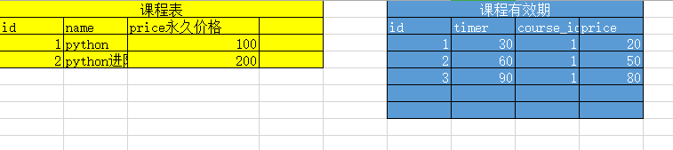

# 课程购买过程中的优惠问题

## 显示当前课程所属的真实价格

#### 价格策略模型

```day84
价格优惠活动类型名称: 限时免费, 限时折扣, 限时减免, 积分抵扣, 满减, 优惠券
公式:
限时免费      原价 - 原价
限时折扣      原价 * 0.8
限时减免      原价 - 减免价
满减          原价 - (满减计算后换算价格)  

积分抵扣     总价-(积分计算后换算价格) ->> 积分换算比率
优惠券       总价-优惠券价格         -->> 优惠券
```

模型course/models.py添加以下模型:

```python
"""价格相关的模型"""
class CourseDiscountType(BaseModel):
    """课程优惠类型"""
    name = models.CharField(max_length=32, verbose_name="优惠类型名称")
    remark = models.CharField(max_length=250, blank=True, null=True, verbose_name="备注信息")

    class Meta:
        db_table = "ly_course_discount_type"
        verbose_name = "课程优惠类型"
        verbose_name_plural = "课程优惠类型"

    def __str__(self):
        return "%s" % (self.name)


class CourseDiscount(BaseModel):
    """课程优惠模型"""
    discount_type = models.ForeignKey("CourseDiscountType", on_delete=models.CASCADE, related_name='coursediscounts',
                                      verbose_name="优惠类型")
    condition = models.IntegerField(blank=True, default=0, verbose_name="满足优惠的价格条件",help_text="设置参与优惠的价格门槛，表示商品必须在xx价格以上的时候才参与优惠活动，<br>如果不填，则不设置门槛")
    sale = models.TextField(verbose_name="优惠公式",blank=True,null=True, help_text="""
    不填表示免费；<br>
    *号开头表示折扣价，例如*0.82表示八二折；<br>
    -号开头则表示减免，例如-20表示原价-20；<br>
    如果需要表示满减,则需要使用 原价-优惠价格,例如表示课程价格大于100,优惠10;大于200,优惠20,格式如下:<br>
    &nbsp;&nbsp;&nbsp;&nbsp;&nbsp;&nbsp;&nbsp;&nbsp;&nbsp;&nbsp;&nbsp;&nbsp;满100-10<br>
    &nbsp;&nbsp;&nbsp;&nbsp;&nbsp;&nbsp;&nbsp;&nbsp;&nbsp;&nbsp;&nbsp;&nbsp;满200-25<br>
    """)

    class Meta:
        db_table = "ly_course_discount"
        verbose_name = "价格优惠策略"
        verbose_name_plural = "价格优惠策略"

    def __str__(self):
        return "价格优惠:%s,优惠条件:%s,优惠值:%s" % (self.discount_type.name, self.condition, self.sale)

class Activity(BaseModel):
    """优惠活动"""
    name = models.CharField(max_length=150, verbose_name="活动名称")
    start_time = models.DateTimeField(verbose_name="优惠策略的开始时间")
    end_time = models.DateTimeField(verbose_name="优惠策略的结束时间")
    remark = models.CharField(max_length=250, blank=True, null=True, verbose_name="备注信息")

    class Meta:
        db_table = "ly_activity"
        verbose_name="商品活动"
        verbose_name_plural="商品活动"

    def __str__(self):
        return self.name

class CoursePriceDiscount(BaseModel):
    """课程与优惠策略的关系表"""
    course = models.ForeignKey("Course",on_delete=models.CASCADE, related_name="activeprices",verbose_name="课程")
    active = models.ForeignKey("Activity",on_delete=models.DO_NOTHING, related_name="activecourses",verbose_name="活动")
    discount = models.ForeignKey("CourseDiscount",on_delete=models.CASCADE,related_name="discountcourse",verbose_name="优惠折扣")

    class Meta:
        db_table = "ly_course_price_dicount"
        verbose_name="课程与优惠策略的关系表"
        verbose_name_plural="课程与优惠策略的关系表"

    def __str__(self):
        return "课程：%s，优惠活动: %s,开始时间:%s,结束时间:%s" % (self.course.name, self.active.name, self.active.start_time,self.active.end_time)
```


#### 执行数据迁移

```bash
python manage.py makemigrations
python manage.py migrate
```


在xadmin中注册模型管理器，course/adminx.py增加代码:

```python
"""价格优惠相关的模型注册"""
from .models import CourseDiscountType
class CourseDiscountTypeModelAdmin(object):
    """价格优惠类型"""
    pass
xadmin.site.register(CourseDiscountType, CourseDiscountTypeModelAdmin)


from .models import CourseDiscount
class CourseDiscountModelAdmin(object):
    """价格优惠公式"""
    pass
xadmin.site.register(CourseDiscount, CourseDiscountModelAdmin)

from .models import CoursePriceDiscount
class CoursePriceDiscountModelAdmin(object):
    """商品优惠和活动的关系"""
    pass
xadmin.site.register(CoursePriceDiscount, CoursePriceDiscountModelAdmin)


from .models import Activity
class ActivityModelAdmin(object):
    """商品活动模型"""
    pass
xadmin.site.register(Activity, ActivityModelAdmin)
```


#### 添加测试数据

```python
INSERT INTO `ly_course_discount_type` VALUES (1,1,1,0,'2019-08-19 03:26:43.250177','2019-08-19 03:26:43.250209','限时免费','1'),(2,1,1,0,'2019-08-19 03:27:13.403084','2019-08-19 03:27:13.403120','限时折扣','阶梯级别的折扣'),(3,3,1,0,'2019-08-19 03:27:20.496817','2019-08-19 03:27:20.496854','限时减免',NULL),(4,4,1,0,'2019-08-19 03:27:29.321802','2019-08-19 03:27:29.321834','满减',NULL);

INSERT INTO `ly_course_discount` VALUES (1,1,1,0,'2019-08-19 03:30:42.064537','2019-08-19 03:30:42.064568',0,'',1),(2,2,1,0,'2019-08-19 03:31:02.636950','2019-08-19 03:31:02.636978',0,'*0.82',2),(3,3,1,0,'2019-08-19 03:31:14.827451','2019-08-19 03:31:14.827482',0,'*0.75',2),(4,3,1,0,'2019-08-19 03:32:02.323298','2019-08-19 03:32:02.323329',0,'-10',3),(5,4,1,0,'2019-08-19 03:32:25.227211','2019-08-19 11:56:19.239184', 0,'满500-80\r\n满400-40\r\n满300-20\r\n满200-10',4);

INSERT INTO `ly_activity` VALUES (1,3,1,0,'2019-08-19 03:28:52.003151','2019-08-19 03:28:52.003181','超级新品日','2019-08-19 02:00:00.000000','2019-09-18 16:00:00.000000',NULL),(2,2,1,0,'2019-08-19 03:29:52.662367','2019-08-19 03:29:52.662850','中秋节快乐购','2019-09-24 16:00:00.000000','2019-09-30 16:00:00.000000',NULL);
```


#### 后端在模型中计算课程的真实价格

因为课程的优惠是具有时效性的，所以我们计算价格的时候需要先判断当前优惠是否过期了。

关于时间的判断,那么就需要在项目中配置下时区.

settings/dev.py，代码：

```python
USE_TZ = False # 禁用ubunt系统GMT时区，使用设定的上海时区，保证数据库中django中使用的时区一致！
```


在课程模型中,新增2个属性方法,分别用于获取当前课程的优惠类型和优惠以后的真实价格, course/models.py代码：

```python
from datetime import datetime
class Course(Basemodel):
    @property
    def get_activity(self): #查询当前课程是否在活动期
        try:
            #activeprices为CoursePriceDiscount模型中Course字段的别名
            result = self.activeprices.get(is_show=True, is_deleted=False, active__start_time__lte=datetime.now(), active__end_time__gt=datetime.now())
            return result   #返回查询到的course对象
        except CoursePriceDiscount.DoesNotExist:
            return "" #查询当前课程如果没有参与到活动中,则直接返回空字符串

    @property
    def discount_name(self):
        """当前课程参与的优惠类型"""
        result = self.get_activity
        if result == "":
            return result
        return result.discount.discount_type.name #返回活动中商品的优惠类型,discount为CoursePriceDiscount模型中字段

    @property
    def discount_price(self):
        """当前课程参与活动以后的优惠"""
        #判断当前课程是否参与了活动,如果有参与活动,是否处于活动时间范围内
        result = self.get_activity
        print(result)
        if result == "":
            return 0
        #根据优惠公式,计算新的价格
        price = float(self.price) #原价
        sale = result.discount.sale #价格优惠公式
        if sale == "":  #限时免费
            price = 0
        elif sale[0] == "*":    #限时折扣
            price = price * float(sale[1:])
        elif sale[0] == "-":    #限时减免
            price = price - float(sale[1:])
        elif sale[0] == "满":   #满减
            sale_list = sale.split("\r\n")
            discount_list = []
            for sale_item in sale_list:
                item_price, discount = sale_item.split("-")
                if float(item_price[1:]) < price:
                    discount_list.append(float(discount))
            price = price - max(discount_list)
        return "%.2f" % price

```


```python
from django.db import models
from datetime import datetime
from luffyapi.utils.models import BaseModel
# Create your models here.
class CourseCategory(BaseModel):
    """
    课程分类
    """
    name = models.CharField(max_length=50, unique=True, verbose_name="分类名称")

    class Meta:
        db_table = "ly_course_category"
        verbose_name = "课程分类"
        verbose_name_plural = verbose_name

    def __str__(self):
        return self.name

from ckeditor_uploader.fields import RichTextUploadingField
class Course(BaseModel):
    """
    实战课程
    """
    course_type = (
        (0, '付费'),
        (1, 'VIP专享'),
        (2, '学位课程'),
    )
    level_choices = (
        (0, '初级'),
        (1, '中级'),
        (2, '高级'),
    )
    status_choices = (
        (0, '上线'),
        (1, '下线'),
        (2, '预上线'),
    )
    name = models.CharField(max_length=128, verbose_name="课程名称")
    course_img = models.ImageField(upload_to="course", max_length=255, verbose_name="封面图片", blank=True, null=True)
    course_video = models.FileField(upload_to="course", max_length=255, verbose_name="封面视频", blank=True, null=True)
    course_type = models.SmallIntegerField(choices=course_type, default=0, verbose_name="付费类型")
    # 使用这个字段的原因
    # brief = models.TextField(verbose_name="详情介绍", null=True, blank=True)
    brief = RichTextUploadingField(verbose_name="详情介绍", null=True, blank=True)
    level = models.SmallIntegerField(choices=level_choices, default=1, verbose_name="难度等级")
    pub_date = models.DateField(verbose_name="发布日期", auto_now_add=True)
    period = models.IntegerField(verbose_name="建议学习周期(day)", default=7)
    attachment_path = models.FileField(upload_to="course_attachment", max_length=255, verbose_name="课件路径", blank=True, null=True)
    status = models.SmallIntegerField(choices=status_choices, default=0, verbose_name="课程状态")
    course_category = models.ForeignKey("CourseCategory", on_delete=models.DO_NOTHING, null=True, blank=True,verbose_name="课程分类")
    students = models.IntegerField(verbose_name="学习人数",default = 0)
    lessons = models.IntegerField(verbose_name="总课时数量",default = 0)
    pub_lessons = models.IntegerField(verbose_name="课时更新数量",default = 0)
    price = models.DecimalField(max_digits=6,decimal_places=2, verbose_name="课程原价",default=0)
    teacher = models.ForeignKey("Teacher",on_delete=models.DO_NOTHING, null=True, blank=True,verbose_name="授课老师")
    class Meta:
        db_table = "ly_course"
        verbose_name = "专题课程"
        verbose_name_plural = "专题课程"

    def __str__(self):
        return "%s" % self.name

    @property
    def lesson_list(self):
        """课程列表的推荐课时"""
        data_list = self.course_lesson.filter(is_recomment=True)
        if len(data_list) < 1:
            return []

        data = []
        for item in data_list:
            data.append({
                "id": item.id,
                "name": item.name,
                "lesson": item.lesson,
                "section_type": item.section_type,
                "section_link": item.section_link,
                "free_trail": item.free_trail,
            })
        return data

    @property
    def level_text(self):
        return self.level_choices[self.level][1]

    @property
    def get_expire_list(self):
        """当前课程所属的有效期选项"""
        data_list = []
        # 1. 再获取课程有效期选项的价格列表
        expire_list = self.course_expire.filter(is_show=True, is_deleted=False)
        for item in expire_list:
            data_list.append({
                "expire_time": item.expire_time,
                "expire_text": item.expire_text,
                "price": item.price,
            })

        # 2. 先获取当前课程的价格
        if self.price > 0:
            data_list.append({
                "expire_time": 0,
                "expire_text": "永久有效",
                "price": self.price,
            })

        return data_list

    def real_price(self,expire_time):
        """根据有效期选项获取真实价格"""
        price = self.price
        # 如果购物车中的有效期选项非0,则表示有其他的有效期选项,则提取对应选项的价格
        if expire_time > 0:
            courseexpire = self.course_expire.get(expire_time=expire_time)
            price = courseexpire.price

        return price

    @property
    def discount_name(self):
        """当前课程参与的优惠类型"""
        # 判断当前课程是否参与了活动，如果有参与了活动，是否处于活动时间范围内
        result = self.get_activity
        if result == "":
            return result
        # 返回活动中商品的优惠类型
        return result.discount.discount_type.name

    @property
    def discount_price(self):
        """当前课程参与活动以后的优惠实价"""
        # 判断当前课程是否参与了活动，如果有参与了活动，是否处于活动时间范围内
        result = self.get_activity
        if result == "":
            return 0

        # 根据优惠公式，计算新的价格
        price = float(self.price)          # 原价
        sale = result.discount.sale # 价格优惠公式
        if sale == "":
            """限时免费"""
            price = 0

        elif sale[0] == "*":
            """限时折扣"""
            price = price * float( sale[1:] )

        elif sale[0] == "-":
            """限时减免"""
            price = price - float(sale[1:] )

        elif sale[0] == "满":
            sale_list = sale.split("\r\n")
            discount_list = []
            for sale_item in sale_list:
                item_price,discount=sale_item.split("-")
                if float(item_price[1:]) < price:
                    discount_list.append( float(discount) )

            price = price - max( discount_list )

        return "%.2f" % price

    @property
    def get_activity(self):
        try:
            result = self.activeprices.get(is_show=True, is_deleted=False, active__start_time__lte=datetime.now(), active__end_time__gt=datetime.now())
            return result
        except CoursePriceDiscount.DoesNotExist:
            # 查询当前课程如果没有参与到活动中，则直接返回空字符串
            return ""


class Teacher(BaseModel):
    """讲师、导师表"""
    role_choices = (
        (0, '讲师'),
        (1, '导师'),
        (2, '班主任'),
    )
    name = models.CharField(max_length=32, verbose_name="讲师title")
    role = models.SmallIntegerField(choices=role_choices, default=0, verbose_name="讲师身份")
    title = models.CharField(max_length=64, verbose_name="职位、职称")
    signature = models.CharField(max_length=255, verbose_name="导师签名", help_text="导师签名", blank=True, null=True)
    image = models.ImageField(upload_to="teacher", null=True, verbose_name = "讲师封面")
    brief = models.TextField(max_length=1024, verbose_name="讲师描述")

    class Meta:
        db_table = "ly_teacher"
        verbose_name = "讲师导师"
        verbose_name_plural = "讲师导师"

    def __str__(self):
        return "%s" % self.name


class CourseChapter(BaseModel):
    """课程章节"""
    course = models.ForeignKey("Course", related_name='coursechapters', on_delete=models.CASCADE, verbose_name="课程名称")
    chapter = models.SmallIntegerField(verbose_name="第几章", default=1)
    name = models.CharField(max_length=128, verbose_name="章节标题")
    summary = models.TextField(verbose_name="章节介绍", blank=True, null=True)
    pub_date = models.DateField(verbose_name="发布日期", auto_now_add=True)

    class Meta:
        db_table = "ly_course_chapter"
        verbose_name = "课程章节"
        verbose_name_plural = "课程章节"

    def __str__(self):
        return "%s:(第%s章)%s" % (self.course, self.chapter, self.name)

    @property
    def lesson_list(self):
        """章节下的课时列表"""
        lessons = self.chaper_lesson.filter(is_show=True, is_deleted=False)
        data = []
        for lesson in lessons:
            data.append({
                "id": lesson.id,
                "name": lesson.name,
                "lesson": lesson.lesson,
                "section_type": lesson.section_type,
                "section_link": lesson.section_link,
                "duration": lesson.duration,
                "free_trail": lesson.free_trail,
            })

        return data

class CourseLesson(BaseModel):
    """
    课程课时
    """
    section_type_choices = (
        (0, '文档'),
        (1, '练习'),
        (2, '视频')
    )
    chapter = models.ForeignKey("CourseChapter", related_name='chaper_lesson', on_delete=models.CASCADE,verbose_name="课程章节")
    course = models.ForeignKey("Course", related_name="course_lesson", on_delete=models.CASCADE, verbose_name="课程名称")
    name = models.CharField(max_length=128,verbose_name = "课时标题")
    lesson = models.IntegerField(default=1, verbose_name="第几课时")
    section_type = models.SmallIntegerField(default=2, choices=section_type_choices, verbose_name="课时种类")
    section_link = models.CharField(max_length=255, blank=True, null=True, verbose_name="课时链接", help_text = "若是video，填vid,若是文档，填link")
    duration = models.CharField(verbose_name="视频时长", blank=True, null=True, max_length=32)  # 仅在前端展示使用
    pub_date = models.DateTimeField(verbose_name="发布时间", auto_now_add=True)
    free_trail = models.BooleanField(verbose_name="是否可试看", default=False)
    is_recomment = models.BooleanField(verbose_name="是否推荐到课程列表", default=False)

    class Meta:
        db_table = "ly_course_lesson"
        verbose_name = "课程课时"
        verbose_name_plural = "课程课时"

    def __str__(self):
        return "%s-%s" % (self.chapter, self.name)


class CourseExpire(BaseModel):
    """课程有效期模型"""
    # 后面必须在数据库把course和expire_time字段设置为联合索引
    course = models.ForeignKey("Course", related_name='course_expire', on_delete=models.CASCADE,
                               verbose_name="课程名称")
    expire_time = models.IntegerField(verbose_name="有效期时间", null=True, blank=True, help_text="有效期按天数计算")
    expire_text = models.CharField(max_length=150, verbose_name="有效期文本格式", null=True, blank=True, help_text="如果时间为30天，则可以填写1个月有效，其他可以按规律参考")
    price = models.DecimalField(max_digits=6, decimal_places=2, verbose_name="课程价格", default=0)

    class Meta:
        db_table = "ly_course_expire"
        verbose_name = "课程有效期选项"
        verbose_name_plural = verbose_name

    def __str__(self):
        return "课程：%s，有效期：%s，价格：%s" % (self.course, self.expire_text, self.price)

    @classmethod
    def get_expire_text(cls, course_id, expire_time):
        """获取课程的有效期文本格式"""
        if expire_time > 0:
            courseexpire = CourseExpire.objects.get(course_id=course_id, expire_time=expire_time)
            expire_text = courseexpire.expire_text
        else:
            expire_text = "永久有效"

        return expire_text


"""价格优惠相关的模型"""
class CourseDiscountType(BaseModel):
    """课程优惠类型"""
    name = models.CharField(max_length=32, verbose_name="优惠类型名称")
    remark = models.CharField(max_length=250, blank=True, null=True, verbose_name="备注信息")

    class Meta:
        db_table = "ly_course_discount_type"
        verbose_name = "课程优惠类型"
        verbose_name_plural = "课程优惠类型"

    def __str__(self):
        return "%s" % (self.name)


class CourseDiscount(BaseModel):
    """课程优惠策略公式模型"""
    discount_type = models.ForeignKey("CourseDiscountType", on_delete=models.CASCADE, related_name='coursediscounts',
                                      verbose_name="优惠类型")
    condition = models.IntegerField(blank=True, default=0, verbose_name="满足优惠的价格条件",help_text="设置参与优惠的价格门槛，表示商品必须在xx价格以上的时候才参与优惠活动，<br>如果不填，则不设置门槛")
    sale = models.TextField(verbose_name="优惠公式",blank=True,null=True, help_text="""
    不填表示免费；<br>
    *号开头表示折扣价，例如*0.82表示八二折；<br>
    -号开头则表示减免，例如-20表示原价-20；<br>
    如果需要表示满减,则需要使用 原价-优惠价格,例如表示课程价格大于100,优惠10;大于200,优惠20,格式如下:<br>
    &nbsp;&nbsp;&nbsp;&nbsp;&nbsp;&nbsp;&nbsp;&nbsp;&nbsp;&nbsp;&nbsp;&nbsp;满100-10<br>
    &nbsp;&nbsp;&nbsp;&nbsp;&nbsp;&nbsp;&nbsp;&nbsp;&nbsp;&nbsp;&nbsp;&nbsp;满200-25<br>
    """)

    class Meta:
        db_table = "ly_course_discount"
        verbose_name = "价格优惠策略"
        verbose_name_plural = "价格优惠策略"

    def __str__(self):
        return "价格优惠:%s,优惠条件:%s,优惠值:%s" % (self.discount_type.name, self.condition, self.sale)

class Activity(BaseModel):
    """优惠活动"""
    name = models.CharField(max_length=150, verbose_name="活动名称")
    start_time = models.DateTimeField(verbose_name="优惠策略的开始时间")
    end_time = models.DateTimeField(verbose_name="优惠策略的结束时间")
    remark = models.CharField(max_length=250, blank=True, null=True, verbose_name="备注信息")

    class Meta:
        db_table = "ly_activity"
        verbose_name="商品活动"
        verbose_name_plural="商品活动"

    def __str__(self):
        return self.name

class CoursePriceDiscount(BaseModel):
    """课程与优惠策略的关系表"""
    course = models.ForeignKey("Course",on_delete=models.CASCADE, related_name="activeprices",verbose_name="课程")
    active = models.ForeignKey("Activity",on_delete=models.DO_NOTHING, related_name="activecourses",verbose_name="活动")
    discount = models.ForeignKey("CourseDiscount",on_delete=models.CASCADE,related_name="discountcourse",verbose_name="优惠折扣")

    class Meta:
        db_table = "ly_course_price_dicount"
        verbose_name="课程与优惠策略的关系表"
        verbose_name_plural="课程与优惠策略的关系表"

    def __str__(self):
        return "课程：%s，优惠活动: %s,开始时间:%s,结束时间:%s" % (self.course.name, self.active.name, self.active.start_time,self.active.end_time)
```


修改序列化器，增加返回字段[优惠类型和课程真实价格]

courses/serializers.py文件中找到 `CourseModelSerializer`类，增加"discount_name", "discount_price":

```python
class CourseModelSerializer(serializers.ModelSerializer):
    """课程列表的模型序列化器"""
    teacher = CourseTeacherModelSerializer()
    class Meta:
        model = Course
        fields = ["id","name","course_img","students","lessons","pub_lessons","price","lesson_list","teacher","discount_name","discount_price"]
```


#### 前端课程列表页展示真实课程价格

判断是否有课程类型，如果有，则显示优惠价格。没有则显示课程原价。

```html
<span class="discount-type" v-if="course.discount_name">{{course.discount_name}}</span>
<span class="discount-price" v-if="course.discount_name">￥{{course.discount_price}}元</span>
<span class="discount-price" v-else>￥{{course.price}}元</span>
<span class="original-price" v-if="course.discount_name">原价：{{course.price}}元</span>
```

course.vue，代码：

```vue
<template>
  <div class="course">
    <Header></Header>
    <div class="main">
      <!-- 筛选条件 -->
      <div class="condition">
        <ul class="cate-list">
          <li class="title">课程分类:</li>
          <li :class="category==0?'this':''" @click="category=0">全部</li>
          <li :class="category==item.id?'this':''" v-for="item in category_list" @click="category=item.id">{{item.name}}</li>
        </ul>
        <div class="ordering">
          <ul>
            <li class="title">筛&nbsp;&nbsp;&nbsp;&nbsp;&nbsp;&nbsp;&nbsp;&nbsp;选: </li>
            <li class="default" :class="change_cls('id',orders)" @click="change_orders('id')">默认</li>
            <li class="hot" :class="change_cls('students',orders)" @click="change_orders('students')">人气</li>
            <li class="price" :class="change_cls('price',orders)" @click="change_orders('price')">价格</li>
          </ul>
          <p class="condition-result">共{{course_count}}个课程</p>
        </div>

      </div>
      <!-- 课程列表 -->
      <div class="course-list">
        <div class="course-item" v-for="course in course_list">
          <div class="course-image">
            
          </div>
          <div class="course-info">
            <h3><router-link :to="`/course/${course.id}?num=100`">{{course.name}}</router-link> <span>{{course.students}}人已加入学习</span></h3>
<!--            <h3><router-link :to="{path:`/course/${course.id}`,query:{num:100}}">{{course.name}}</router-link> <span>{{course.students}}人已加入学习</span></h3>-->
            <p class="teather-info">{{course.teacher.name}} {{course.teacher.signature}} {{course.teacher.title}} <span>共{{course.lessons}}课时/{{course.pub_lessons==course.lessons?'更新完成':`已更新${course.pub_lessons}个课时`}}</span></p>
            <ul class="lesson-list">
              <li v-for="lesson,key in course.lesson_list">
                <router-link :to="lesson.section_link">
                  <span class="lesson-title">0{{key+1}} | 第{{lesson.lesson}}节：{{lesson.name}}</span>
                  <span class="free" v-if="lesson.free_trail">免费</span>
                </router-link>
              </li>
            </ul>
            <div class="pay-box">
              <span class="discount-type" v-if="course.discount_name">{{course.discount_name}}</span>
              <span class="discount-price" v-if="course.discount_name">￥{{course.discount_price}}元</span>
              <span class="discount-price" v-else>￥{{course.price}}元</span>
              <span class="original-price" v-if="course.discount_name">原价：{{course.price}}元</span>
              <span class="buy-now">立即购买</span>
            </div>
          </div>
        </div>
        <el-pagination
          @size-change="handleSizeChange"
          @current-change="handleCurrentChange"
          :page-sizes="[2, 5, 10, 20]"
          background
          :page-size="size"
          layout="sizes, prev, pager, next,jumper"
          :total="course_count">
        </el-pagination>
      </div>
    </div>
    <Footer></Footer>
  </div>
</template>

<script>
  import Header from "./common/Header"
  import Footer from "./common/Footer"
  export default {
      name: "Course",
      data(){
        return{
          category: 0,
          course_count: 0,
          category_list: [],
          course_list:[{
              teacher:{},
          }],
          orders: "id", // id表示默认正序,-id表示默认倒序，students表示人气正序，...,price表示价格...
          size: 10, // 每一页显示的数据量
          page: 1, // 当前页码
        }
      },
      components:{
        Header,
        Footer,
      },
      watch:{
          category(){
              // 在切换不同分类时，重新组装ajax请求参数，获取课程列表
              this.page = 1;
              this.get_course();
          },
          orders(){
              // 在切换不同的排序方式时，重新组装ajax请求参数，获取课程列表
              this.get_course();
          },
          size(){
              // 在切换不同页面显示数据量大小的时候
              this.page = 1;
              this.get_course();
          },
          page(){
              // 在切换不用页码的时候
              this.get_course();
          }
      },
      created() {
          this.get_course_category();
          this.get_course();
      },
      methods:{
          get_course_category(){
              // 获取课程分类列表
              this.$axios.get(`${this.$settings.Host}/course/category/`).then(response=>{
                 this.category_list = response.data;
              }).catch(error=>{
                 this.$alert("网络错误！获取课程分类信息失败！","路飞学城");
              });
          },
          change_orders(type){
              // 修改排序方式
              if(this.orders===type){
                this.orders = "-"+type;
              }else {
                  this.orders = type;
              }
          },
          change_cls(type,orders){
              if(type==="id" && orders === "id"){
                  return "this asc";
              }else if(type === "id" && orders === "-id"){
                  return "this desc";
              }else if(type === "students" && orders === "students"){
                  return "this asc";
              }else if(type==="students" && orders === "-students"){
                  return "this desc";
              }else if(type==="price" && orders === "price"){
                  return "this asc";
              }else if(type==="price" && orders === "-price"){
                  return "this desc";
              }
          },
          get_course(){
              // 获取课程列表
              let filter = {
                  ordering: this.orders,
                  size: this.size,
                  page: this.page,
              };
              if(this.category > 0){
                  filter.course_category = this.category;
              }

              this.$axios.get(`${this.$settings.Host}/course/`,{
                  params: filter,
              }).then(response=>{
                  this.course_list = response.data.results;
                  this.course_count = response.data.count;
              }).catch(error=>{
                  this.$alert("网络错误！获取课程信息失败！","路飞学城");
              });
          },
          handleSizeChange(size){
            // 分页组件发生页面数据量大小改动时
            this.size = size;
          },
          handleCurrentChange(page){
            // 分页组件发生页码改变时
            this.page = page;
          },
      }
  }
</script>


<style scoped>
  .course{
    background: #f6f6f6;
  }
  .course .main{
    width: 1100px;
    margin: 35px auto 0;
  }
  .course .condition{
    margin-bottom: 35px;
    padding: 25px 30px 25px 20px;
    background: #fff;
    border-radius: 4px;
    box-shadow: 0 2px 4px 0 #f0f0f0;
  }
  .course .cate-list{
    border-bottom: 1px solid #333;
    border-bottom-color: rgba(51,51,51,.05);
    padding-bottom: 18px;
    margin-bottom: 17px;
  }
  .course .cate-list::after{
    content:"";
    display: block;
    clear: both;
  }
  .course .cate-list li{
    float: left;
    font-size: 16px;
    padding: 6px 15px;
    line-height: 16px;
    margin-left: 14px;
    position: relative;
    transition: all .3s ease;
    cursor: pointer;
    color: #4a4a4a;
    border: 1px solid transparent; /* transparent 透明 */
  }
  .course .cate-list .title{
    color: #888;
    margin-left: 0;
    letter-spacing: .36px;
    padding: 0;
    line-height: 28px;
  }
  .course .cate-list .this{
    color: #ffc210;
    border: 1px solid #ffc210!important;
    border-radius: 30px;
  }
  .course .ordering::after{
    content:"";
    display: block;
    clear: both;
  }
  .course .ordering ul{
    float: left;
  }
  .course .ordering ul::after{
    content:"";
    display: block;
    clear: both;
  }
  .course .ordering .condition-result{
    float: right;
    font-size: 14px;
    color: #9b9b9b;
    line-height: 28px;
  }
  .course .ordering ul li{
    float: left;
    padding: 6px 15px;
    line-height: 16px;
    margin-left: 14px;
    position: relative;
    transition: all .3s ease;
    cursor: pointer;
    color: #4a4a4a;
  }
  .course .ordering .title{
    font-size: 16px;
    color: #888;
    letter-spacing: .36px;
    margin-left: 0;
    padding:0;
    line-height: 28px;
  }
  .course .ordering .this{
    color: #ffc210;
    position: relative;
  }
  .course .ordering .this::before,
  .course .ordering .this::after{
    cursor: pointer;
    content:"";
    display: block;
    width: 0px;
    height: 0px;
    border: 5px solid transparent;
    position: absolute;
    right: 0;
  }
  .course .ordering .this::before{
    border-bottom: 5px solid #aaa;
    margin-bottom: 2px;
    top: 2px;
  }
  .course .ordering .this::after{
    border-top: 5px solid #aaa;
    bottom: 2px;
  }
  .course .ordering .asc::before{
    border-bottom: 5px solid #ffc210;
  }
  .course .ordering .desc::after{
    border-top: 5px solid #ffc210;
  }
  .course .course-item:hover{
    box-shadow: 4px 6px 16px rgba(0,0,0,.5);
  }
  .course .course-item{
    width: 1050px;
    background: #fff;
    padding: 20px 30px 20px 20px;
    margin-bottom: 35px;
    border-radius: 2px;
    cursor: pointer;
    box-shadow: 2px 3px 16px rgba(0,0,0,.1);
    /* css3.0 过渡动画 hover 事件操作 */
    transition: all .2s ease;
  }
  .course .course-item::after{
    content:"";
    display: block;
    clear: both;
  }
  /* 顶级元素 父级元素  当前元素{} */
  .course .course-item .course-image{
    float: left;
    width: 423px;
    height: 210px;
    margin-right: 30px;
  }
  .course .course-item .course-image img{
    width: 100%;
  }
  .course .course-item .course-info{
    float: left;
    width: 596px;
  }
  .course-item .course-info h3 {
    font-size: 26px;
    color: #333;
    font-weight: normal;
    margin-bottom: 8px;
  }
  .course-item .course-info h3 span{
    font-size: 14px;
    color: #9b9b9b;
    float: right;
    margin-top: 14px;
  }
  .course-item .course-info h3 span img{
      width: 11px;
      height: auto;
      margin-right: 7px;
  }
  .course-item .course-info .teather-info{
      font-size: 14px;
      color: #9b9b9b;
      margin-bottom: 14px;
      padding-bottom: 14px;
      border-bottom: 1px solid #333;
      border-bottom-color: rgba(51,51,51,.05);
  }
  .course-item .course-info .teather-info span{
      float: right;
  }
  .course-item .lesson-list::after{
      content:"";
      display: block;
      clear: both;
  }
  .course-item .lesson-list li {
    float: left;
    width: 44%;
    font-size: 14px;
    color: #666;
    padding-left: 22px;
    /* background: url("路径") 是否平铺 x轴位置 y轴位置 */
    background: url("/static/image/play-icon-gray.svg") no-repeat left 4px;
    margin-bottom: 15px;
  }
  .course-item .lesson-list li .lesson-title{
      /* 以下3句，文本内容过多，会自动隐藏，并显示省略符号 */
      text-overflow: ellipsis;
      overflow: hidden;
      white-space: nowrap;
      display:inline-block;
      max-width: 200px;
  }
  .course-item .lesson-list li:hover{
      background-image: url("/static/image/play-icon-yellow.svg");
      color: #ffc210;
  }
  .course-item .lesson-list li .free{
      width: 34px;
      height: 20px;
      color: #fd7b4d;
      vertical-align: super;
      margin-left: 10px;
      border: 1px solid #fd7b4d;
      border-radius: 2px;
      text-align: center;
      font-size: 13px;
      white-space: nowrap;
  }
  .course-item .lesson-list li:hover .free{
      color: #ffc210;
      border-color: #ffc210;
  }
  .course-item .pay-box::after{
    content:"";
    display: block;
    clear: both;
  }
  .course-item .pay-box .discount-type{
    padding: 6px 10px;
    font-size: 16px;
    color: #fff;
    text-align: center;
    margin-right: 8px;
    background: #fa6240;
    border: 1px solid #fa6240;
    border-radius: 10px 0 10px 0;
    float: left;
  }
  .course-item .pay-box .discount-price{
    font-size: 24px;
    color: #fa6240;
    float: left;
  }
  .course-item .pay-box .original-price{
    text-decoration: line-through;
    font-size: 14px;
    color: #9b9b9b;
    margin-left: 10px;
    float: left;
    margin-top: 10px;
  }
  .course-item .pay-box .buy-now{
    width: 120px;
    height: 38px;
    background: transparent;
    color: #fa6240;
    font-size: 16px;
    border: 1px solid #fd7b4d;
    border-radius: 3px;
    transition: all .2s ease-in-out;
    float: right;
    text-align: center;
    line-height: 38px;
  }
  .course-item .pay-box .buy-now:hover{
    color: #fff;
    background: #ffc210;
    border: 1px solid #ffc210;
  }
</style>
```


#### 前端课程详情页展示真实课程的价格

后端在课程模型中实现返回活动剩余时间功能,`course/models.py`,Course模型，代码:

```python
    @property
    def activity_time(self):
        """当前课程参与活动的剩余时间"""
        # 判断当前课程是否参与了活动，如果有参与了活动，是否处于活动时间范围内
        result = self.get_activity
        has_time = -1
        if result != "":
            # 活动结束时间
            end_time = result.active.end_time.timestamp()
            # 当前服务器时间
            now_time = datetime.now().timestamp()
            # 剩余时间= 活动结束 - 当前时间
            has_time = end_time - now_time

        return int(has_time)
```

在序列化器中,找到`CourseRetrieveSerializer`,新增返回字段[优惠类型.活动剩余时间以及真实价格]

course/serializers.py，代码：

```python
class CourseRetrieveModelSerializer(serializers.ModelSerializer):
    """课程详情页的序列化器"""
    teacher = CourseTeacherModelSerializer()
    class Meta:
        model = Course
        fields = ["id","name","course_img","course_video","students","lessons","pub_lessons","price","teacher","level_text","brief","attachment_path","discount_name","discount_price","activity_time"]
```


#### 前端中对数据接口内容展示

前端中对数据接口内容展示出来,并通过js提供的定时器方法来实现优惠活动的倒计时,Detail.vue代码:

parseInt：js中的地板除，去除小数位

```html
<div class="sale-time" v-if="course.discount_name">
    <p class="sale-type">{{course.discount_name}}</p>
    <p class="expire">距离结束：仅剩 
        {{parseInt(course.activity_time/(3600*24)) | pad_0}}天 			
        {{parseInt(course.activity_time/3600%24) | pad_0}}小时 
        {{parseInt(course.activity_time/60%60) | pad_0}}分 <span class="second">
        {{parseInt(course.activity_time%60) | pad_0}}</span> 秒</p>
</div>
<p class="course-price" v-if="course.discount_name">
    <span>活动价</span>
    <span class="discount">¥{{course.discount_price}}</span>
    <span class="original">¥{{course.price}}</span>
</p>
<div class="sale-time" v-else>
    <p class="sale-type">¥{{course.price}}</p>
    <p class="expire"></p>
</div>

filters:{
	pad_0(num){
		if(num<10){
            return "0"+num;
        }
        return num;
   }
},
                    
let timer = setInterval(()=>{
	if(this.course.activity_time > 0){
		this.course.activity_time--;
    }else{
        this.course.discount_name="";
        clearInterval(timer);
    }
},1000)
```

```vue
<template>
    <div class="detail">
      <Header/>
      <div class="main">
        <div class="course-info">
          <div class="wrap-left">
            <videoPlayer
               class="video-player vjs-custom-skin"
               ref="videoPlayer"
               :playsinline="true"
               :options="playerOptions"
               @play="onPlayerPlay($event)"
               @pause="onPlayerPause($event)">
            </videoPlayer>
          </div>
          <div class="wrap-right">
            <h3 class="course-name">{{course.name}}</h3>
            <p class="data">{{course.students}}人在学&nbsp;&nbsp;&nbsp;&nbsp;课程总时长：{{course.lessons}}课时/{{course.lessons==course.pub_lessons?'更新完成':`已更新${course.pub_lessons}课时`}}&nbsp;&nbsp;&nbsp;&nbsp;难度：{{course.level_text}}</p>
            <div class="sale-time" v-if="course.discount_name">
              <p class="sale-type">{{course.discount_name}}</p>
              <p class="expire">距离结束：仅剩 {{parseInt(course.activity_time/(3600*24)) | pad_0}}天 {{parseInt(course.activity_time/3600%24) | pad_0}}小时 {{parseInt(course.activity_time/60%60) | pad_0}}分 <span class="second">{{parseInt(course.activity_time%60) | pad_0}}</span> 秒</p>
            </div>
            <p class="course-price" v-if="course.discount_name">
              <span>活动价</span>
              <span class="discount">¥{{course.discount_price}}</span>
              <span class="original">¥{{course.price}}</span>
            </p>
            <div class="sale-time" v-else>
              <p class="sale-type">¥{{course.price}}</p>
              <p class="expire"></p>
            </div>
            <div class="buy">
              <div class="buy-btn">
                <button class="buy-now">立即购买</button>
                <button class="free">免费试学</button>
              </div>
              <div class="add-cart" @click="add_cart">加入购物车</div>
            </div>
          </div>
        </div>
        <div class="course-tab">
          <ul class="tab-list">
            <li :class="tabIndex==1?'active':''" @click="tabIndex=1">详情介绍</li>
            <li :class="tabIndex==2?'active':''" @click="tabIndex=2">课程章节 <span :class="tabIndex!=2?'free':''">(试学)</span></li>
            <li :class="tabIndex==3?'active':''" @click="tabIndex=3">用户评论 (42)</li>
            <li :class="tabIndex==4?'active':''" @click="tabIndex=4">常见问题</li>
          </ul>
        </div>
        <div class="course-content">
          <div class="course-tab-list">
            <div v-html="pad_image_url(course.brief)" class="tab-item" v-if="tabIndex==1">

            </div>
            <div class="tab-item" v-if="tabIndex==2">
              <div class="tab-item-title">
                <p class="chapter">课程章节</p>
                <p class="chapter-length">共11章 147个课时</p>
              </div>
              <div class="chapter-item" v-for="chapter in chapter_list">
                <p class="chapter-title">第{{chapter.chapter}}章·{{chapter.name}}</p>
                <ul class="lesson-list">
                  <li class="lesson-item" v-for="lesson in chapter.lesson_list">
                    <p class="name"><span class="index">{{chapter.chapter}}-{{lesson.lesson}}</span> {{lesson.name}}<span class="free" v-if="lesson.free_trail">免费</span></p>
                    <p class="time">{{lesson.duration}} </p>
                    <button class="try" v-if="lesson.free_trail">
                      <router-link v-if="lesson.section_type===0" data="文档" to="/">立即试学</router-link>
                      <router-link v-else-if="lesson.section_type===1" data="练习" to="/">立即试学</router-link>
                      <router-link v-else data="视频" to="/">立即试学</router-link>
                      <router-link to="/">立即试学</router-link>
                    </button>
                    <button class="try" v-else>立即购买</button>
                  </li>

                </ul>
              </div>
            </div>
            <div class="tab-item" v-if="tabIndex==3">
              用户评论
            </div>
            <div class="tab-item" v-if="tabIndex==4">
              常见问题
            </div>
          </div>
          <div class="course-side">
             <div class="teacher-info">
               <h4 class="side-title"><span>授课老师</span></h4>
               <div class="teacher-content">
                 <div class="cont1">
                   
                   <div class="name">
                     <p class="teacher-name">{{course.teacher.name}}</p>
                     <p class="teacher-title">{{course.teacher.signature}} {{course.teacher.title}}</p>
                   </div>
                 </div>
                 <p class="narrative" >{{course.teacher.brief}}</p>
               </div>
             </div>
          </div>
        </div>
      </div>
      <Footer/>
    </div>
</template>

<script>
import Header from "./common/Header"
import Footer from "./common/Footer"
import {videoPlayer} from 'vue-video-player';

export default {
    name: "Detail",
    data(){
      return {
        course_id: 0,     // 当前课程的ID
        course: {         // 当前课程的基本信息
          teacher:{},
        },
        chapter_list:[], // 当前课程的章节列表
        tabIndex:2, // 当前选项卡显示的下标
        playerOptions: {  // vue-video-player的初始化配置参数
          playbackRates: [0.7, 1.0, 1.5, 2.0], // 播放速度
          autoplay: false, //如果true,则自动播放
          muted: false, // 默认情况下将会消除任何音频。
          loop: false, // 循环播放
          preload: 'auto',     // 建议浏览器在<video>加载元素后是否应该开始下载视频数据。auto浏览器选择最佳行为,立即开始加载视频（如果浏览器支持）
          language: 'zh-CN',
          aspectRatio: '16:9', // 将播放器置于流畅模式，并在计算播放器的动态大小时使用该值。值应该代表一个比例 - 用冒号分隔的两个数字（例如"16:9"或"4:3"）
          fluid: true, // 当true时，Video.js player将拥有流体大小。换句话说，它将按比例缩放以适应其容器。
          sources: [{ // 播放资源和资源格式
            type: "video/mp4",
            src: "http://img.ksbbs.com/asset/Mon_1703/05cacb4e02f9d9e.mp4", //你的视频地址（必填）
          }],
          poster: "../static/image/course-cover.jpeg", //视频封面图
          width: document.documentElement.clientWidth, // 默认视频全屏时的最大宽度
          notSupportedMessage: '此视频暂无法播放，请稍后再试', //允许覆盖Video.js无法播放媒体源时显示的默认信息。
        }
      }
    },
    filters:{
        pad_0(num){
            if(num<10){
                return "0"+num;
            }
            return num;
        }
    },
    created(){
      // 课程ID
      this.get_course_id();
      this.get_course();
      this.get_chapter();
    },
    methods: {
      get_course_id(){
          // 获取课程id
          this.course_id = this.$route.params.id; // 获取路由参数，参数名称是在index.js理由文件中已经指定名称的
          // alert(this.course_id);
          // let num = this.$route.query.num; // 获取地址栏上问号后面的查询字符串 例如 /course/11?num=100
          // alert(num)
          if(this.course_id<1){
              let self = this;
              this.$alert('对不起，非法参数！不可以访问当前页面！',`路飞学城`,{
                  callback(){
                      self.$router.go(-1);
                  }
              });
              return;
          }
      },
      get_course(){
          // 获取课程详细信息
          this.$axios.get(`${this.$settings.Host}/course/${this.course_id}/`).then(response=>{
              this.course = response.data;
              // 修改vue-video-player的视频和封面图片
              this.playerOptions.poster = response.data.course_img;
              this.playerOptions.sources[0].src = response.data.course_video;
              // 进行活动的倒计时
              let t = setInterval(()=>{
                if( this.course.activity_time > 0 ){
                    this.course.activity_time--;
                }else{
                    this.course.discount_name = "";
                    clearInterval(t);
                }
              },1000);
          }).catch(error=>{
              this.$alert('对不起，获取课程信息失败，请联系客服工作人员！',`路飞学城`,{
                  callback(){
                      self.$router.go(-1);
                  }
              });
          });
      },
      get_chapter(){
          // 获取当前课程的章节信息
          this.$axios.get(`${this.$settings.Host}/course/chapter/`,{
              params:{
                  course: this.course_id,
              }
          }).then(response=>{
              this.chapter_list = response.data;
          }).catch(error=>{
              let self = this;
              this.$alert('对不起，无法获取当前课程的章节信息',"路飞学城",{
                  callback(){
                      self.$router.go(-1);
                  }
              })
          })
      },
      pad_image_url(data){
          while(data.search(`"/media`) !== -1){
              data = data.replace(`"/media`,`"${this.$settings.Host}/media`);
          }
          return data;
      },
      onPlayerPlay(){
          // 播放器准备播放
          this.$alert("准备开始播放视频");
      },
      onPlayerPause(){
          // 播放器按了暂停
          this.$alert("点击了暂停按钮");
      },
      add_cart(){
        let token = this.$settings.check_user_login();
        if(!token){
          // 让用户确认是否要登录
          this.$confirm('您尚未登录,请登录再进行操作, 是否继续?', '路飞学城', {
            confirmButtonText: '登录',
            cancelButtonText: '取消',
            type: 'warning'
          }).then(() => {
            this.$router.push("/user/login");
          }).catch(() => {
            return ;
          });
        }else{
          // 添加课程商品到购物车
          this.$axios.post(`${this.$settings.Host}/cart/`,{
            course_id: this.course_id,
          },{
            headers:{
              Authorization: "jwt "+token,
            }
          }).then(response=>{
            this.$message.success("添加商品到购物车操作成功!");
            this.$store.commit(`update_num`, response.data.cart_num);
          }).catch(error=>{
            this.$message.error("添加商品到购物车操作失败!");
          });
        }
      }
    },
    components:{
      Header,
      Footer,
      videoPlayer,
    }
}
</script>

<style scoped>
.main{
  background: #fff;
  padding-top: 30px;
}
.course-info{
  width: 1200px;
  margin: 0 auto;
  overflow: hidden;
}
.wrap-left{
  float: left;
  width: 690px;
  height: 388px;
  background-color: #000;
}
.wrap-right{
  float: left;
  position: relative;
  height: 388px;
}
.course-name{
  font-size: 20px;
  color: #333;
  padding: 10px 23px;
  letter-spacing: .45px;
}
.data{
  padding-left: 23px;
  padding-right: 23px;
  padding-bottom: 16px;
  font-size: 14px;
  color: #9b9b9b;
}
.sale-time{
  width: 464px;
  background: #fa6240;
  font-size: 14px;
  color: #4a4a4a;
  padding: 10px 23px;
  overflow: hidden;
}
.sale-type {
  font-size: 16px;
  color: #fff;
  letter-spacing: .36px;
  float: left;
}
.sale-time .expire{
  font-size: 14px;
  color: #fff;
  float: right;
}
.sale-time .expire .second{
  width: 24px;
  display: inline-block;
  background: #fafafa;
  color: #5e5e5e;
  padding: 6px 0;
  text-align: center;
}
.course-price{
  background: #fff;
  font-size: 14px;
  color: #4a4a4a;
  padding: 5px 23px;
}
.discount{
  font-size: 26px;
  color: #fa6240;
  margin-left: 10px;
  display: inline-block;
  margin-bottom: -5px;
}
.original{
  font-size: 14px;
  color: #9b9b9b;
  margin-left: 10px;
  text-decoration: line-through;
}
.buy{
  width: 464px;
  padding: 0px 23px;
  position: absolute;
  left: 0;
  bottom: 20px;
  overflow: hidden;
}
.buy .buy-btn{
  float: left;
}
.buy .buy-now{
  width: 125px;
  height: 40px;
  border: 0;
  background: #ffc210;
  border-radius: 4px;
  color: #fff;
  cursor: pointer;
  margin-right: 15px;
  outline: none;
}
.buy .free{
  width: 125px;
  height: 40px;
  border-radius: 4px;
  cursor: pointer;
  margin-right: 15px;
  background: #fff;
  color: #ffc210;
  border: 1px solid #ffc210;
}
.add-cart{
  float: right;
  font-size: 14px;
  color: #ffc210;
  text-align: center;
  cursor: pointer;
  margin-top: 10px;
}
.add-cart img{
  width: 20px;
  height: 18px;
  margin-right: 7px;
  vertical-align: middle;
}

.course-tab{
    width: 100%;
    background: #fff;
    margin-bottom: 30px;
    box-shadow: 0 2px 4px 0 #f0f0f0;

}
.course-tab .tab-list{
    width: 1200px;
    margin: auto;
    color: #4a4a4a;
    overflow: hidden;
}
.tab-list li{
    float: left;
    margin-right: 15px;
    padding: 26px 20px 16px;
    font-size: 17px;
    cursor: pointer;
}
.tab-list .active{
    color: #ffc210;
    border-bottom: 2px solid #ffc210;
}
.tab-list .free{
    color: #fb7c55;
}
.course-content{
    width: 1200px;
    margin: 0 auto;
    background: #FAFAFA;
    overflow: hidden;
    padding-bottom: 40px;
}
.course-tab-list{
    width: 880px;
    height: auto;
    padding: 20px;
    background: #fff;
    float: left;
    box-sizing: border-box;
    overflow: hidden;
    position: relative;
    box-shadow: 0 2px 4px 0 #f0f0f0;
}
.tab-item{
    width: 880px;
    background: #fff;
    padding-bottom: 20px;
    box-shadow: 0 2px 4px 0 #f0f0f0;
}
.tab-item-title{
    justify-content: space-between;
    padding: 25px 20px 11px;
    border-radius: 4px;
    margin-bottom: 20px;
    border-bottom: 1px solid #333;
    border-bottom-color: rgba(51,51,51,.05);
    overflow: hidden;
}
.chapter{
    font-size: 17px;
    color: #4a4a4a;
    float: left;
}
.chapter-length{
    float: right;
    font-size: 14px;
    color: #9b9b9b;
    letter-spacing: .19px;
}
.chapter-title{
    font-size: 16px;
    color: #4a4a4a;
    letter-spacing: .26px;
    padding: 12px;
    background: #eee;
    border-radius: 2px;
    display: -ms-flexbox;
    display: flex;
    -ms-flex-align: center;
    align-items: center;
}
.chapter-title img{
    width: 18px;
    height: 18px;
    margin-right: 7px;
    vertical-align: middle;
}
.lesson-list{
    padding:0 20px;
}
.lesson-list .lesson-item{
    padding: 15px 20px 15px 36px;
    cursor: pointer;
    justify-content: space-between;
    position: relative;
    overflow: hidden;
}
.lesson-item .name{
    font-size: 14px;
    color: #666;
    float: left;
}
.lesson-item .index{
    margin-right: 5px;
}
.lesson-item .free{
    font-size: 12px;
    color: #fff;
    letter-spacing: .19px;
    background: #ffc210;
    border-radius: 100px;
    padding: 1px 9px;
    margin-left: 10px;
}
.lesson-item .time{
    font-size: 14px;
    color: #666;
    letter-spacing: .23px;
    opacity: 1;
    transition: all .15s ease-in-out;
    float: right;
}
.lesson-item .time img{
    width: 18px;
    height: 18px;
    margin-left: 15px;
    vertical-align: text-bottom;
}
.lesson-item .try{
    width: 86px;
    height: 28px;
    background: #ffc210;
    border-radius: 4px;
    font-size: 14px;
    color: #fff;
    position: absolute;
    right: 20px;
    top: 10px;
    opacity: 0;
    transition: all .2s ease-in-out;
    cursor: pointer;
    outline: none;
    border: none;
}
.lesson-item:hover{
    background: #fcf7ef;
    box-shadow: 0 0 0 0 #f3f3f3;
}
.lesson-item:hover .name{
    color: #333;
}
.lesson-item:hover .try{
    opacity: 1;
}

.course-side{
    width: 300px;
    height: auto;
    margin-left: 20px;
    float: right;
}
.teacher-info{
    background: #fff;
    margin-bottom: 20px;
    box-shadow: 0 2px 4px 0 #f0f0f0;
}
.side-title{
    font-weight: normal;
    font-size: 17px;
    color: #4a4a4a;
    padding: 18px 14px;
    border-bottom: 1px solid #333;
    border-bottom-color: rgba(51,51,51,.05);
}
.side-title span{
    display: inline-block;
    border-left: 2px solid #ffc210;
    padding-left: 12px;
}

.teacher-content{
    padding: 30px 20px;
    box-sizing: border-box;
}

.teacher-content .cont1{
    margin-bottom: 12px;
    overflow: hidden;
}

.teacher-content .cont1 img{
    width: 54px;
    height: 54px;
    margin-right: 12px;
    float: left;
}
.teacher-content .cont1 .name{
    float: right;
}
.teacher-content .cont1 .teacher-name{
    width: 188px;
    font-size: 16px;
    color: #4a4a4a;
    padding-bottom: 4px;
}
.teacher-content .cont1 .teacher-title{
    width: 188px;
    font-size: 13px;
    color: #9b9b9b;
    white-space: nowrap;
}
.teacher-content .narrative{
    font-size: 14px;
    color: #666;
    line-height: 24px;
}
</style>
```


## 根据课程有效期调整优惠价格

目前我们已经在后端实现了课程优惠价格的功能，但是这个优惠价格并没有考虑有效期选项的情况。



因为我们之前在购物车中商品列表的商品使用的字段是real_price，所以在永久有效选项的情况下，价格是正确的。但是如果我们有其他的有效期选项时，在切换有效期后，则价格显示有问题！

所以我们接下来需要调整在切换有效期时的代码逻辑.让程序以指定的有效期价格进行优惠计算！！

模型中把原来计算商品真实价格的公共代码进行分离，保存成一个独立的方法，然后给real_price属性进行调用。

为了完成把课程有效期纳入到真实价格的计算功能。找到course/models.py模型文件的 `Course`模型类,调整以下代码：

```python
	def discount_price(self, price=None):
        """当前课程参与活动以后的优惠"""
        if price is None:
            price = self.price #原价

        #判断当前课程是否参与了活动,如果有参与活动,是否处于活动时间范围内
        result = self.get_activity
        if result == "":
            return price

        #根据优惠公式,计算新的价格
        price = float(price)    
        
    def real_price(self, expire_time):
        price = float(self.discount_price(price))
        
    @property
    def get_expire_list(self):
                "price": float(self.discount_price(item.price)),
                # "price": item.price,
                
                "price": float(self.discount_price(self.price)),
                # "price": self.price,
```

course/models.py 模型代码：

```python
from django.db import models
from datetime import datetime
from luffyapi.utils.models import BaseModel
# Create your models here.
class CourseCategory(BaseModel):
    """
    课程分类
    """
    name = models.CharField(max_length=50, unique=True, verbose_name="分类名称")

    class Meta:
        db_table = "ly_course_category"
        verbose_name = "课程分类"
        verbose_name_plural = verbose_name

    def __str__(self):
        return self.name

from ckeditor_uploader.fields import RichTextUploadingField
class Course(BaseModel):
    """
    实战课程
    """
    course_type = (
        (0, '付费'),
        (1, 'VIP专享'),
        (2, '学位课程'),
    )
    level_choices = (
        (0, '初级'),
        (1, '中级'),
        (2, '高级'),
    )
    status_choices = (
        (0, '上线'),
        (1, '下线'),
        (2, '预上线'),
    )
    name = models.CharField(max_length=128, verbose_name="课程名称")
    course_img = models.ImageField(upload_to="course", max_length=255, verbose_name="封面图片", blank=True, null=True)
    course_video = models.FileField(upload_to="course", max_length=255, verbose_name="封面视频", blank=True, null=True)
    course_type = models.SmallIntegerField(choices=course_type, default=0, verbose_name="付费类型")
    # 使用这个字段的原因
    # brief = models.TextField(verbose_name="详情介绍", null=True, blank=True)
    brief = RichTextUploadingField(verbose_name="详情介绍", null=True, blank=True)
    level = models.SmallIntegerField(choices=level_choices, default=1, verbose_name="难度等级")
    pub_date = models.DateField(verbose_name="发布日期", auto_now_add=True)
    period = models.IntegerField(verbose_name="建议学习周期(day)", default=7)
    attachment_path = models.FileField(upload_to="course_attachment", max_length=255, verbose_name="课件路径", blank=True, null=True)
    status = models.SmallIntegerField(choices=status_choices, default=0, verbose_name="课程状态")
    course_category = models.ForeignKey("CourseCategory", on_delete=models.DO_NOTHING, null=True, blank=True,verbose_name="课程分类")
    students = models.IntegerField(verbose_name="学习人数",default = 0)
    lessons = models.IntegerField(verbose_name="总课时数量",default = 0)
    pub_lessons = models.IntegerField(verbose_name="课时更新数量",default = 0)
    price = models.DecimalField(max_digits=6,decimal_places=2, verbose_name="课程原价",default=0)
    teacher = models.ForeignKey("Teacher",on_delete=models.DO_NOTHING, null=True, blank=True,verbose_name="授课老师")
    class Meta:
        db_table = "ly_course"
        verbose_name = "专题课程"
        verbose_name_plural = "专题课程"

    def __str__(self):
        return "%s" % self.name

    @property
    def lesson_list(self):
        """课程列表的推荐课时"""
        data_list = self.course_lesson.filter(is_recomment=True)
        if len(data_list) < 1:
            return []

        data = []
        for item in data_list:
            data.append({
                "id": item.id,
                "name": item.name,
                "lesson": item.lesson,
                "section_type": item.section_type,
                "section_link": item.section_link,
                "free_trail": item.free_trail,
            })
        return data

    @property
    def level_text(self):
        return self.level_choices[self.level][1]

    @property
    def get_expire_list(self):
        """当前课程所属的有效期选项"""
        data_list = []
        # 1. 再获取课程有效期选项的价格列表
        expire_list = self.course_expire.filter(is_show=True, is_deleted=False)
        for item in expire_list:
            data_list.append({
                "expire_time": item.expire_time,
                "expire_text": item.expire_text,
                "price": float( self.discount_price(item.price) ),
            })

        # 2. 先获取当前课程的价格
        if self.price > 0:
            data_list.append({
                "expire_time": 0,
                "expire_text": "永久有效",
                "price": float( self.discount_price(self.price) ),
            })

        return data_list

    def real_price(self,expire_time):
        """根据有效期选项获取真实价格"""
        price = self.price
        # 如果购物车中的有效期选项非0,则表示有其他的有效期选项,则提取对应选项的价格
        if expire_time > 0:
            courseexpire = self.course_expire.get(expire_time=expire_time)
            price = courseexpire.price

        # 如果课程参与了活动，则返回活动的优惠价格
        result = self.get_activity
        if result != "":
            price = float( self.discount_price(price) )

        return price

    @property
    def discount_name(self):
        """当前课程参与的优惠类型"""
        # 判断当前课程是否参与了活动，如果有参与了活动，是否处于活动时间范围内
        result = self.get_activity
        if result == "":
            return result
        # 返回活动中商品的优惠类型
        return result.discount.discount_type.name

    def discount_price(self,price=None):
        """当前课程参与活动以后的优惠"""
        if price is None:
            price = self.price #没有传入价格，返回原价

        #判断当前课程是否参与了活动,如果有参与活动,是否处于活动时间范围内
        result = self.get_activity
        if result == "":
            return price #没有参与活动，返回原价

        #参加了活动，根据优惠公式,计算新的价格
        price = float(price)
        sale = result.discount.sale # 价格优惠公式
        if sale == "":
            """限时免费"""
            price = 0

        elif sale[0] == "*":
            """限时折扣"""
            price = price * float( sale[1:] )

        elif sale[0] == "-":
            """限时减免"""
            price = price - float(sale[1:] )

        elif sale[0] == "满":
            sale_list = sale.split("\r\n")
            discount_list = []
            for sale_item in sale_list:
                item_price,discount=sale_item.split("-")
                if float(item_price[1:]) < price:
                    discount_list.append( float(discount) )

            price = price - max( discount_list )

        return "%.2f" % price

    @property
    def get_activity(self):
        try:
            result = self.activeprices.get(is_show=True, is_deleted=False, active__start_time__lte=datetime.now(), active__end_time__gt=datetime.now())
            return result
        except CoursePriceDiscount.DoesNotExist:
            # 查询当前课程如果没有参与到活动中，则直接返回空字符串
            return ""


    @property
    def activity_time(self):
        """当前课程参与活动的剩余时间"""
        # 判断当前课程是否参与了活动，如果有参与了活动，是否处于活动时间范围内
        result = self.get_activity
        has_time = -1
        if result != "":
            # 活动结束时间
            end_time = result.active.end_time.timestamp()
            # 当前服务器时间
            now_time = datetime.now().timestamp()
            # 剩余时间= 活动结束 - 当前时间
            has_time = end_time - now_time

        return int(has_time)


class Teacher(BaseModel):
    """讲师、导师表"""
    role_choices = (
        (0, '讲师'),
        (1, '导师'),
        (2, '班主任'),
    )
    name = models.CharField(max_length=32, verbose_name="讲师title")
    role = models.SmallIntegerField(choices=role_choices, default=0, verbose_name="讲师身份")
    title = models.CharField(max_length=64, verbose_name="职位、职称")
    signature = models.CharField(max_length=255, verbose_name="导师签名", help_text="导师签名", blank=True, null=True)
    image = models.ImageField(upload_to="teacher", null=True, verbose_name = "讲师封面")
    brief = models.TextField(max_length=1024, verbose_name="讲师描述")

    class Meta:
        db_table = "ly_teacher"
        verbose_name = "讲师导师"
        verbose_name_plural = "讲师导师"

    def __str__(self):
        return "%s" % self.name


class CourseChapter(BaseModel):
    """课程章节"""
    course = models.ForeignKey("Course", related_name='coursechapters', on_delete=models.CASCADE, verbose_name="课程名称")
    chapter = models.SmallIntegerField(verbose_name="第几章", default=1)
    name = models.CharField(max_length=128, verbose_name="章节标题")
    summary = models.TextField(verbose_name="章节介绍", blank=True, null=True)
    pub_date = models.DateField(verbose_name="发布日期", auto_now_add=True)

    class Meta:
        db_table = "ly_course_chapter"
        verbose_name = "课程章节"
        verbose_name_plural = "课程章节"

    def __str__(self):
        return "%s:(第%s章)%s" % (self.course, self.chapter, self.name)

    @property
    def lesson_list(self):
        """章节下的课时列表"""
        lessons = self.chaper_lesson.filter(is_show=True, is_deleted=False)
        data = []
        for lesson in lessons:
            data.append({
                "id": lesson.id,
                "name": lesson.name,
                "lesson": lesson.lesson,
                "section_type": lesson.section_type,
                "section_link": lesson.section_link,
                "duration": lesson.duration,
                "free_trail": lesson.free_trail,
            })

        return data

class CourseLesson(BaseModel):
    """
    课程课时
    """
    section_type_choices = (
        (0, '文档'),
        (1, '练习'),
        (2, '视频')
    )
    chapter = models.ForeignKey("CourseChapter", related_name='chaper_lesson', on_delete=models.CASCADE,verbose_name="课程章节")
    course = models.ForeignKey("Course", related_name="course_lesson", on_delete=models.CASCADE, verbose_name="课程名称")
    name = models.CharField(max_length=128,verbose_name = "课时标题")
    lesson = models.IntegerField(default=1, verbose_name="第几课时")
    section_type = models.SmallIntegerField(default=2, choices=section_type_choices, verbose_name="课时种类")
    section_link = models.CharField(max_length=255, blank=True, null=True, verbose_name="课时链接", help_text = "若是video，填vid,若是文档，填link")
    duration = models.CharField(verbose_name="视频时长", blank=True, null=True, max_length=32)  # 仅在前端展示使用
    pub_date = models.DateTimeField(verbose_name="发布时间", auto_now_add=True)
    free_trail = models.BooleanField(verbose_name="是否可试看", default=False)
    is_recomment = models.BooleanField(verbose_name="是否推荐到课程列表", default=False)

    class Meta:
        db_table = "ly_course_lesson"
        verbose_name = "课程课时"
        verbose_name_plural = "课程课时"

    def __str__(self):
        return "%s-%s" % (self.chapter, self.name)


class CourseExpire(BaseModel):
    """课程有效期模型"""
    # 后面必须在数据库把course和expire_time字段设置为联合索引
    course = models.ForeignKey("Course", related_name='course_expire', on_delete=models.CASCADE,
                               verbose_name="课程名称")
    expire_time = models.IntegerField(verbose_name="有效期时间", null=True, blank=True, help_text="有效期按天数计算")
    expire_text = models.CharField(max_length=150, verbose_name="有效期文本格式", null=True, blank=True, help_text="如果时间为30天，则可以填写1个月有效，其他可以按规律参考")
    price = models.DecimalField(max_digits=6, decimal_places=2, verbose_name="课程价格", default=0)

    class Meta:
        db_table = "ly_course_expire"
        verbose_name = "课程有效期选项"
        verbose_name_plural = verbose_name

    def __str__(self):
        return "课程：%s，有效期：%s，价格：%s" % (self.course, self.expire_text, self.price)

    @classmethod
    def get_expire_text(cls, course_id, expire_time):
        """获取课程的有效期文本格式"""
        if expire_time > 0:
            courseexpire = CourseExpire.objects.get(course_id=course_id, expire_time=expire_time)
            expire_text = courseexpire.expire_text
        else:
            expire_text = "永久有效"

        return expire_text


"""价格优惠相关的模型"""
class CourseDiscountType(BaseModel):
    """课程优惠类型"""
    name = models.CharField(max_length=32, verbose_name="优惠类型名称")
    remark = models.CharField(max_length=250, blank=True, null=True, verbose_name="备注信息")

    class Meta:
        db_table = "ly_course_discount_type"
        verbose_name = "课程优惠类型"
        verbose_name_plural = "课程优惠类型"

    def __str__(self):
        return "%s" % (self.name)


class CourseDiscount(BaseModel):
    """课程优惠策略公式模型"""
    discount_type = models.ForeignKey("CourseDiscountType", on_delete=models.CASCADE, related_name='coursediscounts',
                                      verbose_name="优惠类型")
    condition = models.IntegerField(blank=True, default=0, verbose_name="满足优惠的价格条件",help_text="设置参与优惠的价格门槛，表示商品必须在xx价格以上的时候才参与优惠活动，<br>如果不填，则不设置门槛")
    sale = models.TextField(verbose_name="优惠公式",blank=True,null=True, help_text="""
    不填表示免费；<br>
    *号开头表示折扣价，例如*0.82表示八二折；<br>
    -号开头则表示减免，例如-20表示原价-20；<br>
    如果需要表示满减,则需要使用 原价-优惠价格,例如表示课程价格大于100,优惠10;大于200,优惠20,格式如下:<br>
    &nbsp;&nbsp;&nbsp;&nbsp;&nbsp;&nbsp;&nbsp;&nbsp;&nbsp;&nbsp;&nbsp;&nbsp;满100-10<br>
    &nbsp;&nbsp;&nbsp;&nbsp;&nbsp;&nbsp;&nbsp;&nbsp;&nbsp;&nbsp;&nbsp;&nbsp;满200-25<br>
    """)

    class Meta:
        db_table = "ly_course_discount"
        verbose_name = "价格优惠策略"
        verbose_name_plural = "价格优惠策略"

    def __str__(self):
        return "价格优惠:%s,优惠条件:%s,优惠值:%s" % (self.discount_type.name, self.condition, self.sale)

class Activity(BaseModel):
    """优惠活动"""
    name = models.CharField(max_length=150, verbose_name="活动名称")
    start_time = models.DateTimeField(verbose_name="优惠策略的开始时间")
    end_time = models.DateTimeField(verbose_name="优惠策略的结束时间")
    remark = models.CharField(max_length=250, blank=True, null=True, verbose_name="备注信息")

    class Meta:
        db_table = "ly_activity"
        verbose_name="商品活动"
        verbose_name_plural="商品活动"

    def __str__(self):
        return self.name

class CoursePriceDiscount(BaseModel):
    """课程与优惠策略的关系表"""
    course = models.ForeignKey("Course",on_delete=models.CASCADE, related_name="activeprices",verbose_name="课程")
    active = models.ForeignKey("Activity",on_delete=models.DO_NOTHING, related_name="activecourses",verbose_name="活动")
    discount = models.ForeignKey("CourseDiscount",on_delete=models.CASCADE,related_name="discountcourse",verbose_name="优惠折扣")

    class Meta:
        db_table = "ly_course_price_dicount"
        verbose_name="课程与优惠策略的关系表"
        verbose_name_plural="课程与优惠策略的关系表"

    def __str__(self):
        return "课程：%s，优惠活动: %s,开始时间:%s,结束时间:%s" % (self.course.name, self.active.name, self.active.start_time,self.active.end_time)
```


经过上面的操作，切换有效期选项以后的价格计算是没有问题了.

结算页面中显示当前课程的优惠类型以及课程原价格.

在course/models.py新增获取原价的字段,代码:

```python
    def original_price(self,expire_time):
        """根据有效期选项获取真实价格"""
        price = self.price
        # 如果购物车中的有效期选项非0,则表示有其他的有效期选项,则提取对应选项的价格
        if expire_time > 0:
            courseexpire = self.course_expire.get(expire_time=expire_time)
            price = courseexpire.price

        return price
```

在cart/views.py,增加优惠类型和优惠实价的字段返回,代码:

```python
    def get_selected_course(self,request):
        """获取购物车中勾选的商品信息"""
        # 1.获取当前用户的id
        user_id = request.user.id

        # 2.在redis中获取当前用户的购物车商品信息
        redis_conn = get_redis_connection("cart")

        cart_hash = redis_conn.hgetall("cart_%s" % user_id)
        selected_set = redis_conn.smembers("selected_%s" % user_id)

        # 要返回给客户端的数据
        data = []

        # 在mysql中根据购物车的商品id获取商品其他详细信息
        for course_id_bytes in selected_set:
            course_id = course_id_bytes.decode()
            expire_time = int( cart_hash.get(course_id_bytes).decode() )

            try:
                course = Course.objects.get(pk=course_id)
                data.append({
                    "course_id": course.id,
                    "course_img": constants.SERVER_IMAGE_URL + course.course_img.url, # 返回图片的url地址
                    "course_name": course.name,
                    "price": course.original_price(expire_time), # 商品原价
                    "real_price": course.real_price(expire_time), # 折扣以后的价格
                    "selected": True if course_id_bytes in selected_set else False,
                    "discount_name": course.discount_name,
                    "expire_text": CourseExpire.get_expire_text(course_id, expire_time)
                })
            except Course.DoesNotExist:
                pass

        # 4.返回数据给客户端
        return Response(data)
```


