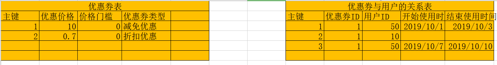

## 优惠券

生活中所看到的优惠券都是商家赠送的，那么在网站中如果要完成商城的优惠券，必须明确优惠券的信息存储。

```
优惠券的分析：
优惠券有优惠券的价格，有效的使用时间范围，使用的范围，持有人，使用门槛
```



当前项目中,我们就直接把上面的优惠券指定针对订单的整体优惠.


创建一个coupon子应用.

```bash
cd luffyapi/apps
python ../../manage.py startapp coupon
```

注册子应用

```python
INSTALLED_APPS = [

    # 子应用
	。。。
    'coupon',
]
```


coupon/models.py代码：

```python
from django.db import models
from luffyapi.utils.models import BaseModel
# Create your models here.
class Coupon(BaseModel):
    """优惠券"""
    coupon_choices = (
        (0, '折扣优惠'),
        (1, '减免优惠')
    )
    name = models.CharField(max_length=32, verbose_name="优惠券标题")
    coupon_type = models.SmallIntegerField(choices=coupon_choices, default=0, verbose_name="优惠券类型")
    condition = models.IntegerField(blank=True, default=0, verbose_name="满足使用优惠券的价格条件")
    sale = models.TextField(verbose_name="优惠公式", help_text="""
        *号开头表示折扣价，例如*0.82表示八二折；<br>
        -号开头表示减免价,例如-10表示在总价基础上减免10元<br>    
        """)

    class Meta:
        db_table = "ly_coupon"
        verbose_name="优惠券"
        verbose_name_plural=verbose_name

    def __str__(self):
        return "%s" % (self.name)

from user.models import User
class UserCoupon(BaseModel):
    """我的优惠券"""
    user = models.ForeignKey(User, on_delete=models.CASCADE, related_name="coupons", verbose_name="用户")
    coupon = models.ForeignKey(Coupon, on_delete=models.CASCADE, related_name="users", verbose_name="优惠券")
    start_time = models.DateTimeField(verbose_name="优惠券的开始使用时间")
    end_time = models.DateTimeField(verbose_name="优惠券的结束使用时间")
    is_use = models.BooleanField(default=False, verbose_name="优惠券是否使用过")

    class Meta:
        db_table = "ly_user_coupon"
        verbose_name = "用户的优惠券"
        verbose_name_plural = verbose_name

    def __str__(self):
        return "优惠券:%s,用户:%s" % (self.coupon.name, self.user.username)
```

数据迁移

```base
cd ../../
python manage.py makemigrations
python manage.py migrate
```


注册到coupon/xadmin.py，添加测试数据[1.添加优惠券，给用户发放优惠券]

```python
import xadmin
from .models import Coupon
class CouponModelAdmin(object):
    """优惠券模型管理类"""
    list_display = ["name","coupon_type"]
xadmin.site.register(Coupon, CouponModelAdmin)

from .models import UserCoupon
class UserCouponModelAdmin(object):
    """我的优惠券模型管理类"""
    list_display = ["user","coupon","start_time","end_time","is_use"]

xadmin.site.register(UserCoupon, UserCouponModelAdmin)
```

coupon/apps.py，xadmin管理界面标题设置

```python
from django.apps import AppConfig

class CouponConfig(AppConfig):
    name = 'coupon' 			#xadmin管理界面默认侧边栏标题
    verbose_name = "优惠券管理" 	#设置xadmin界面侧边栏中文标题

```

coupon/\__init__.py，导入xadmin标题设置

```python
default_app_config = "coupon.apps.CouponConfig" #导入侧边栏标题设置
```


#### 在订单页面查询当前用户拥有的优惠券

前端Order.vue增加优惠券的样式代码：

```vue
<!-- 优惠券和积分相关代码 -->
<div class="discount">
    <div id="accordion">
        <div class="coupon-box">
            <div class="icon-box">
                <span class="select-coupon">使用优惠劵：</span>
                <a class="select-icon unselect" :class="use_coupon?'is_selected':''" @click="use_coupon=!use_coupon"></a>
                <span class="coupon-num">有{{coupon_list.length}}张可用</span>
            </div>
            <p class="sum-price-wrap">商品总金额：<span class="sum-price">¥ {{total_price.toFixed(2)}}元</span></p>
        </div>
        <div id="collapseOne" v-if="use_coupon">
            <ul class="coupon-list" v-if="coupon_list.length>0">
                <li class="coupon-item" v-for="(item,key) in coupon_list">
                    <p class="coupon-name">{{item.coupon.name}}</p>
                    <p class="coupon-condition" v-if="item.coupon.condition>0">满{{item.coupon.condition}}元可以使用</p>
                    <p class="coupon-condition" v-else>没有使用条件</p>
                    <p class="coupon-time start_time">开始时间：{{item.start_time.replace("T"," ")}}</p>
                    <p class="coupon-time end_time">过期时间：{{item.end_time}}</p>
                </li>
            </ul>
            <div class="no-coupon" v-if="coupon_list.length<1">
                <span class="no-coupon-tips">暂无可用优惠券</span>
            </div>
        </div>
    </div>
    <div class="credit-box">
        <label class="my_el_check_box"><el-checkbox class="my_el_checkbox" v-model="use_credit"></el-checkbox></label>
        <p class="discount-num1" v-if="!use_credit">使用我的贝里</p>
        <p class="discount-num2" v-else><span>总积分：{{user_credit}}，抵扣 <el-input-number @change="handleChange"  v-model="credit" :min="0" :max="max_credit()" label="请填写积分"></el-input-number>，本次花费以后，剩余{{parseInt(user_credit-credit)}}积分</span></p>
    </div>
</div>


<script>
  import Header from "./common/Header"
  import Footer from "./common/Footer"
  export default {
    name:"Order",
    data(){
      return {
        token:"",
        pay_type: 1,
        credit: 0, // 本次订单使用的积分
        coupon: 0, // 用户选择使用的优惠券ID
        coupon_price: 0, // 优惠券抵扣的金额
        course_list: [],
        total_price: 0,   // 当前订单的价格
        use_coupon:false, // 用户是否选择使用了优惠券
        use_credit:false, // 使用户是否选择使用了积分
        user_credit: 0,   // 当前用户拥有的积分
        coupon_list:[
            {
                "start_time": "2019-10-01 00:00:00",
                "end_time": "2019-10-07 00:00:00",
                "coupon":{
                  "name":"八折优惠券",
                  "condition":0,

                }
            }
        ],
      }
    },
    components:{
      Header,
      Footer,
    },
    created(){
      this.check_user();
      this.get_selected_course();
    },
    methods: {
      max_credit(){
          // 设置当前用户能够使用的最大积分
          return 100900990;
      },
      handleChange(){

      }
    }
  }
</script>


<style scoped>
  /** 优惠券 **/
.coupon-box{
  text-align: left;
  padding-bottom: 22px;
  padding-left:30px;
  border-bottom: 1px solid #e8e8e8;
}
.coupon-box::after{
  content: "";
  display: block;
  clear: both;
}
.icon-box{
  float: left;
}
.icon-box .select-coupon{
  float: left;
  color: #666;
  font-size: 16px;
}
.icon-box::after{
  content:"";
  clear:both;
  display: block;
}
.select-icon{
  width: 20px;
  height: 20px;
  float: left;
}
.select-icon img{
  max-height:100%;
  max-width: 100%;
  margin-top: 2px;
  transform: rotate(-90deg);
  transition: transform .5s;
}
.is_show_select{
  transform: rotate(0deg)!important;
}
.coupon-num{
    height: 22px;
    line-height: 22px;
    padding: 0 5px;
    text-align: center;
    font-size: 12px;
    float: left;
    color: #fff;
    letter-spacing: .27px;
    background: #fa6240;
    border-radius: 2px;
    margin-left: 20px;
}
.sum-price-wrap{
    float: right;
    font-size: 16px;
    color: #4a4a4a;
    margin-right: 45px;
}
.sum-price-wrap .sum-price{
  font-size: 18px;
  color: #fa6240;
}

.no-coupon{
  text-align: center;
  width: 100%;
  padding: 50px 0px;
  align-items: center;
  justify-content: center; /* 文本两端对其 */
  border-bottom: 1px solid rgb(232, 232, 232);
}
.no-coupon-tips{
  font-size: 16px;
  color: #9b9b9b;
}
.credit-box{
  height: 30px;
  margin-top: 40px;
  display: flex;
  align-items: center;
  justify-content: flex-end
}
.my_el_check_box{
  position: relative;
}
.my_el_checkbox{
  margin-right: 10px;
  width: 16px;
  height: 16px;
}
.discount{
  overflow: hidden;
}
.discount-num1{
  color: #9b9b9b;
  font-size: 16px;
  margin-right: 45px;
}
.discount-num2{
  margin-right: 45px;
  font-size: 16px;
  color: #4a4a4a;
}
.sun-coupon-num{
  margin-right: 45px;
  margin-bottom:43px;
  margin-top: 40px;
  font-size: 16px;
  color: #4a4a4a;
  display: inline-block;
  float: right;
}
.sun-coupon-num span{
  font-size: 18px;
  color: #fa6240;
}
.coupon-list{
  margin: 20px 0;
}
.coupon-list::after{
  display: block;
  content:"";
  clear: both;
}
.coupon-item{
  float: left;
  margin: 15px 8px;
  width: 180px;
  height: 100px;
  padding: 5px;
  background-color: #fa3030;
  cursor: pointer;
}
.coupon-list .active{
  background-color: #fa9000;
}
.coupon-list .disable{
  cursor: not-allowed;
  background-color: #fa6060;
}
.coupon-condition{
  font-size: 12px;
  text-align: center;
  color: #fff;
}
.coupon-name{
  color: #fff;
  font-size: 24px;
  text-align: center;
}
.coupon-time{
  text-align: left;
  color: #fff;
  font-size: 12px;
}
.unselect{
  margin-left: 0px;
  transform: rotate(-90deg);
}
.is_selected{
  transform: rotate(-1turn)!important;
}
[class*=" el-icon-"], [class^=el-icon-]{
  font-size: 12px;
}
</style>
```


后端提供查询当前用户拥有的优惠券api接口

序列化器，coupon/serializers.py代码：

```python
from rest_framework import serializers
from .models import Coupon, UserCoupon

class CouponModelSerializer(serializers.ModelSerializer):
    class Meta:
        model = Coupon
        fields = ("name","coupon_type","condition","sale")

class UserCouponModelSerializer(serializers.ModelSerializer):
    coupon = CouponModelSerializer()
    class Meta:
        model = UserCoupon
        fields = ("id","start_time","end_time","coupon")
```

视图，coupon/views.py代码：

```python
# Create your views here.
from rest_framework.generics import ListAPIView
from .models import Coupon,UserCoupon
from datetime import datetime
from .serializers import UserCouponModelSerializer
from rest_framework.permissions import IsAuthenticated
from rest_framework.response import Response
from django_filters.rest_framework import DjangoFilterBackend

class UserCouponListAPIView(ListAPIView):
    queryset = UserCoupon.objects.filter( is_show=True, is_deleted=False, is_use=False, end_time__gte= datetime.now() )
    serializer_class = UserCouponModelSerializer
    permission_classes = [IsAuthenticated]
    # 使用过滤查哈获取当前用户有拥有的优惠券
    filter_backends = [DjangoFilterBackend]
    filter_fields = ('user_id',)

    # def list(self,request):
    #     """通过重写list方法，获取当前用户拥有的优惠券"""
    #     queryset = self.get_queryset().filter(user_id=request.user.id)
    #     queryset = self.filter_queryset(queryset)
    #
    #     page = self.paginate_queryset(queryset)
    #     if page is not None:
    #         serializer = self.get_serializer(page, many=True)
    #         return self.get_paginated_response(serializer.data)
    #
    #     serializer = self.get_serializer(queryset, many=True)
    #     return Response(serializer.data)
```

子应用路由，coupon/urls.py代码：

```python
from django.urls import path,re_path
from . import views
urlpatterns = [
    path("", views.UserCouponListAPIView.as_view()),
]
```

总路由，代码：

```python
    path('coupon/', include("coupon.urls")),
```


#### 前端展示当前用户拥有的优惠券并勾选使用优惠券以后，会自动调整订单实付价格

Order.vue增加代码：

```vue
        <!-- 优惠券和积分相关代码 -->
        <div class="discount">
            <div id="accordion">
                <div class="coupon-box">
                    <div class="icon-box">
                        <span class="select-coupon">使用优惠劵：</span>
                        <a class="select-icon unselect" :class="use_coupon?'is_selected':''" @click="use_coupon=!use_coupon"></a>
                        <span class="coupon-num">有{{coupon_list.length}}张可用</span>
                    </div>
                    <p class="sum-price-wrap">商品总金额：<span class="sum-price">¥ {{total_price.toFixed(2)}}元</span></p>
                </div>
                <div id="collapseOne" v-if="use_coupon">
                    <ul class="coupon-list" v-if="coupon_list.length>0">
                        <li class="coupon-item" v-for="(item,key) in coupon_list" :class="check_coupon(item.start_time,item.now_time,item.id,coupon)" @click="check_disable(item.start_time,item.now_time,item.id)">
                            <p class="coupon-name">{{item.coupon.name}}</p>
                            <p class="coupon-condition" v-if="item.coupon.condition>0">满{{item.coupon.condition}}元可以使用</p>
                            <p class="coupon-condition" v-else>没有使用条件</p>
                            <p class="coupon-time start_time">开始时间：{{item.start_time.replace("T"," ")}}</p>
                            <p class="coupon-time end_time">过期时间：{{item.end_time.replace("T", " ")}}</p>
                        </li>
                    </ul>
                    <div class="no-coupon" v-if="coupon_list.length<1">
                        <span class="no-coupon-tips">暂无可用优惠券</span>
                    </div>
                </div>
            </div>
            <div class="credit-box">
                <label class="my_el_check_box"><el-checkbox class="my_el_checkbox" v-model="use_credit"></el-checkbox></label>
                <p class="discount-num1" v-if="!use_credit">使用我的贝里</p>
                <p class="discount-num2" v-else><span>总积分：{{user_credit}}，抵扣 <el-input-number @change="handleChange"  v-model="credit" :min="0" :max="max_credit()" label="请填写积分"></el-input-number>，本次花费以后，剩余{{parseInt(user_credit-credit)}}积分</span></p>
            </div>
        </div>

<script>
    data(){
      return {
        token:"",
        pay_type: 1,
        credit: 0, // 本次订单使用的积分
        coupon: 0, // 用户选择使用的优惠券ID
        coupon_price: 0, // 优惠券抵扣的金额
        course_list: [],
        total_price: 0,   // 当前订单的价格
        use_coupon:false, // 用户是否选择使用了优惠券
        use_credit:false, // 使用户是否选择使用了积分
        user_credit: 0,   // 当前用户拥有的积分
        coupon_list:[],   // 后端提供的当前用户拥有的优惠券列表
      }
    },
    components:{
      Header,
      Footer,
    },
    watch:{
      use_coupon(){
          if(!this.use_coupon){
              this.coupon = 0; // 当用户收起优惠券列表，则表示取消使用优惠券，当前选择的优惠券归0重置.
          }
      },
      coupon(){
          // 在用户选择不同优惠券时，计算当前优惠券产生的抵扣金额
          this.get_coupon_price();
      }
    },
    created(){
      this.check_user();
      this.get_selected_course();
      this.get_user_coupon_list();
    },
    methods: {
      get_user_coupon_list(){
          //获取当前用户的优惠券列表
          let user_id = localStorage.user_id || sessionStorage.user_id; //获取当前登录用户的id
          //获取当前用户拥有的可用的优惠券列表
          this.$axios.get(`${this.$settings.Host}/coupon/`,{
              params:{
                  user_id: user_id,
              },
              headers:{
                  Authorization:"jwt "+this.token,
              }
          }).then(response=>{
              this.coupon_list = response.data;
          }).catch(error=>{
              this.$message.error("获取优惠券失败!");
          })
      },
      check_coupon(start_time, now_time, coupon_id, current_coupon){
          //判断获取到的优惠券是否已到可用时间,未到开始时间则禁用
          start_time = (new Date(start_time) - 0) / 1000; //将开始时间转换为秒
          if(start_time > now_time){
              return "disable"; //如果优惠券开始时间还未到,禁用当前优惠券
          }
          if(current_coupon === coupon_id){
              return "active";  //  如果当前优惠券id为
          }
      },
      check_disable(start_time, now_time, coupon_id){
          //选择优惠券
          start_time = (new Date(start_time) - 0) / 1000;
          if(start_time > now_time){
              return false;        //选择的优惠券未到开始时间则返回false
          }
          this.coupon = coupon_id; //选择使用的优惠券,返回优惠券id
      },
      get_coupon_price(){
          //计算优惠券可抵扣的金额
          if(this.coupon === 0){ //默认优惠券id为0,如果未选择使用任何优惠券,抵扣金额为0
              this.coupon_price = 0;
              return false;
          }
          //获取优惠券的抵扣金额
          for(let item of this.coupon_list){
              if(item.id === this.coupon){
                  let sale = parseFloat(item.coupon.sale.substr(1)); //获取优惠公式从下标1开始的字符
                  if(item.coupon.coupon_type === 0){
                      //折扣优惠
                      this.coupon_price = this.total_price * (1-sale);
                  }else{
                      //减免优惠
                      this.coupon_price = sale;
                  }
              }
          }
      },
      calc_cart_total(){
          //统计整个订单中,所选商品的总价格
          this.total_price = 0;
          for(let course of this.course_list){
              this.total_price += course.real_price;
          }
      },
</script>
```

coupon/models.py增加：

```python
from datetime import datetime
class UserCoupon(BaseModel):

    @property
    def now_time(self):
        return datetime.now().timestamp()
```

coupon/serializers.py增加返回nowtime字段：

```python
class UserCouponModelSerializer(serializers.ModelSerializer):
    coupon = CouponModelSerializer()
    class Meta:
        model = UserCoupon
        fields = ("id", "start_time", "end_time", "now_time", "coupon")
```

