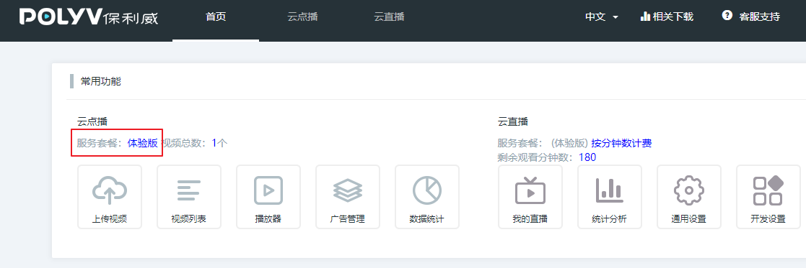
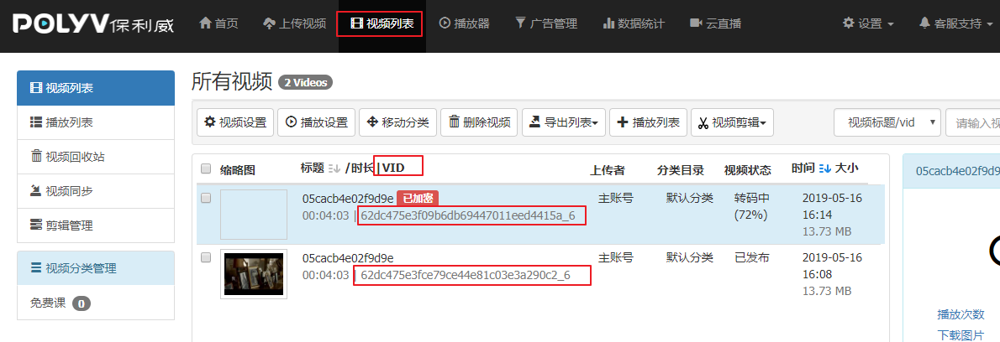

# 视频播放

项目中有两种视频：收费视频[需要加密]和免费视频

## 使用保利威云视频服务来对视频进行加密

官方网址: http://www.polyv.net/vod/

注意：

>  开发时通过`免费试用`注册**体验版**账号【测试账号的测试有效期是一周】
>
> 公司使用**酷播尊享版**



开发文档地址: http://dev.polyv.net/2017/videoproduct/v-playerapi/html5player/html5-docs/

要开发播放保利威的加密视频功能,需要在用户中心->设置->API接口和加密设置.

http://my.polyv.net/secure/setting/api


配置视频上传加密.


上传视频并记录视频的VID




## 后端获取保利威的视频播放授权token,提供接口api给前端

参考文档:http://dev.polyv.net/2019/videoproduct/v-api/v-api-play/create-playsafe-token/


根据官方文档的案例,已经有其他人开源了,针对polvy的token生成的python版本了,我们可以直接拿来使用.

在libs下创建polyv.py,编写token生成工具函数

```python
from django.conf import settings
import time
import requests
import hashlib

class PolyvPlayer(object):
    def __init__(self,userId,secretkey,tokenUrl):
        """初始化，提供用户id和秘钥"""
        self.userId = userId
        self.secretKey = secretkey
        self.tokenUrl = tokenUrl

    def tomd5(self, value):
        """取md5值"""
        return hashlib.md5(value.encode()).hexdigest()

    # 获取视频数据的token
    def get_video_token(self, videoId, viewerIp, viewerId=None, viewerName='', extraParams='HTML5'):
        """
        :param videoId: 视频id
        :param viewerId: 看视频用户id
        :param viewerIp: 看视频用户ip
        :param viewerName: 看视频用户昵称
        :param extraParams: 扩展参数
        :param sign: 加密的sign
        :return: 返回点播的视频的token
        """
        ts = int(time.time() * 1000)  # 时间戳
        plain = {
            "userId": self.userId,
            'videoId': videoId,
            'ts': ts,
            'viewerId': viewerId,
            'viewerIp': viewerIp,
            'viewerName': viewerName,
            'extraParams': extraParams
        }

        # 按照ASCKII升序 key + value + key + value... + value 拼接
        plain_sorted = {}
        key_temp = sorted(plain)
        for key in key_temp:
            plain_sorted[key] = plain[key]
        print(plain_sorted)

        plain_string = ''
        for k, v in plain_sorted.items():
            plain_string += str(k) + str(v)
        print(plain_string)

        # 首尾拼接上秘钥
        sign_data = self.secretKey + plain_string + self.secretKey

        # 取sign_data的md5的大写
        sign = self.tomd5(sign_data).upper()

        # 新的带有sign的字典
        plain.update({'sign': sign})
        # python 提供的发送http请求的模块
        result = requests.post(
            url=self.tokenUrl,
            headers={"Content-type": "application/x-www-form-urlencoded"},
            data=plain
        ).json()
        token = {} if isinstance(result, str) else result.get("data", {})

        return token
```


配置文件settings/dev.py，代码：

```python
# 保利威视频加密服务（已设为自己的）
POLYV_CONFIG = {
    "userId":"158384da6b",
    "secretkey":"ExnUzIH8u7",
    "tokenUrl":"https://hls.videocc.net/service/v1/token",
}
```


courses/views.py，视图增加代码:

```python
"""保利威云视频加密播放"""
from rest_framework.views import APIView
from rest_framework.permissions import IsAuthenticated
from luffyapi.libs.polyv import PolyvPlayer
from django.conf import settings
from rest_framework.response import Response
class PolyvAPIView(APIView):
    permission_classes = [IsAuthenticated]
    def get(self,request):
        """获取保利威云视频加密播放的播放凭证token"""
        vid = request.query_params.get("vid")   # 视频播放ID
        remote_addr = request.META.get("REMOTE_ADDR")  # 远程地址
        user_id = request.user.id  # 用户ID
        user_name = request.user.username  # 用户名
        polvy = PolyvPlayer(
            userId=settings.POLYV_CONFIG.get("userId"),
            secretkey=settings.POLYV_CONFIG.get("secretkey"),
            tokenUrl=settings.POLYV_CONFIG.get("tokenUrl")
        )

        data = polvy.get_video_token(vid, remote_addr, user_id, user_name)

        return Response(data.get("token"))
```


courses/urls.py，路由代码：

```python
path(r"polyv/token/",views.PolyvAPIView.as_view()),
```


服务端后面要提供课时信息的api接口

course/views.py,视图代码:

```python
from rest_framework.generics import RetrieveAPIView
from .models import CourseLesson
from .serializers import CourseLessonModelSerializer
class LessonRetrieveAPIView(RetrieveAPIView):
    """课时详细信息"""
    queryset = CourseLesson.objects.filter(is_show=True,is_deleted=False)
    serializer_class = CourseLessonModelSerializer
```

序列化器,course/serializers.py,代码:

```python
from .models import CourseLesson
class CourseLessonModelSerializer(serializers.ModelSerializer):
    class Meta:
        model = CourseLesson
        fields = "__all__"
```

路由地址:

```python
from django.urls import path,re_path
from . import views
urlpatterns = [
    path("category/", views.CourseCategoryListAPIView.as_view()),
    path("", views.CourseListAPIView.as_view()),
    re_path("^(?P<pk>\d+)/$", views.CourseRetrieveAPIView.as_view()),
    path("chapter/",views.CourseChapterListAPIView.as_view()),
    path("polyv/token/",views.PolyvAPIView.as_view()),
    re_path("^lesson/(?P<pk>\d+)/$",views.LessonRetrieveAPIView.as_view()),
]
```


## 客户端请求课时信息以及播放token并播放视频

在 vue项目的入口文件index.html 中加载保利威视频播放器的js核心类库

```html
<script src='https://player.polyv.net/script/polyvplayer.min.js'></script>
```


创建视频播放页面的组件components/Player.vue，代码：

```vue
<template>
    <div class="player">
      <div id="player"></div>
    </div>
</template>

<script>
export default {
  name:"Player",
  data () {
    return {

    }
  },
  methods: {

  },
  computed: {
  }
}
</script>

<style scoped>
</style>
```

前端路由，代码：

```javascript
      {
       name:"Player",
       path:"/player/:lesson",
       component: Player,
     },
```


引入保利威前端HTML5视频播放器代码，Player.vue：

```vue
<template>
    <div class="player">
      <div id="player"></div>
    </div>
</template>

<script>
export default {
  name:"Player",
  data () {
    return {
      token: '',
      lesson: {}, // 当前课时的详细信息
    }
  },
  mounted() {
      this.token = this.$settings.check_user_login();
      this.get_course();
  },
  methods: {
      get_course(){
          // 后端实现根据课时id来获取课时详细信息[包括vid]
          console.log(this.$route.params);
          let lesson_id = this.$route.params.lesson;
          this.$axios.get(`${this.$settings.Host}/course/lesson/${lesson_id}/`).then(response=>{
              this.lesson = response.data;
              // 对播放器进行初始化,传入参数课时的视频vid
              this.polyv_init(this.lesson.section_link); 

          }).catch(error=>{
              this.$message.error("获取服务端课程信息失败！");
          });
      },
      polyv_init(vid){
        let user_name = localStorage.user_name || sessionStorage.user_name;
        let self = this;
        // 对保利威播放器进行初始化
        var player = polyvObject('#player').videoPlayer({
            width: document.documentElement.clientWidth-260, // todo 默认设置的播放器宽度，右边保留了260px的课程课时列表
            height: document.documentElement.clientHeight,
            forceH5: true,
            code: user_name, // 一般是用户昵称
            vid: vid,
            playsafe: function(vid, next) {
              self.$axios.get(`${self.$settings.Host}/course/polyv/token/`,{
                  params:{
                      vid,
                  },
                  headers:{
                      Authorization: "jwt " + self.token,
                  }
              }).then(response=>{
                  // 让播放器调用服务器返回的token
                  next(response.data);
              }).catch(error=>{
                  if(error.response.status=="401"){
                      self.$alert("对不起，您尚未登录！请登录！",{
                          callback(){
                            self.$router.push("/user/login");
                          }
                      })
                  }
              })
            }
      });
      }
  },

}
</script>

<style scoped>

</style>
```


Detail.vue，增加立即试学代码：

```vue
                  <li class="lesson-item" v-for="lesson in chapter.lesson_list">
                    <p class="name"><span class="index">{{chapter.chapter}}-{{lesson.lesson}}</span> {{lesson.name}}<span class="free" v-if="lesson.free_trail">免费</span></p>
                    <p class="time">{{lesson.duration}} </p>
                    <button class="try" v-if="lesson.free_trail">
                      <router-link v-if="lesson.section_type===0" data="文档" to="/">立即试学</router-link>
                      <router-link v-else-if="lesson.section_type===1" data="练习" to="/">立即试学</router-link>
                      <router-link v-else data="视频" :to="'/player/'+lesson.id">立即试学</router-link>
                    </button>
                    <button class="try" v-else>立即购买</button>
                  </li>
```


## 完善API接口的身份认证

试学必须在用户登录以后才能进行，所以后端的token的API接口必须保证用户登陆以后，才提供的视频播放的token。（已添加登陆检查）

如果有些视频必须购买了以后才能播放！对于这种情况，在用户进入播放器Player.vue组件时，我们在后端返回token时，进行数据库查询，这个用户是否购买了对应课程，并且课程在有效期范围内！

```
作业！
课时->课程->课程购买记录->用户 === request.user
```


