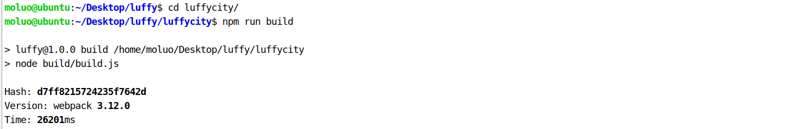
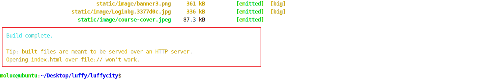
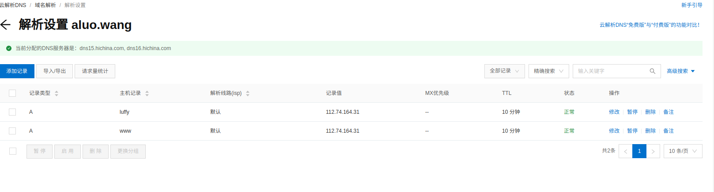

# 1. 部署架构


### 购买服务器

根据上面的分析的架构和性能分析,来决定购买多少台服务器,买多好的服务器.

这里我们学习,所以我只买一台.

云服务器,价格偏贵,买了云平台上通过云计算技术虚拟的一台服务器.可以自己安装操作系统.

虚拟服务器,云空间  价格便宜,但是只能租了别人电脑的一个目录.


### 域名解析

```
www.dingpc.info  34.92.193.28   客户端域名解析
api.dingpc.info  34.92.193.28   服务端域名解析
```


ubuntu18.04 服务器更新源

```
cp /etc/apt/sources.list /etc/apt/sources.list.bak

vim /etc/apt/sources.list

#添加阿里源
deb http://mirrors.aliyun.com/ubuntu/ bionic main restricted universe multiverse
deb http://mirrors.aliyun.com/ubuntu/ bionic-security main restricted universe multiverse
deb http://mirrors.aliyun.com/ubuntu/ bionic-updates main restricted universe multiverse
deb http://mirrors.aliyun.com/ubuntu/ bionic-proposed main restricted universe multiverse
deb http://mirrors.aliyun.com/ubuntu/ bionic-backports main restricted universe multiverse
deb-src http://mirrors.aliyun.com/ubuntu/ bionic main restricted universe multiverse
deb-src http://mirrors.aliyun.com/ubuntu/ bionic-security main restricted universe multiverse
deb-src http://mirrors.aliyun.com/ubuntu/ bionic-updates main restricted universe multiverse
deb-src http://mirrors.aliyun.com/ubuntu/ bionic-proposed main restricted universe multiverse
deb-src http://mirrors.aliyun.com/ubuntu/ bionic-backports main restricted universe multiverse

apt update
```


# 2.前端项目部署

### **编译前端项目**

我们先把没有上传的代码提交一个版本到码云。接下来,我们修改本地相关配置,使用公司提供的资源信息,例如,IP地址,域名地址,短信接口,....

```python
git add .
git commit -m "项目完成"
git push -u origin dev

线上合并分支，把dev的内容合并到master里面
```

修改前端项目中ajax请求api地址, src/settings.js文件.

```javascript
export default {
  Host: "http://api.dingpc.info",
  check_user_login(){
    // 检查用户是否登录了
    let token = sessionStorage.user_token || localStorage.user_token;
    return token;
  }
}
```

自动化程序会将打包的文件自动生成到项目的dist文件夹中。

```bash
cd ~/Desktop/luffy/lufei_pc
npm run build

# 注意：前端项目编译以后的文件dist，默认在vue项目是不会进行版本跟踪，所以需要在前端项目的.gitignore文件中删除 /dist/ 这一行，才能将编译后的dist上传
# 再次提交前端项目到git仓库
git commit -am "前端编译完成"
git push -u origin dev
```

效果：



编译完成的内容会被保存在dist目录下，并且编译出来的项目，不能直接通过file://来访问，只能通过http服务器的运行这个项目。



因为根据我们上面的部署方案，我们需要安装nginx来运行这个前端项目。


### 安装docker

**使用docker进行容器化管理进行持续集成部署**

更新ubuntu的apt源索引

```shell
sudo apt-get update
```

安装包允许apt通过HTTPS使用仓库

```shell
sudo dpkg --configure -a
sudo apt-get install apt-transport-https ca-certificates curl software-properties-common
```

添加Docker官方GPG key（PGP：Pretty Good Privacy 是一套用于消息加密、验证的应用程序。GNU Privacy Guard(GPG)是一个免费的软件用于替换**[Symantec](https://en.wikipedia.org/wiki/NortonLifeLock)**的PGP加密软件套件。这个是国外服务器地址，所以网络不好的时候，会失败！在网路好的情况下，多执行几次就没问题了）

```shell
curl -fsSL https://download.docker.com/linux/ubuntu/gpg | sudo apt-key add -
```

设置Docker稳定版仓库

```shell
sudo add-apt-repository "deb [arch=amd64] https://download.docker.com/linux/ubuntu $(lsb_release -cs) stable"
```

添加仓库后，更新apt源索引

```shell
sudo apt-get update
```

前面的准备工作完成以后，接下来安装最新版Docker CE（社区版）

```shell
sudo apt-get install docker-ce
```

检查Docker CE是否安装正确

```shell
sudo docker run hello-world
```

出现了`hello from Docker`则表示上面的安装成功！


运行起来的容器，就是一个单独的操作系统，我们可以通过docker提供的命令，进入到容器内部，在这个容器内不的操作系统上安装和启动想要的软件。


容器：容器是运行在内存中的镜像，不能提供给别人，但是我们可以进入容器内部，安装/控制软件的运行。如果我们要把容器里面的东西提供给别人，则需要先把容器保存成镜像文件，然后把镜像文件发给别人，别人通过镜像文件运行起来，才能得到容器。

镜像：每一个镜像里面都是包含了一个操作系统，这个系统里面的文件是很小的，里面只会安装一些跟当前镜像有关的文件。如果这个镜像文件里面只是安装了nginx，则这个镜像可以被称之为nginx镜像。我们可以从官网或者别人手上得到镜像文件。

我们获取镜像文件，可以直接去官方网站上获取: https://hub.docker.com/

镜像加速配置

```python
sudo mkdir -p /etc/docker
sudo tee /etc/docker/daemon.json <<-'EOF'
{
  "registry-mirrors": ["https://2xdmrl8d.mirror.aliyuncs.com"]
}
EOF
sudo systemctl daemon-reload
sudo systemctl restart docker
```


#### **docker的启动与停止**

安装完成Docker后，默认已经启动了docker服务，如需手动控制docker服务的启停，可执行如下命令

```shell
# 启动docker
sudo service docker start

# 停止docker
sudo service docker stop

# 重启docker
sudo service docker restart

# 列出所有镜像
dokcer images
docker image ls

# 拉取镜像
docker image pull library/hello-world

# 删除镜像
docker image rm 镜像id/镜像名

# 创建容器
docker run [选项参数] 镜像名 [命令]

# 停止一个已经在运行的容器
docker container stop 容器名或容器id

# 启动一个已经停止的容器
docker container start 容器名或容器id

# kill掉一个已经在运行的容器
docker container kill 容器名或容器id

# 删除容器
docker container rm 容器名或容器id

# 运行容器打开交互式终端
docker container exec -it 容器名/容器ID bash
docker container exec -itd 容器名/容器ID bash #后台运行
```


### 通过nginx容器来运行前端项目

Nginx是一款基于异步框架的轻量级/高性能的Web 服务器/反向代理服务器/缓存服务器/电子邮件(IMAP/POP3)代理服务器，并在一个BSD-like协议下发行。由俄罗斯的程序设计师Igor Sysoev(伊戈尔·赛索耶夫)所开发，最初供俄国大型网站Rambler.ru及搜寻引擎Rambler使用。

#### 下载nginx镜像

```python
# 在docker中下载nginx镜像
docker image pull nginx
```

#### **上传前端项目到服务器**

再次确认已上传已编译的前端项目

```shell
# 在本地终端通过以下命令上传编译后的项目文件（再次确认）
git add -f lufei_pc/dist
git commit -m "上传dist编译后的前端项目"
git push -u origin dev
```

将码云上的前端项目克隆到服务器

```shell
# 使用git把码云上面的编译过的vue项目克隆到服务器/home
# 阿里云服务器中，已经内置了git，所以可以直接从码云克隆项目下来: /home/luffy
# git clone 项目git地址，默认克隆master分支
cd /home/
git clone https://gitee.com/sincere_ye/luffy.git
#git clone -b dev https://gitee.com/sincere_ye/luffy.git #克隆dev分支
# 注意,上面提交的代码版本中,真正的前端项目编译代码在dev分支下面,所以我们需要切换分支
git checkout dev
```

#### 创建nginx容器并映射

```shell
# 创建nginx容器，并以80端口对外提供服务
# 容器内部的/usr/share/nginx/html 是nginx在安装时，系统默认分配的网站项目的根目录
docker run -itd -p 80:80 -v /home/luffy/lufei_pc/dist:/usr/share/nginx/html --name=lufei_pc nginx
# 执行上面的命令，理论上来说，就可以让前端项目，可以阿里云的IP地址访问到了。

"""
/etc/nginx              # nginx容器中nginx的配置目录
/etc/nginx/conf.d/default.conf  # 默认站点的配置文件
/usr/share/nginx/html   # nginx容器中默认网站的根目录
"""
```

docker run 选项：

-v --volume 目录映射，把服务器中的真实目录，映射到 容器内部的指定目录，当容器内部操作指定目录时，则相当于操作服务器里面的真实目录

-p --port 端口映射，把服务器中的真实端口，映射到 容器内部的执行端口，当用户访问/操作真实端口时，则相当于访问/操作容器里面的端口

#### nginx站点配置前端域名

上面部署命令之后，我们就可以通过IP来访问项目了，但是我们项目一般通过域名提供给用户来进行访问的

把IP和域名的映射关联到阿里云服务器上面来。

```python
前端域名：http://www.dingpc.info
服务器的公网IP： 34.92.193.28
```



我们现在可以解析域名到服务器了，但是如果有多个域名同时都指向这个服务器，则所有的域名都会访问到同一个项目中，所有我们把**不同的域名和不同的项目目录进行配置绑定**。

这里就需要手动配置nginx的站点配置了。

```bash
# 进入nginx容器，修改/etc/nginx/conf.d/default.conf文件
# 要在容器里面编辑文件，可以通过 apt-get update 和 apt install vim 来安装一个编辑器。
# docker container exec -it <容器名称/容器ID> bash
docker container exec -it lufei_pc bash
# exit命令退出容器
# 如果容器内部没有vim编辑器,则可以安装一下.
apt-get update
apt-get install vim

vim /etc/nginx/conf.d/default.conf
# 修改 server_name 对应的路径
server {
  listen   80;
  server_name  www.dingpc.info;  
  # ...
}

# 按Esc键
# 输入 :wq 保存文件

# 重启nginx
nginx -s reload
```


# 3. 后端项目部署

根据我们之前分析的项目部署架构，后端需要需要mysql和redis。所有再此我们需要先把这些外部工具先预装。

### 创建redis容器

```python
# 因此我们需要在docker中下载redis和mysql的容器
docker pull redis

# 创建redis容器并运行redis
docker run -itd --name=redis -p6379:6379 redis
    
# 可以进入到容器中，进行测试redis是否已经成功启动
docker container exec -it <容器名称/容器ID> bash

# 可以通过进入容器内部，执行 redis-cli 来操作redis
```


### 创建mysql容器

之前我们使用的mysql版本是5.7版本的。

```python
# 如果之前的mysql的镜像没有下载，则下载命令如下：
docker image pull mysql:5.7
# -e 设置容器内部的环境变量,一个容器在创建的时候,可以多个不同的环境
# 启动mysql容器，MYSQL_ROOT_PASSWORD 指代的就是mysql的root用户的登录密码(两个root，一个本地，一个所有ip)
#注意服务器要在安全组或防火墙中开启相应的端口
docker run -itd -p3306:3306 --name=mysql -e MYSQL_ROOT_PASSWORD=123456 mysql:5.7
# 如果需要多台mysql容器安装在一台服务器中，那么容器内部的端口可以不用设置，但是真实物理系统的端口必须要修改，保证端口唯一！
# docker run -itd -p3307:3306 -e MYSQL_ROOT_PASSWORD=123456 mysql:5.7
# docker run -itd -p3308:3306 -e MYSQL_ROOT_PASSWORD=123456 mysql:5.7


# 我们可以在任意一个外部网路中（虚拟机本地终端），远程连接到阿里云服务器上的数据库中
# 注意使用命令远程链接mysql，必须使用的地方有mysql
#mysql -uroot -P端口 -p密码 -hIP
#mysql -uroot -p123456 -h34.92.193.28
```

docker container run的选项：

-e 就是设置容器内部的环境变量， 在docker容器的使用过程中， 有部分容器需要配置环境的，这些环境变量都是有下载镜像时官方指定的。


#### 把本地的数据导入到容器的mysql数据库中

```python
# 虚拟机本地终端连接到远程服务器的数据库,服务器本地root登陆密码为123456
mysql -uroot -pChang95213 -h34.92.193.28 

# 创建数据库
create database luffy charset=utf8mb4;

# 为当前项目创建账号
create user luffy_user identified by 'luffy';
grant all privileges on luffy.* to 'luffy_user'@'%';
flush privileges;
exit

# 把本地的数据库导出到桌面
mysqldump -uroot -p123 luffy > ~/Desktop/luffy.sql

# 把桌面下导出的数据库文件导入到docker容器中的mysql数据库
mysql -uroot -pChang95213 -h34.92.193.28  luffy <  ~/Desktop/luffy.sql
```


```shell
#服务器中进入容器
docker container exec -it mysql bash 
#进入数据库，查询数据
mysql -uroot -p123456
#在服务器中修改远程连接root用户的密码
set password for root@'%' = password('Chang95213')
```


### 后端项目部署docker容器前的准备

1. 修改配置：
   
   现在的配置，保存在dev.py中，不管数据库密码或者redis的地址或者配置信息都是属于开发阶段，项目上线以后，肯定换成公司的，所以一定会修改。我们需要把dev.py的内容移动到prod.py中，并修改对应的配置信息。

2. 关闭debug模式

   在本地开发时，我们使用的框架运行在debug模式下的，但是项目上线时，会关闭debug，所以我们如果关闭了debug模式，则drf框架会不再提供静态文件的浏览服务，也就是之前xadmin，drf的接口页面的图片，样式或者js文件都不能访问到了。我们需要收集这些文件到外界，后面通过nginx来对外提供静态文件的浏览服务。

3. 配置uwsgi

   原来的drf项目是运行在python内置的提供的web服务器中，wsgiref在项目上线的时候，我们不能使用这个模块来提供对外服务。wsgiref模块不支持多线程，性能不好，本身在安全性上并不完善，python提供这个模块仅供学习和开发测试使用。runserver 不能用于生产,改成uwsgi。

4. 同步依赖模块

   原来drf项目在本地开发时，其实要运行这个项目，我们是安装了很多的依赖模块。将来项目上线了，我们也肯定需要把本地的模块同步到线上服务器！否则项目跑不起来


### 修改配置文件pord.py

在项目中复制开发配置文件dev.py 到生产配置prod.py

修改配置中的地址，修改第零处到到第五处

DEBUG模式、ALLOWED_HOST、跨域白名单CORS_ALLOWD_WHITELIST、数据库DATABASES、redis缓存CACHES、支付宝ALIPAY_CONFIG

后期要改的：极验证、SMS云通讯、保利威云视频

```python
# 线下开发的配置文件
"""
Django settings for luffyapi project.

Generated by 'django-admin startproject' using Django 2.2.7.

For more information on this file, see
https://docs.djangoproject.com/en/2.2/topics/settings/

For the full list of settings and their values, see
https://docs.djangoproject.com/en/2.2/ref/settings/
"""

import os

# Build paths inside the project like this: os.path.join(BASE_DIR, ...)
BASE_DIR = os.path.dirname(os.path.dirname(os.path.abspath(__file__)))
# 增加了子应用目录到系统的导包路径中
import sys
sys.path.insert(0, os.path.join(BASE_DIR, "apps"))

# Quick-start development settings - unsuitable for production
# See https://docs.djangoproject.com/en/2.2/howto/deployment/checklist/

# SECURITY WARNING: keep the secret key used in production secret!
SECRET_KEY = 'a2=m9te*ytqi#=rqf-q#bn*o2fb!s6k=1zllm_oamzlfv6s9h@'

# SECURITY WARNING: don't run with debug turned on in production!
DEBUG = False	#第零处

ALLOWED_HOSTS = [
    "api.dingpc.info",   #第一处,允许访问后端文件的host
]


# Application definition

INSTALLED_APPS = [
    'django.contrib.admin',
    'django.contrib.auth',
    'django.contrib.contenttypes',
    'django.contrib.sessions',
    'django.contrib.messages',
    'django.contrib.staticfiles',

	# 注意，加上drf框架的注册
    'rest_framework',
    'corsheaders',
    'xadmin',
    'crispy_forms',
    'reversion',
    'django_filters',
    'ckeditor',  # 富文本编辑器
    'ckeditor_uploader',  # 富文本编辑器上传图片模块

    'home',
    'user',
    'course',
    'cart',
    'order',
    'coupon',
]

# CORS组的配置信息
CORS_ORIGIN_WHITELIST = (
    'http://www.dingpc.info',  #第二处，允许访问的前端的host
)
CORS_ALLOW_CREDENTIALS = False  # 允许ajax跨域请求时携带cookie

MIDDLEWARE = [
    'corsheaders.middleware.CorsMiddleware',
    'django.middleware.security.SecurityMiddleware',
    'django.contrib.sessions.middleware.SessionMiddleware',
    'django.middleware.common.CommonMiddleware',
    'django.middleware.csrf.CsrfViewMiddleware',
    'django.contrib.auth.middleware.AuthenticationMiddleware',
    'django.contrib.messages.middleware.MessageMiddleware',
    'django.middleware.clickjacking.XFrameOptionsMiddleware',
]

ROOT_URLCONF = 'luffyapi.urls'

TEMPLATES = [
    {
        'BACKEND': 'django.template.backends.django.DjangoTemplates',
        'DIRS': [],
        'APP_DIRS': True,
        'OPTIONS': {
            'context_processors': [
                'django.template.context_processors.debug',
                'django.template.context_processors.request',
                'django.contrib.auth.context_processors.auth',
                'django.contrib.messages.context_processors.messages',
            ],
        },
    },
]

WSGI_APPLICATION = 'luffyapi.wsgi.application'


# Database
# https://docs.djangoproject.com/en/2.2/ref/settings/#databases

DATABASES = {
    # 'default': {
    #     'ENGINE': 'django.db.backends.sqlite3',
    #     'NAME': os.path.join(BASE_DIR, 'db.sqlite3'),
    # }
    'default': {
        'ENGINE': 'django.db.backends.mysql',
        "HOST": "34.92.193.28", # 修改成公网IP地址，第三处
        "PORT": 3306,
        "USER": "luffy_user",
        "PASSWORD": "luffy",
        "NAME": "luffy",
    }
}

# 设置redis缓存
CACHES = {
    # 默认缓存
    "default": {
        "BACKEND": "django_redis.cache.RedisCache",
        # 项目上线时,需要调整这里的路径
        "LOCATION": "redis://34.92.193.28:6379/0", #第四处，改四个redis数据库

        "OPTIONS": {
            "CLIENT_CLASS": "django_redis.client.DefaultClient",
        }
    },
    # 提供给xadmin或者admin的session存储
    "session": {
        "BACKEND": "django_redis.cache.RedisCache",
        "LOCATION": "redis://34.92.193.28:6379/1",
        "OPTIONS": {
            "CLIENT_CLASS": "django_redis.client.DefaultClient",
        }
    },
    # 提供存储短信验证码
    "sms_code": {
        "BACKEND": "django_redis.cache.RedisCache",
        "LOCATION": "redis://34.92.193.28:6379/2",
        "OPTIONS": {
            "CLIENT_CLASS": "django_redis.client.DefaultClient",
        }
    },
    "cart": {
        "BACKEND": "django_redis.cache.RedisCache",
        "LOCATION": "redis://34.92.193.28:6379/3",
        "OPTIONS": {
            "CLIENT_CLASS": "django_redis.client.DefaultClient",
        }
    }
}

# 设置xadmin用户登录时,登录信息session保存到redis
SESSION_ENGINE = "django.contrib.sessions.backends.cache"
SESSION_CACHE_ALIAS = "session"

# Password validation
# https://docs.djangoproject.com/en/2.2/ref/settings/#auth-password-validators

AUTH_PASSWORD_VALIDATORS = [
    {
        'NAME': 'django.contrib.auth.password_validation.UserAttributeSimilarityValidator',
    },
    {
        'NAME': 'django.contrib.auth.password_validation.MinimumLengthValidator',
    },
    {
        'NAME': 'django.contrib.auth.password_validation.CommonPasswordValidator',
    },
    {
        'NAME': 'django.contrib.auth.password_validation.NumericPasswordValidator',
    },
]


# Internationalization
# https://docs.djangoproject.com/en/2.2/topics/i18n/

# 修改使用中文界面
LANGUAGE_CODE = 'zh-Hans'

# 修改时区
TIME_ZONE = 'Asia/Shanghai'

USE_I18N = True

USE_L10N = True

USE_TZ = False


# Static files (CSS, JavaScript, Images)
# https://docs.djangoproject.com/en/2.2/howto/static-files/

STATIC_URL = '/static/'
# 设置django的静态文件目录
STATICFILES_DIRS = [
    os.path.join(BASE_DIR,"static")
]

# 项目中存储上传文件的根目录[暂时配置]，注意，uploads目录需要手动创建否则上传文件时报错
MEDIA_ROOT=os.path.join(BASE_DIR,"uploads")
# 访问上传文件的url地址前缀
MEDIA_URL ="/media/"

# 日志配置
LOGGING = {
    'version': 1,
    'disable_existing_loggers': False,
    # 日志格式
    'formatters': {
        'verbose': {
            'format': '%(levelname)s %(asctime)s %(module)s %(lineno)d %(message)s'
        },
        'simple': {
            'format': '%(levelname)s %(module)s %(lineno)d %(message)s'
        },
    },
    'filters': {
        'require_debug_true': {
            '()': 'django.utils.log.RequireDebugTrue',
        },
    },
    'handlers': {
        'console': {
            'level': 'DEBUG',
            'filters': ['require_debug_true'],
            'class': 'logging.StreamHandler',
            'formatter': 'simple'
        },
        'file': {
            'level': 'INFO',
            'class': 'logging.handlers.RotatingFileHandler',
            # 日志位置,日志文件名,日志保存目录必须手动创建
            'filename': os.path.join(os.path.dirname(BASE_DIR), "logs/luffy.log"),
            # 日志文件的最大值,这里我们设置300M
            'maxBytes': 300 * 1024 * 1024,
            # 日志文件的数量,设置最大日志数量为10
            'backupCount': 10,
            # 日志格式:详细格式
            'formatter': 'verbose'
        },
    },
    # 日志对象
    'loggers': {
        'django': {
            'handlers': ['console', 'file'],
            'propagate': True, # 是否让日志信息继续冒泡给其他的日志处理系统
        },
    }
}

REST_FRAMEWORK = {
    # 异常处理
    'EXCEPTION_HANDLER': 'luffyapi.utils.exceptions.custom_exception_handler',
    # 自定义用户认证[配置的是保存用户信息使用什么方式来保存]
    'DEFAULT_AUTHENTICATION_CLASSES': (
        'rest_framework_jwt.authentication.JSONWebTokenAuthentication',
        'rest_framework.authentication.SessionAuthentication',
        'rest_framework.authentication.BasicAuthentication',
    ),
}

import datetime
JWT_AUTH = {
    # 配置 jwt token的有效期
    'JWT_EXPIRATION_DELTA': datetime.timedelta(days=1),
    # 自定义返回数据
    'JWT_RESPONSE_PAYLOAD_HANDLER': 'user.utils.jwt_response_payload_handler',
}


# 指定系统调用的模型类路径，模型的路径格式：必须是 '子应用目录.模型类名'
AUTH_USER_MODEL = 'user.User'

# 自定义多条件登录
AUTHENTICATION_BACKENDS = [
    'user.utils.UsernameMobileAuthBackend',
]

# 极验验证码【换成公司的】
GEETEST = {
    "pc_geetest_id": "e951ba436ca7c3f6192615f006d0b2ae",
    "pc_geetest_key": "fba7357abd64ff84132bd520834afe4e",
}


# 短信相关配置【换成公司的】
SMS = {
    # 说明：主账号，登陆云通讯网站后，可在"控制台-应用"中看到开发者主账号ACCOUNT SID
    "_accountSid": '8a216da863f8e6c20164139687e80c1b',
    # 说明：主账号Token，登陆云通讯网站后，可在控制台-应用中看到开发者主账号AUTH TOKEN
    "_accountToken": '6dd01b2b60104b3dbc88b2b74158bac6',

    # 请使用管理控制台首页的APPID或自己创建应用的APPID
    "_appId": '8a216da863f8e6c20164139688400c21',

    # 说明：请求地址，生产环境配置成app.cloopen.com
    "_serverIP": 'sandboxapp.cloopen.com',

    # 说明：请求端口 ，生产环境为8883
    "_serverPort": "8883",

    # 说明：REST API版本号保持不变
    "_softVersion": '2013-12-26',
}


# 富文本编辑器ckeditor配置
CKEDITOR_CONFIGS = {
    'default': {
        # 'toolbar': 'full',  # 工具条功能 full表示显示全部工具条        #
        'toolbar': 'Custom',
        'toolbar_Custom': [
            ['Bold', 'Italic', 'Underline','Image'],
            ['NumberedList', 'BulletedList', '-', 'Outdent', 'Indent', '-', 'JustifyLeft', 'JustifyCenter',
             'JustifyRight', 'JustifyBlock','Smiley'],
            ['Link', 'Unlink',"Table"],
            ['RemoveFormat', 'Source'],
        ],
        'height': 300,      # 编辑器高度
        # 'width': 300,     # 编辑器宽
    },
}
CKEDITOR_UPLOAD_PATH = ''  # 上传图片保存路径，留空则调用django的文件上传功能


# 支付宝配置信息
ALIPAY_CONFIG = {
    # "gateway_url": "https://openapi.alipay.com/gateway.do?", # 真实支付宝网关地址
    "gateway_url": "https://openapi.alipaydev.com/gateway.do?", # 沙箱支付宝网关地址
    "appid": "2016101400686802",
    "app_notify_url": None,
    "app_private_key_path": os.path.join(BASE_DIR, "apps/payments/keys/app_private_key.pem"),
    "alipay_public_key_path": os.path.join(BASE_DIR, "apps/payments/keys/alipay_public_key.pem"),
    "sign_type": "RSA2",
    "debug": False,
    "return_url": "http://www.dingpc.info/payments/alipay/result", #同步回调地址，第五处，改两个地址
    "notify_url": "http://api.dignpc.info/payments/alipay/result", # 异步结果通知
}


# 保利威视频加密服务【换成公司】
POLYV_CONFIG = {
    "userId":"158384da6b",
    "secretkey":"ExnUzIH8u7",
    "tokenUrl":"https://hls.videocc.net/service/v1/token", # token申请地址
}
```


### 从后端收集静态文件

当Django运行在生产环境中，我们会关闭debug调试，那么服务端项目将不再提供静态文件的支持，需要将静态文件交给静态文件的nginx服务器来提供访问。

我们先收集所有静态文件。项目中的静态文件除了我们使用的上传文件之外，django本身还有自己的静态文件，如rest_framework、xadmin、admin、ckeditor等。我们需要收集这些静态文件，集中一起放到静态文件服务器中。

**我们要将收集的静态文件放到项目的static目录中，所以先创建目录static。**

Django提供了收集静态文件的方法。先在配置文件中配置收集之后存放的目录

因为目前在本地我们依然使用了dev.py文件运行项目，所以我们在本地项目收集静态文件也需要把配置信息同步到dev.py

settings/prod.py和dev.py ，增加代码：

```python
#上线前收集静态资源，此命令将会在luffyapi下创建static目录
STATIC_ROOT = os.path.join(os.path.dirname(BASE_DIR), 'static')
```

在终端下执行收集命令

```shell
python manage.py collectstatic
```

执行收集命令以后，效果如下：


收集完成静态资源以后,我们就使用git提交并上传到码云，然后通过git上传到真实服务器上面,

```
# 本地电脑
cd ~/Desktop/luffy
git add .
git commit -m "收集静态资源"
git push -u origin dev

# 在真实服务器的/home/luffy目录下使用git拉取 静态资源
git pull
```


### 配置uwsgi服务器

django的程序通常使用uwsgi服务器来运行

修改本地luffyapi/wsgi.py文件

```python
os.environ.setdefault('DJANGO_SETTINGS_MODULE', 'luffy.settings.prod')
```

我们可以在本地环境中先安装uwsgi模块进行使用，然后成功使用uwsgi启动项目，后面再一并上传到服务器即可。

```python
pip install uwsgi -i https://pypi.douban.com/simple
uwsgi --version    # 查看 uwsgi 版本
```

在项目根目录下(manage.py同级目录下)创建uwsgi配置文件uwsgi.ini

```ini
[uwsgi]
#使用nginx连接时使用，Django程序所在服务器地址
# socket=0.0.0.0:8000
#直接做web服务器使用，Django程序所在服务器地址
http=0.0.0.0:8000
#项目目录
chdir=/home/moluo/Desktop/luffy/luffyapi
#项目中wsgi.py文件的目录，相对于项目目录
wsgi-file=luffyapi/wsgi.py
# 进程数
processes=4
# 线程数
threads=2
# uwsgi服务器的角色
master=True
# 存放进程编号的文件
pidfile=uwsgi.pid
# 日志文件，因为uwsgi可以脱离终端在后台运行，日志看不见。我们以前的runserver是依赖终端的
daemonize=uwsgi.log
# 指定依赖的虚拟环境
virtualenv=/home/moluo/.virtualenvs/luffy
```

启动uwsgi服务器，必须在uwsgi.ini配置文件所在的目录中运行下面的命令(注意，在本地环境中必须先把runserver停止)

```shell
#在uwsgi所在目录中运行
uwsgi --ini uwsgi.ini
```


停止uwsgi服务器(还可以通过使用kill命令停止)

```
uwsgi --stop uwsgi.pid
```

访问项目

注意，因为prod.py配置文件中，设置了访问当前服务端项目的地址是api.dingpc.info，所以我们如果直接通过127.0.0.1访问,则会报400参数错误,所以我们需要配置下prod.py的ALLOWED_HOSTS中加上127.0.0.1或者在本地电脑中配置一下域名映射 /etc/hosts，把api.dingpc.info追加上去,并通过api.dingpc.info访问

```python
#停止uwsgi后在prod.py中更改
ALLOWED_HOSTS = [
    'api.dingpc.info',
    '127.0.0.1',
]
```

重新启动uwsgi，即可访问127.0.0.1:8000


#### 上传依赖模块列表到服务器

1. 在本地电脑中导出当前虚拟环境中的模块包列表（注意,安装包列表是属于后端项目的,所以放到luffyapi下面）

   ```
   cd ~/Desktop/luffy/luffyapi/
   pip freeze > requirments.txt
   ```

   

   

2. 把本地更改的内容通过git提交到码云

   ```bash
   git add .
   git commit -m "导出api项目运行依赖的模块包列表到根目录luffyapi目录下"
   git push -u origin dev
   ```

   

3. 在服务器中使用git拉取最新的项目内容。

   ```bash
   cd /home/luffy/
   git pull
   ```


#### 创建ubuntu容器

创建一个新容器，使用ubuntu镜像。

```python
# 创建接下来运行django项目的容器
docker pull ubuntu:18.04
# 因为我们的api项目已经上传到了真实服务器中,所以我们执行映射api项目的文件到容器中/home/luffycity目录下
# 此步骤会默认安装启动最新版的ubuntu镜像
docker run -itd -p 8000:8000 -v /home/luffy/luffyapi:/home/luffyapi --name=luffyapi ubuntu
# 进入容器
docker container exec -it luffyapi bash
# 更新镜像源[如果有时间，可以修改这个容器的镜像源]
apt-get update
# 安装基本软件和命令
apt-get install vim
# 检查当前容器中的python版本,如果没有python3则安装python3
```

#### 安装依赖环境

在luffyapi容器安装python的虚拟环境

```python
# 容器内部是没有安装python3的pip工具,所以需要安装
apt install python3-pip

# 使用pip安装虚拟环境
pip3 install virtualenv -i https://pypi.douban.com/simple/
pip3 install virtualenvwrapper  -i https://pypi.douban.com/simple/

# 配置虚拟环境的环境变量
# 执行命令
mkdir $HOME/.virtualenvs

# 执行命令，打开并编辑 ~/.bashrc
vim  ~/.bashrc

# 文件末尾添加以下几行代码，:wq 保存退出。
export WORKON_HOME=$HOME/.virtualenvs
export VIRTUALENVWRAPPER_PYTHON=/usr/bin/python3
source /usr/local/bin/virtualenvwrapper.sh

# 刷新配置文件
source ~/.bashrc

# 创建虚拟环境
mkvirtualenv luffy -p python3
```

3.在线上服务器的容器里重新安装依赖模块

```bash
# 在容器中同步之前的个人开发环境中安装包列表到当前虚拟环境中 requirements.txt
cd /home/luffyapi
pip install -r requirments.txt -i https://pypi.douban.com/simple/

# 项目中有些包是之前使用下载包方式安装的，则这里需要我们手动安装
# 例如：xadmin
pip install https://codeload.github.com/sshwsfc/xadmin/zip/django2 -i https://pypi.douban.com/simple/

# 安装完成这些手动安装的包以后，我们再次执行上面的命令，安装完全部模块
pip install -r requirements.txt -i https://pypi.douban.com/simple
```

#### 修改uwsgi配置中的项目路径

在容器中启动uwsgi，使用uwsgi作为http服务器，后面再改为使用nginx来代理。

修改服务器中uwsgi.ini配置文件中的项目目录和虚拟环境（也可在本地pycharm中修改一下uwsgi.ini配置文件，并通过git上传到真实服务器目录下）。因为我们之前使用uwsgi是在本地运行的，那么现在运行在服务器上面，路径不一样了。

```python
[uwsgi]
#使用nginx连接时使用，Django程序所在服务器地址
# socket=0.0.0.0:8000
#直接做web服务器使用，Django程序所在服务器地址
http=0.0.0.0:8000
#项目目录
chdir=/home/luffyapi
#项目中wsgi.py文件的目录，相对于项目目录
wsgi-file=luffyapi/wsgi.py
# 进程数
processes=4
# 线程数
threads=2
# uwsgi服务器的角色
master=True
# 存放进程编号的文件
pidfile=uwsgi.pid
# 日志文件，因为uwsgi可以脱离终端在后台运行，日志看不见。我们以前的runserver是依赖终端的
daemonize=uwsgi.log
# 指定依赖的虚拟环境
virtualenv=/root/.virtualenvs/luffy
```

在本地通过git上传（如果是在本地pycharm中修改)

```python
git add .
git commit -m "根据真实服务器中容器的路径修改uwsgi的配置文件uwsgi.ini"
git push -u origin dev
```

在真实服务器中，拉取

```python
cd /home/luffy/
git pull
```


#### 启动uwsgi

服务器中进入api项目的容器中，启动uwsgi，命令:

```python
cd /home/luffyapi/
# 经过上面的步骤，我们直接切到uwsgi.ini所在目录下，运行项目
# 注意，必须先进入虚拟环境中， workon luffy，才能运行
uwsgi --ini uwsgi.ini
# 运行过程中， 如果报错了，则直接查看uwsgi.log
```

运行命令查看uwsgi是否启动了：

```
ps aux | grep uwsgi
```

效果：


可以看到uwsgi已经启动了，但是我们通过浏览器`http://api.dingpc.info:8000`访问发现，访问不了。


很明显uwsgi已经启动了，为什么不能访问？我们可以uwsgi的运行日志来查看！

```bash
vim ~/luffy/luffyapi/uwsgi.log
```


上面错误日志显示，pymysql的mysql-client版本监测，所以我们根据提示修改！

```shell
#解决：注释掉报错文件的36行客户端版本监测功能！
vim /root/.virtualenvs/luffy/lib/python3.6/site-packages/django/db/backends/mysql/base.py
```


```python
注意：
1. vim中编辑保存如果不成功！，则在调用vim前面加上sudo
2. vim中如果要显示文件行号，使用 :set nu
```

接下来重启uwsgi

```shell
uwsgi --stop uwsgi.pid
uwsgi --ini uwsgi.ini
```

修改完成以后，重启uwsgi。还是访问不了。查看日志，可以发现：


修改报错位置，保存文件：


经过上面的错误u修改以后，修改就可以访问到了。

```python
如果再次启动uwsgi成功，但是还是无法访问页面，而是出现服务器内部错误的信息，则在logs/luffy.log或者uwsgi.log中查看错误信息。
```


## nginx反向代理

接下来，我们要使用nginx对uwsgi进行反向代理

```bash
# 接下来进入到前端项目所在的容器内部，安装vim编辑 /etc/nginx/conf.d/default.conf配置文件
docker container exec -it lufei_pc bash
apt-get update
apt install vim
vim /etc/nginx/conf.d/default.conf
```

vim修改Nginx配置文件，让Nginx接收到请求后转发给uwsgi服务器，增加代码：

```python
upstream luffy {
    server 34.92.193.28:8000;
    # server 121.41.97.45:8001;
}

#gzip  on;
server {
    listen  80;						#监听端口，nginx对外的端口
    server_name api.dingpc.info;	#监听的域名

    location / {
        include uwsgi_params;
        uwsgi_pass luffy;
    }
}
```

完成上面对应位置的配置信息修改以后，重启nginx

```bash
nginx -s reload
```


接下来，我们就需要把服务端luffyapi容器里面的uwsgi的运行模式改成socket模式。

退出当前的前端容器lufei_pc，进入服务端容器luffyapi

```bash
exit
docker container exec -it luffyapi bash
vim /home/luffyapi/uwsgi.ini
```

uwsgi.ini文件修改如下：

```python
[uwsgi]
#使用nginx连接时使用，Django程序所在服务器地址
socket=0.0.0.0:8000
# 直接做web服务器使用，Django程序所在服务器地址
# http=0.0.0.0:8000
#项目目录
chdir=/home/luffyapi
#项目中wsgi.py文件的目录，相对于项目目录
wsgi-file=luffyapi/wsgi.py
# 进程数
processes=4
# 线程数
threads=2
# uwsgi服务器的角色
master=True
# 存放进程编号的文件
pidfile=uwsgi.pid
# 日志文件，因为uwsgi可以脱离终端在后台运行，日志看不见。我们以前的runserver是依赖终端的
daemonize=uwsgi.log
# 指定依赖的虚拟环境
virtualenv=/root/.virtualenvs/luffy
```

重启uwsgi，

```bash
cd /home/luffyapi
workon luffy  # 进入虚拟环境
uwsgi --stop uwsgi.pid
uwsgi --ini uwsgi.ini

ps aux | grep uwsgi   # 查看是否uwsgi正常启动
```


## 给nginx提供静态文件访问

因为之前在前端项目部署的时候，已经有了一个nginx容器，所以我们接下来，就直接让前端的nginx容器同时提供静态文件的访问支持。

进入前端nginx容器并在nginx的配置文件default.conf里面的server部分中配置提供静态文件的访问！

先删除前端的vue项目的容器，然后再创建一个新的nginx容器，同时在创建的时候，我们进行目录映射。

要把前端项目和api项目的static静态文件目录都映射到该容器中。

```python
# 退出容器，把现有的前端nginx容器打包成镜像
docker commit lufei_pc front #把lufei_pc容器打包成front镜像

# 停止并删除前端nginx服务容器
docker container stop lufei_pc
docker container rm lufei_pc

# 基于上面的front镜像重新创建一个容器。
# 真实服务器下的客户端vue项目目录     /home/luffy/lufei_pc/dist 
# 真实服务器下的服务端drf项目目录     /home/luffy/luffyapi/static
docker run -itd -p 80:80 -v /home/luffy/lufei_pc/dist:/usr/share/nginx/html -v /home/luffy/luffyapi/static:/usr/share/nginx/static --name=lufei_pc front
```


创建完容器以后，通过访问客户端url地址，没有问题以后，我们接下里就要在前端容器中编写nginx的配置文件，写上提供静态文件访问支持的配置信息.

```shell
#运行lufei_pc容器交互式窗口,编辑nginx配置
docker container exec -it lufei_pc bash
vim /etc/nginx/conf.d/default.conf
```

配置文件default.conf，增加location /static 内容：

```python
upstream luffy {
    server 120.77.220.233:8000;
    # server 120.77.220.233:8001;
}

server {
    listen  80;
    server_name api.dingpc.info;

    location / {
        include uwsgi_params;
        uwsgi_pass luffy;
    }
    
    #增加下面这三行
    location /static {
        root /usr/share/nginx;
    }
    
}


server {
    listen       80;
    server_name  www.dingpc.info;

    #charset koi8-r;

    #access_log  logs/host.access.log  main;

    location / {
        root   /usr/share/nginx/html;
        index  index.html index.htm;
        try_files $uri $uri/ /index.html;
    }

    #error_page  404              /404.html;

    # redirect server error pages to the static page /50x.html
    #
    error_page   500 502 503 504  /50x.html;
    location = /50x.html {
        root   html;
    }

    # proxy the PHP scripts to Apache listening on 127.0.0.1:80
    #
    #location ~ \.php$ {
    #    proxy_pass   http://127.0.0.1;
    #}

    # pass the PHP scripts to FastCGI server listening on 127.0.0.1:9000
    #
    #location ~ \.php$ {
    #    root           html;
    #    fastcgi_pass   127.0.0.1:9000;
    #    fastcgi_index  index.php;
    #    fastcgi_param  SCRIPT_FILENAME  /scripts$fastcgi_script_name;
    #    include        fastcgi_params;
    #}

    # deny access to .htaccess files, if Apache's document root
    # concurs with nginx's one
    #
    #location ~ /\.ht {
    #    deny  all;
    #}
}
```

重启nginx，使用www.dingpc.info访问运营后台，样式就正常了，就可以进行访问了。

```bash
nginx -s reload
```

运行celery，开启短信验证

```
celery -A mycelery.main worker --loglevel=info
```


