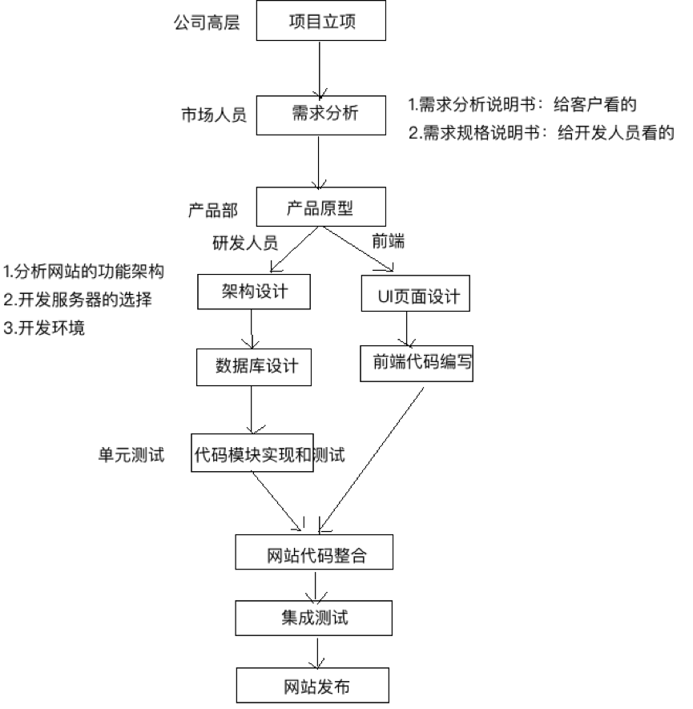
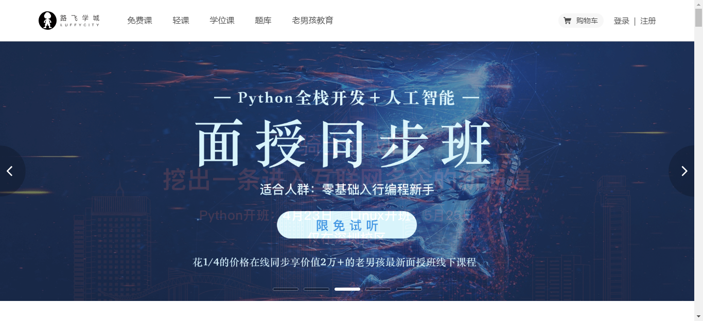
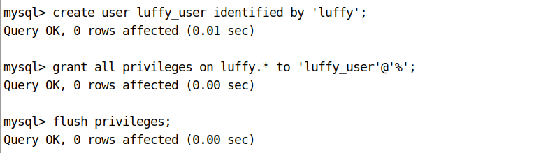
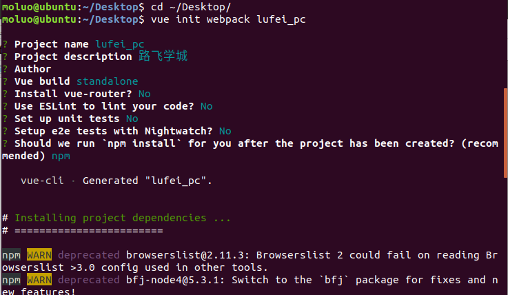
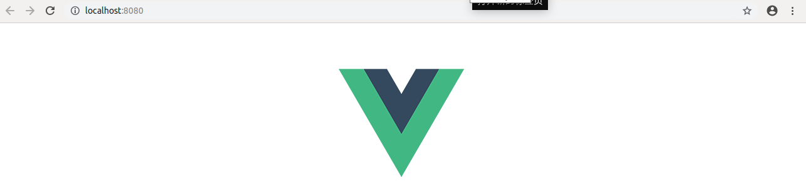
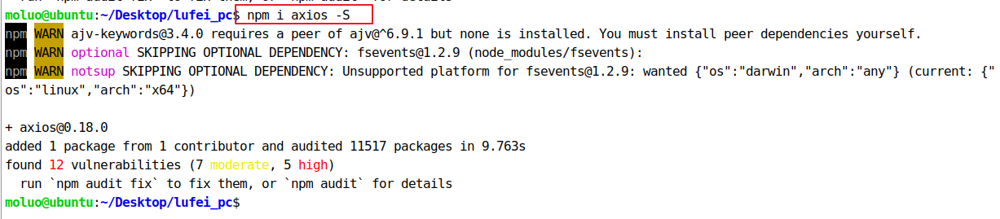

# 1. 项目开发基础概念

## 1.1 企业的web项目类型

1. 商城

   1.1 B2C  直销商城  商家与会员直接交易  ( Business To Customer )

   1.2 B2B  批发商城  商家与商家直接交易

   1.3 B2B2C   购物平台   商家和会员在另一个商家提供的平台上面进行交易

   1.4 C2B   定制商城   会员向商家发起定制商品的需求，商家去完成。

   1.5 O2O  线上线下交易平台   

   1.6 C2C   二手交易平台

2. 门户网站[企业站和门户站]

3. 社交网络

4. 资讯论坛

5. 内部系统 

6. 个人博客

7. 内容收费站

## 1.2 企业项目开发流程




```
UI原型设计：
    axure PC网站原型
    墨刀 手机版原型
UI图片格式：psd（Photoshop）、png    
禅道、teambition：分配任务、监控网站的管理进度
```


## 1.3 立项申请阶段

立项其实就是对产品项目能不能做和怎么做，提出理论基础。大的互联网公司都有比较正规的立项流程。


通常公司内部要研发一款软硬件的产品之前，都要经过市场评估和调研分析，产生一份`产品项目立项报告`给公司。

产品项目立项报告一般包含以下内容：

```
项目概述
需求市场
需求分析和项目建设的必要性
业务分析
总体建设方案
项目风险和风险管理
可行性分析阶段
```

参考资料：<https://blog.csdn.net/m0_37370820/article/details/81077886>


# 2. 需求分析

## 2.1 首页

功能：导航菜单、轮播图、退出登录




## 2.2 登录注册

功能：用户登录、极验验证码/腾讯防水墙、多条件登录、记住密码、短信发送、短信冷却倒计时、jwt认证


## 2.3 课程列表

功能：课程分类、课程列表、课程多条件筛选展示、课程分类展示、课程分页展示、课程章节课时展示、课程优惠策略


## 2.4 课程详情

功能：课程信息展示、视频播放、富文本编辑器


## 2.5 购物车

功能：购物车商品列表、添加商品、删除商品、勾选商品状态、商品结算、订单生成、唯一订单号生成


## 2.6 商品结算

功能：订单商品信息列表、订单信息展示、积分计算功能、优惠券策略、课程有效期计算、第三方支付平台接口


## 2.7 购买成功


## 2.8 个人中心

功能列表：我的订单、订单状态改变


## 2.9 视频播放

功能：视频加密播放


# 3. 环境搭建

## 3.1 创建虚拟环境

```python
mkvirtualenv luffy
```

如果自己的开发机子中存在多个版本的python，则可以指定解析器的版本

```python
mkvirtualenv luffy -p python3
```

 


## 3.2 相关命令

```python
创建虚拟环境：                mkvirtualenv 虚拟环境名称
创建虚拟环境(指定python版本)： mkvirtualenv -p python3 虚拟环境名称
查看所有虚拟环境：             workon+2次tab键
使用虚拟环境：                workon 虚拟环境名称
退出虚拟环境：                deactivate
删除虚拟环境:					rmvirtualenv 虚拟环境名称
    
其他相关命令：
查看虚拟环境中安装的包：       
    pip freeze  --不包括系统系统自带的包
    pip list    --所有安装的包，等同于pip freeze --all
收集当前环境中安装的包及其版本：       
	pip freeze > requirements.txt
在部署项目的服务器中安装项目使用的模块： 
	pip install -r requirements.txt
```

提示:

- 虚拟环境只会管理环境内部的python模块和python解析器,对于源代码是毫无关系

- 创建虚拟环境需要联网
- 创建成功后, 会自动工作在这个虚拟环境上
- 工作在虚拟环境上, 提示符最前面会出现 “(虚拟环境名称)”


## 3.3 技术选型

### 外部依赖

1.  注册支付宝的开发者账号[https://open.alipay.com]
2.  注册阿里云账号,如果可以购买一个服务器和域名, 或者第一次使用的可以申请一个免费外网服务器
3.  注册容联云短信接口平台的账号
4.  注册保利威视频服务平台的账号[暂时别注册]
5.  注册gitee[码云]的账号
6.  如果有条件的,可以申请一个域名进行备案[ICP备案和公安部备案],如果没有的话, 可以注册natapp[内网穿透]

#### 虚拟环境依赖包安装

```shell
pip install django -i https://pypi.douban.com/simple/

pip install djangorestframework -i https://pypi.douban.com/simple/

pip install PymySQL -i https://pypi.douban.com/simple/

pip install Pillow -i https://pypi.douban.com/simple/

pip install django-redis -i https://pypi.douban.com/simple/
```


# 4. 搭建项目

## 4.1 创建项目

```python
cd ~/Desktop
mkdir luffy
cd luffy
django-admin startproject luffyapi
```

效果:


## 4.3 打开项目

在pycharm中打开项目luffy


设置虚拟环境


如果没有看到当前虚拟环境的编译器，点击右上角的设置进行添加存在的环境。


——

启动django项目


效果：


提示：在pycharm中如果要使用已经创建好的虚拟环境，则必须设置pycharm中的python解释器，设置为虚拟环境中的python。


## 4.2 调整目录

```
luffy/
  ├── docs/          # 项目公共相关资料保存目录
  ├── luffycity/     # 前端项目目录（不要手动创建，后期使用vue-cli创建）
  ├── luffyapi/      # 后端项目目录
       ├── logs/          # 项目运行时/开发时日志目录
       ├── manage.py
       ├── luffyapi/      # 项目主应用，开发时的代码保存
       │    ├── apps/      # 开发者的代码保存目录，以模块[子应用]为目录保存
       │    ├── libs/      # 第三方类库的保存目录[第三方组件、模块]
       │    ├── settings/
       │         ├── dev.py   # 项目开发时的本地配置
       │         ├── prod.py  # 项目上线时的运行配置
       │    ├── urls.py    # 总路由
       │    ├── utils/     # 多个模块[子应用]的公共函数类库[自己开发的组件]
       └── scripts/       # 保存项目运营时的脚本文件

```

在编辑中开发项目时,必须指定项目目录才能运行,例如,开发后端项目,则必须选择的目录是luffyapi

```bash
上面的目录结构图，使用linux的命令tree输出的,tree ~/Desktop/luffy -L 3。
如果没有安装tree，可以使用 sudo apt install tree，就有了。

```


### 4.2.1 分不同环境加载不同项目配置

开发者本地的环境、目录、数据库密码和线上的服务器都会不一样,所以我们的配置文件可以针对不同的系统分成多分.

1. 在项目主应用下,创建一个settings的配置文件存储目录
2. 根据线上线下两种情况分别创建2个配置文件 dev.py和prod.py
3. 把原来项目主应用的 settings.py配置内容复制2份到dev.py和prod.py里面
4. 把原来的settings.py配置文件修改文件名或者删除

新的目录settings:


接下来,就可以根据在manage.py中根据不同的情况导入对应的配置文件了


## 4.3 创建git本地仓库

cd进入到自己希望存储代码的目录路径，并创建本地仓库.git（pycharm直接打开终端就是项目根目录了，无须cd了）
新创建的本地仓库.git是个空仓库

```shell
cd 目录路径
git init
```

配置用户名和邮箱

```shell
git config --global user.name 'dpc'
git config --global user.email 'dingpc15@gmail.com'

git config -l #查看配置信息
git config #获取config命令帮助
```

## 4.4 在gitee平台创建工程

公司一般都会有自己的代码仓库，一般都是自己搭建，也有使用第三方提供代码管理平台。

常用的代码管理平台：github、gitee(码云)、codepen(前端)

如果公司自己搭建的代码管理平台，gitlab框架

1） 创建私有项目库


创建私有空仓库以后的界面:


2）克隆项目到本地

```python
注意：
	我们当前项目不需要这个步骤
    这个步骤是 当以后我们进入公司里面，参与人家已经在做的项目时，别人已经有仓库了，但是我们是新人加入项目中的，那么我们不需要在自己本地进行git init，直接git clone 复制别人的仓库代码

```


```shell
git clone 仓库地址
#注意，如果当前目录下出现git仓库同名目录时，会克隆失败。

```


3）创建并切换分支到dev

```shell
git branch			# 查看分支
git branch dev      # 创建本地分支dev,dev是自定义
git checkout dev    # 切换本地分支代码
git checkout -b dev   # 创建并切换到分支dev

```


git提交

```shell
git add 代码目录   # 添加代码到上传队列
git status        # 查看当前项目的版本状态
git commit -m '这是message'  # 提交代码到本地仓库， -m 表示本次提交的描述

```

推送到远端

```shell
git push origin dev:dev
#用前者去更新后者（前者覆盖后者）

```


如果推送代码,出现以下提示: git pull ....,则表示当前本地的代码和线上的代码版本不同.

```shell
1. 把线上的代码执行以下命令,拉取到本地,进行同步
git pull

2. 根据提示,移除多余的冲突的文件,也可以删除.
完成这些步骤以后,再次add,commit,push即可.

```


接下来，我们就把上面创建好的本地项目提交到gitee码云上面

```bash
# .表示当前目录下所有的文件或目录提交到上传队列[上传队列也叫"暂存区"]
git add .

# 把本地上传队列的代码提交到本地仓库
git commit -m "项目初始化搭建"

# 给本地的git版本控制软件设置项目的远程仓库地址，如果origin已经设置，则将.git删掉重新初始化
git remote add origin https://gitee.com/mooluo/luffyproject.git

# 提交代码给远程仓库
git push -u origin master
#-u --set-upstream 上面的命令将本地的master分支推送到origin源的master分支，同时指定master为默认分支，下次直接使用git push时直接默认推送到对应的分支(dev->origin:dev master->origin:master)

```


```shell
扩展：
1. 通过 git status 可以查看当前项目的代码版本状态
2. 通过 git reflog 可以查看代码版本日志[简单格式]
3. 通过 git log    可以查看代码版本日志[详细格式]
4. 删除分支 git branch -D 分支名称
   注意,不能删除当前所在分支,必须切换到别的分支上才能进行删除


```

最终，成功提交了代码版本到gitee平台。效果：


上面虽然成功移交了代码版本，但是一些不需要的文件也被提交上去了。

所以，我们针对一些不需要的文件，可以选择从代码版本中删除，并且使用`.gitignore`把这些垃圾文件过滤掉。

```bash
git rm 文件  # 删除单个文件
git rm -rf 目录  # 递归删除目录

# 以下操作建议通过ubuntu的终端来完成，不要使用pycharm提供，否则删除.idea还会继续生成。
git rm -rf .idea
git rm db.sqlite3
# 注意，上面的操作只是从项目的源代码中删除，但是git是不知情的，所以我们需要同步。
git add .
git commit -m "删除不必要的文件或目录"
git push -u origin master	#上传的哦master主支


```

在luffy目录中(.git同级目录)创建``.gitignore``把一些垃圾文件过滤掉。

```shell
vim .gitignore

./idea
./idea/*
./git
./db.sqlite3


```

开发时我们经常会使用pycharm的提供的git管理工具来完成代码的拉取和推送。


## 4.6 日志配置

 https://docs.djangoproject.com/en/2.2/topics/logging/ 

在settings/dev.py文件中追加如下配置：

```python
# 日志配置
LOGGING = {
    'version': 1,
    'disable_existing_loggers': False, #是否禁用第三方如drf的日志功能
    #日志格式
    'formatters': {
        'verbose': {
            #格式：		报错等级	   报错时间		 模块		  行号	    信息
            'format': '%(levelname)s %(asctime)s %(module)s %(lineno)d %(message)s'
        },
        'simple': {
            'format': '%(levelname)s %(module)s %(lineno)d %(message)s'
        },
    },
    #过滤器
    'filters': {
        'require_debug_true': {
            '()': 'django.utils.log.RequireDebugTrue', #过滤掉调试信息
        },
    },
    #处理错误信息
    'handlers': {
        'console': {
            'level': 'DEBUG', #DEBUG以上级别报错信息都会出现在控制台
            'filters': ['require_debug_true'],
            'class': 'logging.StreamHandler',
            'formatter': 'simple'
        },
        'file': {
            'level': 'INFO', #处理INFO级别以上的报错信息
            'class': 'logging.handlers.RotatingFileHandler',
            # 日志位置,日志文件名,日志保存目录必须手动创建
            'filename': os.path.join(os.path.dirname(BASE_DIR), "logs/luffy.log"),
            # 日志文件的最大值,这里我们设置300M
            'maxBytes': 300 * 1024 * 1024,
            # 日志文件的数量,设置最大日志数量为10
            'backupCount': 10,
            # 日志格式:详细格式
            'formatter': 'verbose'
        },
    },
    # 日志对象
    'loggers': {
        'django': {
            'handlers': ['console', 'file'],
            'propagate': True, # 是否让日志信息继续冒泡给其他的日志处理系统
        },
    }
}
```


## 4.5 异常处理

新建utils/exceptions.py

```python
from rest_framework.views import exception_handler

from django.db import DatabaseError
from rest_framework.response import Response
from rest_framework import status

import logging
logger = logging.getLogger('django')


def custom_exception_handler(exc, context):
    """
    自定义异常处理
    :param exc: 异常类
    :param context: 抛出异常的上下文，为一个异常信息的字典
    :return: Response响应对象
    """
    # 调用drf框架原生的异常处理方法
    response = exception_handler(exc, context) 

    if response is None:
        view = context['view']
        if isinstance(exc, DatabaseError):
            # 数据库异常
            logger.error('[%s] %s' % (view, exc))
            response = Response({'message': '服务器内部错误'}, status=status.HTTP_507_INSUFFICIENT_STORAGE)

    return response

```


settings下dev.py配置文件中添加

```python
REST_FRAMEWORK = {
    # 异常处理
    'EXCEPTION_HANDLER': 'luffyapi.utils.exceptions.custom_exception_handler',
}

```


## 4.7 创建数据库

```mysql
create database luffy default charset=utf8mb4;

```


为当前项目创建数据库用户[这个用户只能看到这个数据库]

```mysql
create user luffy_user identified by 'luffy';	#默认创建的账号没有任何权限
grant all privileges on luffy.* to 'luffy_user'@'%';
flush privileges;

```



**utf8mb4知识扩展**	https://blog.csdn.net/seven_deadly_sins/article/details/91046938

```python
#MySQL在5.5.3版本以后增加了utf8mb4编码，其中mb4是most bytes 4的含义，用来兼容四个字节的Unicode（万国码）。utf8mb4是utf8的一个扩展。
常，计算机在存储字符时，会根据不同类型的字符以及编码方式分配存储空间。例如以下几种编码方式;
(1)ASCII编码中，一个英文字母（不分大小写）占用一个字节的空间，一个中文汉字占用两个字节的空间。一个二进制的数字序列，在计算机中作为一个数字单元存储时，一般为8位二进制数，换算为十进制。最小值0，最大值255。
(2)UTF-8编码中，一个英文字符占用一个字节的存储空间，一个中文（含繁体）占用三个字节的存储空间。
(3)Unicode编码中，一个英文占用两个字节的存储空间，一个中文（含繁体）占用两个字节的存储空间。
(4)UTF-16编码中，一个英文字母字符或一个汉字字符存储都需要占用2个字节的存储空间（Unicode扩展区的一些汉字存储需要4个字节）。
(5)UTF-32编码中，世界上任何字符的存储都需要占用4个字节的存储空间。

#既然utf8能兼容绝大部分的字符，为什么要扩展utf8mb4？
	随着互联网的发展，产生了许多新类型的字符，例如emoji这种类型的符号，也就是我们通常在聊天时发的小黄脸表情，这种字符的出现不在基本多平面的Unicode字符之中，导致无法在MySQL中使用utf8存储，MySQL于是对utf8字符进行了扩展，增加了utf8mb4这个编码。
	所以，设计数据库时如果想要允许用户使用特殊符号，最好使用utf8mb4编码来存储，使得数据库有更好的兼容性，但是这样设计会导致耗费更多的存储空间。
```


## 4.8 配置数据库连接

打开settings/dev.py文件，并配置

```python
DATABASES = {
    "default": {
        "ENGINE": "django.db.backends.mysql",
        "HOST": "127.0.0.1",
        "PORT": 3306,
        "USER": "luffy_user",
        "PASSWORD": "luffy",
        "NAME": "luffy",
    }
}

#ENGINE引擎/驱动：将写入的数据转换成sql语句存入数据库
```

在luffyapi/\__init__.py中导入pymysql

```python
import pymysql

pymysql.install_as_MySQLdb()

#MYSQLdb也是一个流行的数据库驱动，django对MYSQLdb的支持不大好，故替换成为pymysql
```


**调整错误**

数据库版本检测导致的错误


数据库的版本检测代码注释掉。


第二个错误也是因为数据库版本的默认编码导致，query返回的内容格式使用有误。

新增一行代码，把query查询结果转换格式为 bytes类型


# 5. 搭建前端项目

## 5.1 创建项目目录

```bash
cd 项目目录
vue init webpack lufei_pc

```

例如，我要把项目保存在~/Desktop桌面目录下，可以如下操作：

```bash
cd ~/Desktop
vue init webpack lufei_pc
#webpack是一个独立的自动化工具，可供我们打包

```

根据需要在生成项目时，我们选择对应的选项, 效果：



根据上面的提示，我们已经把vue项目构建好了，运行测试服务器。


打开项目已经，在pycharm的终端下运行vue项目，查看效果。

```bash
npm run dev


```

接下来，我们根据终端上效果显示的对应地址来访问项目(如果有多个vue项目在运行，8080端口被占据了，服务器会自动改端口，所以根据自己实际在操作中看到的地址来访问。)

访问：http://localost:8080。效果：




我们也可以把我们的前端项目进行git源代码管理


## 5.2 初始化前端项目

清除默认的HelloWorld组件和APP.vue中的默认样式


接下来，我们可以查看效果了，一张白纸~


## 5.3 安装路由vue-router

### 5.3.1 下载路由组件

```bash
npm i vue-router -S


```

执行效果：


### 5.3.2 配置路由

####  初始化路由对象

#如果前面选择了安装vue-router,则可以跳过该步骤直接创建首页组件

在src目录下创建routers路由目录，在routers目录下创建index.js路由文件

index.js路由文件中，编写初始化路由对象的代码 .

```javascript
import Vue from "vue"
import Router from "vue-router"

// 这里导入可以让让用户访问的组件

Vue.use(Router);

export default new Router({
  // 设置路由模式为‘history’，去掉默认的#(默认为哈希模式)
  mode: "history",
  routes:[
    // 路由列表

  ]
})


```


#### 注册路由信息

打开main.js文件，把router对象注册到vue中.代码：

```javascript
// The Vue build version to load with the `import` command
// (runtime-only or standalone) has been set in webpack.base.conf with an alias.
import Vue from 'vue'
import App from './App'
import router from './routers/index';

Vue.config.productionTip = false

/* eslint-disable no-new */
new Vue({
  el: '#app',
  router,
  components: { App },
  template: '<App/>'
});
```


####  在视图中显示路由对应的内容

在App.vue组件中，添加显示路由对应的内容。


代码：

```vue
<template>
  <div id="app">
    <router-view/>
  </div>
</template>

<script>
export default {
  name: 'App',
  components: {

  }
}
</script>

<style>

</style>


```

####  创建并提供前端首页的组件

routers/index.js

```javascript
// import Vue from "vue"
// import Router from "vue-router"
//
//
// // 这里导入可以让让用户访问的组件
import Home from "../components/Home"
//import Home from "@/components/Home" #vue中@特指src目录
// Vue.use(Router);
//
// export default new Router({
//   // 设置路由模式为‘history’，去掉默认的#
//   mode: "history",
//   routes:[
//     // 路由列表
     {
       name:"Home",
       path:"/",
       component:Home,
     },
      {
       name:"Home",
       path:"/home",
       component:Home,
     },
   ]
// })


```

#### 创建Home组件

components/Home.vue

```vue
<template>
  <div id="home">
    前端首页
  </div>
</template>
<script>
  export default {
      name:"Home",
      data(){
          return {
              
          }
      }
  }
</script>

<style scoped>

</style>


```


## 5.4 前端初始化全局变量和全局方法

在src目录下创建settings.js站点开发配置文件：

```javascript
export default {
  Host:"http://127.0.0.1:8000",
}
```

在main.js中引入

```javascript
// // The Vue build version to load with the `import` command
// // (runtime-only or standalone) has been set in webpack.base.conf with an alias.
// import Vue from 'vue'
// import App from './App'
// import router from './routers/index';
import settings from "./settings"
// Vue.config.productionTip = false;
Vue.prototype.$settings = settings;
//
// /* eslint-disable no-new */
// new Vue({
//   el: '#app',
//   router,
//   components: { App },
//   template: '<App/>'
// });


```


## 5.5  引入ElementUI

```bash
npm i element-ui -S


```

上面的命令等同于 

```bash
npm install element-ui --save


```

执行命令效果：


### 5.5.1 配置ElementUI到项目中

在main.js中导入ElementUI，并调用。

代码：

```javascript
// The Vue build version to load with the `import` command
// (runtime-only or standalone) has been set in webpack.base.conf with an alias.
// import Vue from 'vue'
// import App from './App'
// import router from './routers/index';

// 开发配置文件
// import settings from "./settings"
// Vue.prototype.$settings = settings;

// elementUI 导入
import ElementUI from 'element-ui';
import 'element-ui/lib/theme-chalk/index.css';
// 调用插件
Vue.use(ElementUI);


// Vue.config.productionTip = false;

/* eslint-disable no-new */
// new Vue({
//   el: '#app',
//   router,
//   components: { App },
//   template: '<App/>'
// });


```

效果：


成功引入了ElementUI以后，接下来我们就可以开始进入前端页面开发，首先是首页。

接下来我们把之前完成的首页，直接拿过来使用[注意除了组件以外,还有静态文件也需要拿过来,包括App.vue里面的公共样式]，并运行项目。


App.vue，全局css初始化代码

```vue
<template>
  <div id="app">
    <router-view/>
  </div>
</template>

<script>
export default {
  name: 'App'
}
</script>

<style>
/* 声明全局样式和项目的初始化样式 */
body,h1,h2,h3,h4,p,table,tr,td,ul,li,a,form,input,select,option,textarea{
  margin:0;
  padding: 0;
  font-size: 15px;
}
a{
  text-decoration: none;
  color: #333;
}
ul,li{
  list-style: none;
}
table{
  border-collapse: collapse; /* 合并边框 */
}

/* 工具的全局样式 */
.full-left{
  float: left!important;
}
.full-right{
  float: right!important;
}

[class*=" el-icon-"], [class^=el-icon-]{
  font-size: 50px;
}
.el-carousel__arrow{
  width: 120px;
  height: 120px;
}
.el-checkbox__input.is-checked .el-checkbox__inner,
.el-checkbox__input.is-indeterminate .el-checkbox__inner{
  background: #ffc210;
  border-color: #ffc210;
  border: none;
}
.el-checkbox__inner:hover{
  border-color: #9b9b9b;
}
.el-checkbox__inner{
  width: 16px;
  height: 16px;
  border: 1px solid #9b9b9b;
  border-radius: 0;
}
.el-checkbox__inner::after{
  height: 9px;
  width: 5px;
}

</style>


```

Home.vue中添加代码：

```vue
<template>
    <div class="home">
      <Header></Header>
      <Banner></Banner>
      <Footer></Footer>
    </div>
</template>

<script>
  import Header from "./common/Header"
  import Banner from "./common/Banner"
  import Footer from "./common/Footer"
  export default {
      name: "Home",
      data(){
        return {}
      },
      methods:{

      },
      components:{
        Header,
        Footer,
        Banner,
      }
  }
</script>

<style scoped>

</style>


```

components/common/Header.vue

```vue
<template>
    <div class="header-box">
      <div class="header">
        <div class="content">
          <div class="logo full-left">
            <router-link to="/"></router-link>
          </div>
          <ul class="nav full-left">
              <li><span>免费课</span></li>
              <li><span>轻课</span></li>
              <li><span>学位课</span></li>
              <li><span>题库</span></li>
              <li><span>老男孩教育</span></li>
          </ul>
          <div class="login-bar full-right">
            <div class="shop-cart full-left">
              
              <span><router-link to="/cart">购物车</router-link></span>
            </div>
            <div class="login-box full-left">
              <span>登录</span>
              &nbsp;|&nbsp;
              <span>注册</span>
            </div>
          </div>
        </div>
      </div>
    </div>
</template>

<script>
    export default {
      name: "Header",
      data(){
        return{
        }
      },
    }
</script>

<style scoped>
.header-box{
  height: 80px;
}
.header{
  width: 100%;
  height: 80px;
  box-shadow: 0 0.5px 0.5px 0 #c9c9c9;
  position: fixed;
  top:0;
  left: 0;
  right:0;
  margin: auto;
  z-index: 99;
  background: #fff;
}
.header .content{
  max-width: 1200px;
  width: 100%;
  margin: 0 auto;
}
.header .content .logo{
  height: 80px;
  line-height: 80px;
  margin-right: 50px;
  cursor: pointer; /* 设置光标的形状为爪子 */
}
.header .content .logo img{
  vertical-align: middle;
}
.header .nav li{
  float: left;
  height: 80px;
  line-height: 80px;
  margin-right: 30px;
  font-size: 16px;
  color: #4a4a4a;
  cursor: pointer;
}
.header .nav li span{
  padding-bottom: 16px;
  padding-left: 5px;
  padding-right: 5px;
}
.header .nav li span a{
  display: inline-block;
}
.header .nav li .this{
  color: #4a4a4a;
  border-bottom: 4px solid #ffc210;
}
.header .nav li:hover span{
  color: #000;
}
.header .login-bar{
  height: 80px;
}
.header .login-bar .shop-cart{
  margin-right: 20px;
  border-radius: 17px;
  background: #f7f7f7;
  cursor: pointer;
  font-size: 14px;
  height: 28px;
  width: 88px;
  margin-top: 30px;
  line-height: 32px;
  text-align: center;
}
.header .login-bar .shop-cart:hover{
  background: #f0f0f0;
}
.header .login-bar .shop-cart img{
  width: 15px;
  margin-right: 4px;
  margin-left: 6px;
}
.header .login-bar .shop-cart span{
  margin-right: 6px;
}
.header .login-bar .login-box{
  margin-top: 33px;
}
.header .login-bar .login-box span{
  color: #4a4a4a;
  cursor: pointer;
}
.header .login-bar .login-box span:hover{
  color: #000000;
}
</style>


```


components/common/Bannner.vue

```vue
<template>
  <el-carousel height="720px" :interval="3000" arrow="always">
    <el-carousel-item>
      
    </el-carousel-item>
    <el-carousel-item>
      
    </el-carousel-item>
    <el-carousel-item>
      
    </el-carousel-item>
  </el-carousel>
</template>

<script>
    export default {
        name: "Banner",
    }
</script>

<style scoped>
  .el-carousel__item h3 {
    color: #475669;
    font-size: 18px;
    opacity: 0.75;
    line-height: 300px;
    margin: 0;
  }

  .el-carousel__item:nth-child(2n) {
    background-color: #99a9bf;
  }

  .el-carousel__item:nth-child(2n+1) {
    background-color: #d3dce6;
  }
</style>


```

components/common/Footer.vue

```vue
<template>
    <div class="footer">
      <ul>
        <li>关于我们</li>
        <li>联系我们</li>
        <li>商务合作</li>
        <li>帮助中心</li>
        <li>意见反馈</li>
        <li>新手指南</li>
      </ul>
      <p>Copyright © luffycity.com版权所有 | 京ICP备17072161号-1</p>
    </div>
</template>

<script>
    export default {
        name: "Footer"
    }
</script>

<style scoped>
.footer {
  width: 100%;
  height: 128px;
  background: #25292e;
  color: #fff;
}
.footer ul{
  margin: 0 auto 16px;
  padding-top: 38px;
  width: 810px;
}
.footer ul li{
  float: left;
  width: 112px;
  margin: 0 10px;
  text-align: center;
  font-size: 14px;
}
.footer ul::after{
  content:"";
  display:block;
  clear:both;
}
.footer p{
  text-align: center;
  font-size: 12px;
}
</style>


```

也可以把App.vue的style标签的css代码放到static外部目录下引用过来

main.js

```javascript
import "../static/css/reset.css";


```

reset.css

```css
body,h1,h2,h3,h4,h5,ul,p{
    padding: 0;
    margin:0;
    font-weight: normal;
  }
  body{
    margin-top: 80px;
  }
  a{
    text-decoration: none;
    color: #4a4a4a;
  }
  a:hover{
    color: #000;
  }

  ul{
    list-style: none;
  }

  img{
    width: 100%;
  }

  .header .el-menu li .el-submenu__title{
    height: 26px!important;
    line-height: 26px!important;
  }
  .el-menu--popup{
    min-width: 140px;
  }
  .el-checkbox__inner{
    width:16px;
    height: 16px;
    border: 1px solid #999;
  }
  .el-checkbox__inner:after{
    width: 6px;
    height: 8px;
  }
  .el-form-item__content{
    margin-left:0px!important;
    width: 120px;
  }


```


# 6. 跨域CORS

cross origin resource share

## 6.1 编辑hosts文件

我们现在为前端和后端分别设置两个不同的域名：

| 位置 | 域名               |
| ---- | ------------------ |
| 前端 | `www.luffycity.cn` |
| 后端 | `api.luffycity.cn` |

编辑`/etc/hosts`文件，可以设置本地域名

```bash
sudo vim /etc/hosts
```

在文件中增加两条信息

```shell
127.0.0.1   localhost
127.0.0.1   api.luffycity.cn
127.0.0.1   www.luffycity.cn
```


## 6.2 配置前端项目

通过浏览器访问前端vue项目，会出现nginx的欢迎页面，主要因为我们当前操作中已经有一个nginx监听了80端口，所以访问www.luffycity.cn网址时，会自动被转发到127.0.0.1本机，因为没有网址默认端口是80端口，所以被nginx进行处理了当前请求，因此我们暂时先把nginx关闭先。

```bash
# 查找nginx的进程
ps -ef|grep nginx
# 关闭进程
sudo kill -9 nginx进程号
```


关闭了nginx以后，访问www.luffy.city.cn网址，效果：


上面并不是错误，而是没人监听了这个地址和端口了，解决方法：

暂停运行前端项目，在配置文件config/index.js中增加：

```javascript
host: 'www.luffycity.cn', // can be overwritten by process.env.HOST
port: 8080, // can be overwritten by process.env.PORT, if port is in use, a free one will be determined
autoOpenBrowser: true,
```

保存修改信息，并重启项目


通过浏览器访问drf项目,会出现以下错误信息


可以通过settings/dev.py的ALLOWED_HOSTS,设置允许访问

```python
# 设置哪些客户端可以通过地址访问到后端
ALLOWED_HOSTS = [
    'api.luffycity.cn',
]
```


让用户访问的时候，使用api.luffycity.cn:8000

```
1. 修改pycharm的manage.py的配置参数
```


## 6.3 后端添加跨域访问

现在，前端与后端分处不同的域名，我们需要为后端添加跨域访问的支持

否则前端无法使用axios无法请求后端提供的api数据，我们使用CORS来解决后端对跨域访问的支持。

使用django-cors-headers扩展

```
在 Response(headers={"Access-Control-Allow-Origin":'客户端地址/*'})
```

文档：https://github.com/ottoyiu/django-cors-headers/

虚拟环境中安装django-cors-headers：

```python
pip install django-cors-headers
```

settings/dev.py中添加应用：

```python
INSTALLED_APPS = (
    ...
    'corsheaders',
    ...
)
```

中间件设置【必须写在第一个位置】

```python
MIDDLEWARE = [
    'corsheaders.middleware.CorsMiddleware',
    ...
]
```

添加白名单

```python
# CORS组的配置信息
CORS_ORIGIN_WHITELIST = (
    'http:www.luffycity.cn:8080',
    #'http://www.luffycity.cn:8080','
)
CORS_ALLOW_CREDENTIALS = True  # 允许ajax跨域请求时携带cookie
```


完成了上面的步骤，我们就可以通过后端提供数据给前端使用ajax访问了。

前端使用 axios就可以访问到后端提供给的数据接口，但是如果要附带cookie信息，前端还要设置一下。

前端引入axios插件并配置允许axios发送cookie信息（axios本身不允许ajax发送cookie到后端）

```
npm i axios -S
```



在main.js中引用 axios插件

```javascript
import axios from 'axios'; // 从node_modules目录中导入包
// 允许ajax发送请求时附带cookie
axios.defaults.withCredentials = false;

Vue.prototype.$axios = axios; // 把对象挂载vue中
```


